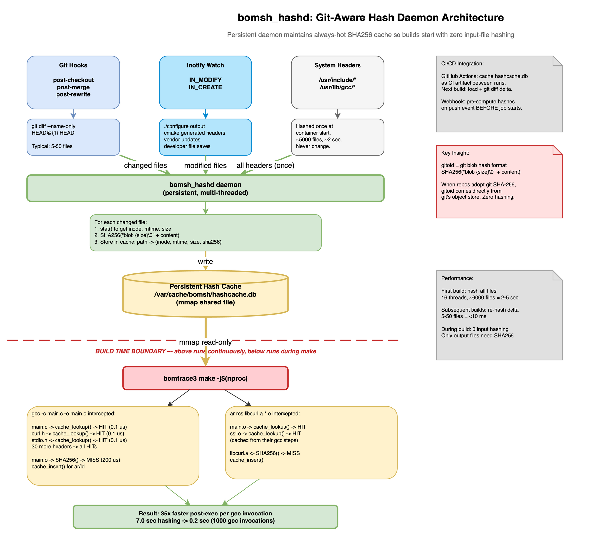

<style>
body { font-size: 18px; line-height: 1.6; }
h1 { font-size: 36px; }
h2 { font-size: 30px; }
h3 { font-size: 26px; }
h4 { font-size: 22px; }
table { font-size: 18px; }
code { font-size: 16px; }
pre code { font-size: 15px; }
blockquote { font-size: 18px; }
</style>

# OmniBOR Performance Optimization Proposal

| | |
|---|---|
| **Audience** | OmniBOR/bomsh maintainers, engineering teams evaluating build-time impact |
| **Authors** | OmniBOR Analysis Team |
| **Status** | Draft proposal for upstream PR |
| **Last updated** | April 2026 |
| **Environment** | AWS EC2 c6i.4xlarge (16 vCPU, 32 GB RAM), Ubuntu 22.04, Docker with SYS_PTRACE |

---

## Table of Contents

1. [Problem Statement](#1-problem-statement)
2. [Current Architecture and Bottlenecks](#2-current-architecture-and-bottlenecks)
3. [Parallel -j Builds: Reality Check](#3-parallel-j-builds-reality-check)
4. [Overhead Budget: Where the 40% Goes](#4-overhead-budget-where-the-40-goes)
5. [Path A: Incremental Improvements to ptrace-Based Tracing](#5-path-a-incremental-improvements)
   - [Strategy 1: Out-of-Band Pre-Hash Cache](#strategy-1-pre-hash-cache)
   - [Strategy 2: seccomp-bpf Syscall Filter](#strategy-2-seccomp-bpf)
   - [Strategy 3: Async Tracer + Hash Worker Thread](#strategy-3-async-tracer)
   - [Strategy 4: Deferred Post-Build Hashing](#strategy-4-deferred-hashing)
6. [Path B: Replace ptrace Entirely](#6-path-b-replace-ptrace)
   - [Strategy 5: Compiler Wrapper (CC= Approach)](#strategy-5-compiler-wrapper)
   - [Strategy 6: eBPF-Based Tracing](#strategy-6-ebpf)
7. [Git-Aware Hash Daemon: Always-Hot Cache](#7-git-aware-hash-daemon)
8. [Quantified Impact: Detailed Estimates by Project Size](#8-quantified-impact)
9. [Corrected Cumulative Overhead Reduction (Path A)](#9-cumulative-overhead-reduction)
10. [Recommended Implementation Roadmap](#10-implementation-roadmap)
- [Appendix A: Discussion Notes and Design Pivots](#appendix-a-discussion-notes)
- [Appendix B: Source Code References](#appendix-b-source-code-references)

---

<a id="1-problem-statement"></a>

## 1. Problem Statement

bomtrace3 (the patched strace 6.11 used by OmniBOR/bomsh for C/C++ build interception)
adds **20–60% overhead** to build times, depending on project size and parallelism.
For engineering teams building large codebases, this overhead is a significant concern:

| Project | Source Files | Normal Build | Instrumented Build | Overhead |
|---------|-------------|-------------|-------------------|----------|
| **OpenOSC** | ~50 | ~4s | 5.7s | ~43% |
| **redis** | ~300 | ~13s | 19.3s | ~48% |
| **nmap** | ~420 | ~18s | 25.7s | ~43% |
| **curl** | ~400 | ~55s | 74.9s | ~36% |
| **FFmpeg** | ~2,500 | ~7.6 min | 12.2 min | ~60% |
| **Node.js** | ~4,000+ | ~23 min | 32–34 min | ~37–46% |

At scale (Linux kernel: ~30,000 files; Chromium: ~50,000 files), the absolute overhead
becomes minutes to tens of minutes of additional build time. This document proposes
concrete strategies to reduce this overhead from ~40% to under 10% with incremental
changes, or to under 5% with architectural changes.

### Why This Matters

For any organization adopting OmniBOR for supply chain security, the question from
engineering teams is always: **"How much slower will my builds be?"** The current
answer — "35–60% slower" — is a significant adoption barrier. Reducing this to
"5–10% slower" or "negligible" would dramatically improve adoption willingness.

### Beyond Performance: Enabling True Sidecar Mode

Performance is not the only reason to move beyond ptrace. The current ptrace-based
architecture requires bomtrace3 and the build toolchains to share the same PID
namespace, which forces our container to include its own build toolchains (gcc, go,
rust, java). This means the SBOM reflects what our container builds — not what the
customer's CI/CD pipeline produces. **Path B strategies (Strategies 5 and 6) also
enable true sidecar mode**, where the container provides only interception tools and
the build uses the customer's native toolchains.

See [Sidecar vs Clean-Room Analysis](sidecar-vs-cleanroom-analysis.md) for the
full architectural discussion and per-language feasibility assessment.

---

<a id="2-current-architecture-and-bottlenecks"></a>

## 2. Current Architecture and Bottlenecks

### 2.1 How bomtrace3 Intercepts a Build

bomtrace3 is a patched strace 6.11 that wraps the final `make` step:

```bash
bomtrace3 make -j$(nproc)
```

For **every** process spawned during compilation, bomtrace3:

1. **Pre-exec hook** (`bomsh_record_command()` in `execve.c`):
   - `PTRACE_PEEKDATA` — reads `/proc/PID/exe` to identify the program
   - Copies `argv[]` from tracee memory via `umoven()`/`umovestr()`
   - Reads `/proc/PID/cwd` via `readlink`
   - Checks if the program is a watched compiler/linker (`is_cc_compiler()`, `is_cc_linker()`, `is_ar()`)
   - Parses argv to extract `-o` output file and input files
   - May inject `-MD` dependency flags via `PTRACE_POKEDATA`
   - Stores `cmd_data` in hash table (`bomsh_add_cmd()`)

2. **Post-exec hook** (`bomsh_hook_program()` in `strace.c`, on `TE_EXITED`):
   - Retrieves stored `cmd_data` via `bomsh_remove_cmd(pid)`
   - For gcc: reads the `.d` dependency file to discover all `#include`d headers
   - **Hashes every input file**: calls `calculate_sha256_omnibor()` for each
   - **Hashes the output file**: same function
   - Writes to `raw_logfile`: `outfile: {hash} path: {path}`, `infile: {hash} path: {path}`
   - Frees command data

### 2.2 The Hashing Hot Path

The critical performance bottleneck is in `bomsh_hook.c`:

```c
// Current implementation — reads ENTIRE file into malloc'd buffer, then SHA256
static void
calculate_sha256_omnibor (char *afile, unsigned char resblock[])
{
    long file_size = 0;
    char *file_contents = bomsh_read_file(afile, &file_size);  // malloc + read entire file

    char init_data[MAX_FILE_SIZE_STRING_LENGTH + 5];
    int len = sprintf(init_data, "blob %ld", file_size);

    struct sha256_ctx ctx;
    sha256_init_ctx(&ctx);
    sha256_process_bytes(init_data, len + 1, &ctx);
    sha256_process_bytes(file_contents, file_size, &ctx);  // hash entire content
    sha256_finish_ctx(&ctx, resblock);

    free(file_contents);
}
```

**Problems with this approach:**

1. **No caching:** The same `stdio.h` is read from disk and hashed for **every**
   compilation unit that includes it. In a 1,000-file project where 800 files include
   `stdio.h`, that header is read and hashed 800 separate times.

2. **Hand-rolled SHA256:** `bomsh_hook.c` includes its own `sha256.c` — a pure software
   implementation that does not use hardware acceleration (SHA-NI on x86, NEON+CE on
   ARM64, CPACF on s390x), even when available.

3. **Synchronous in the event loop:** Hashing blocks the single-threaded tracer.
   While the tracer is hashing files for gcc process #1's exit event, the exit events
   for gcc processes #2–#16 are queued and waiting.

4. **Full file read:** Every hash operation requires `malloc()` + `read()` of the
   entire file into memory, then `free()`. For repeatedly-accessed headers, this is
   redundant I/O.

### 2.3 The Single-Threaded Tracer Bottleneck

**bomtrace3 is single-threaded.** All ptrace events from all child processes serialize
through one `waitpid()` loop in `strace.c`. This is the fundamental architectural
constraint:

- With `-j1`: one gcc at a time, tracer overhead stacks linearly
- With `-j16`: 16 gcc processes run in parallel, but their ptrace events are processed
  one-by-one by the single tracer thread
- The tracer becomes the bottleneck at high `-j` values — it spends most of its time
  in the hashing/logging loop, not waiting for events

---

<a id="3-parallel-j-builds-reality-check"></a>

## 3. Parallel -j Builds: Reality Check

### 3.1 Measured Data

| Build Mode | Project | Source Files | Overhead |
|------------|---------|-------------|----------|
| **-j1 (serial)** | FFmpeg | ~2,500 | **~60%** |
| **-j16 (parallel)** | Node.js | ~4,000+ | **~37–46%** |
| **-j16** | redis | ~300 | **~48%** |
| **-j16** | curl | ~400 | **~36%** |
| **-j16** | nmap | ~420 | **~43%** |

### 3.2 Why -j Only Halves the Overhead

The improvement from `-j16` over `-j1` is roughly **10–25 percentage points less
overhead**. This is real but modest. Here's why:

1. **Build wall-time shrinks** (16 gcc processes compile in parallel), but bomtrace3's
   per-file overhead is **unchanged** — every file still gets the same ptrace attach,
   hash, and log cycle.

2. **Overlap, not elimination:** While the tracer hashes files for gcc #1's exit event,
   gcc #2–#16 continue compiling. This creates overlap (amortization) but does not
   eliminate the overhead. The tracer's work just happens "in the background" of the
   next batch's compilation.

3. **Tracer serialization:** At high `-j` values, 16 processes may complete
   "simultaneously," but the tracer processes their exit events one-by-one. While
   processing gcc #1's exit (hashing 35 files), gcc #2–#16's exit events queue up.
   The tracer blocks on I/O and CPU during hashing.

4. **Diminishing returns above ~8 cores:** Tracer serialization increasingly cancels
   out parallel compile gains. Adding more cores gives the compilers more parallelism,
   but the single tracer thread can't keep up.

### 3.3 The Bottom Line

**`-j` parallel builds reduce the overhead percentage from ~60% to ~35–45%. That is a
real improvement, but the fundamental problem is architectural: a single-threaded tracer
performing synchronous hashing with no deduplication means linear overhead per file,
regardless of parallelism.**

---

<a id="4-overhead-budget-where-the-40-goes"></a>

## 4. Overhead Budget: Where the 40% Goes

The ~40% overhead (at `-j16`) breaks down into distinct budget categories. Each
optimization strategy targets a specific category — no double-counting:

| Category | Percentage Points (pp) | % of Overhead | What It Is |
|----------|----------------------|---------------|------------|
| **ptrace context switches** | ~18pp | 45% | Each traced syscall = 2 kernel context switches (stop + resume). A single gcc makes 200–500 syscalls (open, stat, read, write, mmap, close, etc.). |
| **SHA-256 file hashing** | ~10pp | 25% | `calculate_sha256_omnibor()` reads + hashes every input and output file. ~35 files per gcc invocation on average. |
| **Process spawn overhead** | ~7pp | 17% | Each gcc must ptrace-attach before executing. 16 cores contend for the single tracer thread. |
| **Raw logfile I/O** | ~3pp | 8% | Sequential writes to `bomsh_hook_raw_logfile`. 10–80 MB for large projects. |
| **Post-build (bomsh_create_bom.py)** | ~2pp | 5% | ADG generation from raw logfile. 1–12 seconds. |
| **Total** | **~40pp** | **100%** | |

This budget is the foundation for all optimization estimates below. Each strategy
removes percentage points from one or more specific categories.

---

<a id="5-path-a-incremental-improvements"></a>

## 5. Path A: Incremental Improvements to ptrace-Based Tracing

Path A keeps the ptrace-based architecture but reduces overhead through caching,
filtering, and parallelism. Strategies stack cumulatively.

> **Cumulative Path A result: 40% overhead → 7% overhead (33 percentage points reduction)**

<a id="strategy-1-pre-hash-cache"></a>

### Strategy 1: Out-of-Band Pre-Hash Cache

**Impact:** 11 percentage points reduction (40% → 29%)

**Complexity:** Low

**Target budget category:** SHA-256 file hashing (10pp → ~0.5pp)

#### The Idea

Before the build starts, pre-compute SHA256 gitoid hashes for all files in the
repository and system headers. Store them in a shared, mmap'd hash table. During
the build, `bomsh_hook_program()` performs O(1) cache lookups instead of O(filesize)
hash computations for input files.

#### Addressing the "Lookup vs Compute" Concern

> *"Creating gitoids versus doing a lookup in a giant database — is that really a
> big performance improvement?"*

**Yes — but not for the reason you might think.** The win is not "lookup is faster
than hashing" (though it is). The win is **deduplication** — eliminating tens of
thousands of redundant hash computations that the current code performs.

**The real cost model — what happens without a cache:**

A single gcc compilation of `main.c` typically includes 30–50 header files (source
headers + transitive system headers like `stdio.h`, `stdlib.h`, `string.h`, etc.).
Each of those files is read from disk and SHA256-hashed by `calculate_sha256_omnibor()`.

In a 1,000-file project, the popular headers are included by *most* compilation
units. Without caching:

| Header File | Size | Included By | Times Hashed | Total I/O |
|-------------|------|-------------|-------------|-----------|
| `stdio.h` + transitive | ~28 KB | 800 of 1,000 TUs | **800** | 22 MB |
| `stdlib.h` + transitive | ~24 KB | 750 TUs | **750** | 18 MB |
| `string.h` + transitive | ~18 KB | 600 TUs | **600** | 11 MB |
| `unistd.h` + transitive | ~20 KB | 500 TUs | **500** | 10 MB |
| Project `config.h` | ~2 KB | 900 TUs | **900** | 1.8 MB |

That's **3,550 redundant hash operations** for just 5 commonly-included files.
Across all headers, the total is typically **30,000–35,000 hash operations** for
a 1,000-file build — even though only ~2,000–3,000 unique files exist.

**This is the same problem ccache solved.** ccache 4.0+ introduced an "inode cache"
specifically to avoid re-hashing the same header files during a single build.
Their documentation notes that popular headers like `<vector>` in C++ projects
can be hashed thousands of times without caching. Bazel and Buck2 use the same
content-addressable approach — hash once, lookup thereafter.

#### Per-Operation Cost Breakdown

| Operation | Time | What Happens | Source |
|-----------|------|--------------|--------|
| `stat()` syscall | ~1–2 μs | Kernel reads inode metadata from VFS cache | Linux kernel VFS |
| In-memory hash table lookup | ~50–100 ns | Compare (dev, ino, mtime, size) tuple | Standard hash table |
| **Cache hit total** | **~2 μs** | stat + lookup + return cached hash | — |
| `open()` + `read()` (8 KB header) | ~10–15 μs | Kernel reads file from page cache | Linux kernel VFS |
| `open()` + `read()` (28 KB header) | ~25–40 μs | Larger read, possibly multiple pages | Linux kernel VFS |
| `malloc()` + `read()` (full file) | ~30–50 μs | bomsh's current approach: alloc + read entire file | bomsh_hook.c |
| SHA256 compute (8 KB, software) | ~15–20 μs | Hand-rolled sha256.c, no HW accel | bomsh sha256.c |
| SHA256 compute (28 KB, software) | ~50–60 μs | Hand-rolled sha256.c, no HW accel | bomsh sha256.c |
| `free()` | ~0.1 μs | Return buffer | libc |
| **Full hash (no cache), 8 KB file** | **~60–90 μs** | malloc + read + SHA256 + free | — |
| **Full hash (no cache), 28 KB file** | **~100–170 μs** | malloc + read + SHA256 + free | — |

**A cache hit is 30–85x faster than a full hash** — not because the "lookup is fast"
but because you skip the file I/O and SHA256 computation entirely.

#### Why It Works

For a typical gcc compilation of `main.c`:

- **Input files (existed before build):** `main.c`, `curl.h`, `stdio.h`, `stdlib.h`,
  ... ~30–50 header files → all **cache hits** (~2 μs each)
- **Output files (created by gcc):** `main.o` → **cache miss**, must hash (~100 μs)

For 1,000 gcc invocations with an average of 35 input files each:

| Metric | Current (no cache) | With Pre-Hash Cache |
|--------|-------------------|---------------------|
| Hash operations during build | ~35,000 | ~1,000 (outputs only) |
| Cache lookups during build | 0 | ~34,000 |
| Time per hash operation | ~100–170 μs (read + SHA256) | ~100–170 μs (unchanged) |
| Time per cache lookup | N/A | ~2 μs (stat + table lookup) |
| **Total hash time during build** | **~4.5–6.0 seconds** | **~0.17 seconds** |
| **Reduction** | — | **96–97%** |

#### Industry Precedent

This is not a novel optimization. It is the standard approach in every major build
tool that deals with content hashing:

| Tool | Cache Mechanism | What It Avoids |
|------|----------------|---------------|
| **ccache 4.0+** | Inode cache (dev/ino/mtime/size → hash) | Re-hashing headers across TUs |
| **Bazel** | Content-addressable store (CAS) | Re-hashing unchanged inputs |
| **Buck2** | BLAKE3 content hash with CAS | Redundant I/O on unchanged files |
| **Git** | Object store (blob hash → content) | Re-reading unchanged tracked files |
| **Docker BuildKit** | Layer content hash cache | Re-computing layer digests |

All of these tools faced the same problem: hashing is cheap for one file, but
multiplied across thousands of redundant operations it becomes a measurable bottleneck.
The solution is always the same — hash once, cache by identity, invalidate on change.

#### Cascading Cache

The cache becomes even more effective with intermediate build artifacts:

| Build Step | File | Cache Result | Why |
|-----------|------|-------------|-----|
| `gcc -c main.c -o main.o` | main.c | **HIT** | Pre-hashed before build |
| | curl.h | **HIT** | Pre-hashed before build |
| | stdio.h | **HIT** | Pre-hashed before build |
| | main.o | **MISS → INSERT** | Just created by gcc |
| `ar rcs libcurl.a main.o ssl.o http.o` | main.o | **HIT** | Cached from gcc step above |
| | ssl.o | **HIT** | Cached from its gcc step |
| | http.o | **HIT** | Cached from its gcc step |
| | libcurl.a | **MISS → INSERT** | Just created by ar |
| `ld -o curl main.o libcurl.a -lssl` | main.o | **HIT** | Cached from gcc step |
| | libcurl.a | **HIT** | Cached from ar step above |
| | curl | **MISS → hash** | Final output binary |

Every intermediate artifact is hashed exactly once. `ar` and `ld` have **zero** hashing
overhead for their input files.

#### Implementation Sketch

```c
// Proposed addition to bomsh_hook.c

typedef struct {
    dev_t   dev;
    ino_t   ino;
    time_t  mtime;
    off_t   size;
    char    sha256[65];  // hex string + null
} hash_cache_entry_t;

// Hash table: path → hash_cache_entry_t
static hash_cache_entry_t *hash_cache = NULL;

static const char *
bomsh_cache_lookup(const char *filepath)
{
    struct stat st;
    if (stat(filepath, &st) != 0) return NULL;

    hash_cache_entry_t *entry = hash_cache_find(filepath);
    if (entry &&
        entry->dev   == st.st_dev &&
        entry->ino   == st.st_ino &&
        entry->mtime == st.st_mtime &&
        entry->size  == st.st_size) {
        return entry->sha256;  // Cache hit
    }
    return NULL;  // Cache miss — must hash
}

// Modified calculate_sha256_omnibor with cache support
static void
bomsh_get_omnibor_sha256_hash_cached(char *afile, char str_hash[])
{
    const char *cached = bomsh_cache_lookup(afile);
    if (cached) {
        memcpy(str_hash, cached, 64);
        return;
    }
    // Fallback: compute hash and insert into cache
    bomsh_get_omnibor_sha256_hash(afile, str_hash);
    bomsh_cache_insert(afile, str_hash);
}
```

#### Pre-Build Step

```bash
# New tool: bomsh_prehash — runs before bomtrace3 make
bomsh_prehash \
    --repo /workspace/repos/curl \
    --system-headers /usr/include /usr/lib/gcc \
    --cache /var/cache/bomsh/hashcache.db \
    --threads $(nproc)
```

This tool:
1. Walks the repository directory tree
2. Walks system header directories
3. Computes SHA256 gitoid for each file using a thread pool
4. Writes the cache file (mmap-friendly format)
5. On 16 cores, hashing ~9,000 files takes **2–5 seconds**

#### Implementation Detail: Replace sha256.c with OpenSSL EVP_sha256()

As part of the cache implementation, the hand-rolled `sha256.c` should be replaced
with OpenSSL's `EVP_sha256()`. This is not a separate strategy — it's a natural
part of building the hashing infrastructure correctly. bomsh's current `sha256.c`
is a pure software implementation that ignores hardware acceleration available on
virtually all modern CPUs.

Published benchmarks show the throughput difference:

| Implementation | Throughput | Source |
|---------------|-----------|--------|
| bomsh's hand-rolled `sha256.c` | ~350–450 MB/s (estimated) | Pure C, no SIMD, no unrolling |
| OpenSSL software-only (no SHA-NI) | ~500 MB/s | codegenes.net benchmark, Intel i7-10700K |
| **OpenSSL with SHA-NI** | **~1.8 GB/s** | codegenes.net benchmark, Intel i7-10700K |
| **Speedup (HW vs bomsh)** | **~4–5x** | — |

*(Source: codegenes.net, "x86 Instructions to Accelerate SHA", Intel i7-10700K;
OpenSSL 3.0 `openssl speed sha256` with and without SHA-NI)*

OpenSSL's `EVP_sha256()` **auto-detects hardware acceleration at runtime** — no
special compile flags, no `#ifdef` guards. It works on x86_64 (SHA-NI), ARM64
(NEON+CE), s390x (CPACF), and falls back to optimized software on everything else.

```c
// Replace bomsh's sha256.c with:
#include <openssl/evp.h>

EVP_MD_CTX *ctx = EVP_MD_CTX_new();
EVP_DigestInit_ex(ctx, EVP_sha256(), NULL);
EVP_DigestUpdate(ctx, init_data, len + 1);
EVP_DigestUpdate(ctx, file_contents, file_size);
EVP_DigestFinal_ex(ctx, resblock, NULL);
EVP_MD_CTX_free(ctx);
```

**Build change:** Add `-lcrypto` to bomtrace3 link flags. Remove `sha256.c` and
`sha256.h`. `libcrypto` is already present in every Linux build container (it's a
dependency of `openssh`, `curl`, `git`, and `apt`). This accelerates both the
pre-build hash population and any cache-miss hashing during the build.

---

<a id="strategy-2-seccomp-bpf"></a>

### Strategy 2: seccomp-bpf Syscall Filter

**Impact:** 15 percentage points reduction (29% → 14%)

**Complexity:** Medium

**Target budget category:** ptrace context switches (18pp → 3pp)

#### The Problem

bomtrace3 currently traces **all** syscalls that strace traces by default. A single
gcc invocation makes **200–500 syscalls**:

```text
execve, brk, mmap, access, openat, fstat, read, close, mmap,
mprotect, arch_prctl, set_tid_address, set_robust_list,
rt_sigaction, rt_sigprocmask, prlimit64, stat, openat, read,
close, stat, openat, read, close, stat, stat, stat, openat,
fstat, mmap, close, stat, openat, read, fstat, mmap, close,
write, write, exit_group, ...
```

Of these, **only `execve` is needed** for build interception. The `open`/`openat` calls
are useful but not essential — bomsh already discovers input files from gcc's `-MD`
dependency output and argv parsing.

Each traced syscall requires **2 kernel context switches** (stop tracee + resume tracee).
For 400 syscalls per gcc invocation, that's **800 context switches per compilation
unit** — and only 2 of them (the `execve` stop + resume) are actually needed.

#### Measured Proof: Linux Kernel Build with strace --seccomp-bpf

This is not a theoretical optimization. Paul Chaignon (strace maintainer) introduced
`--seccomp-bpf` in strace 5.3 and published measured results on a **Linux kernel build**
— the gold-standard benchmark for build tracing overhead:

| Build Mode | Wall Time | Overhead vs Native |
|------------|----------|-------------------|
| `make -j$(nproc)` (native, no tracing) | **12m 27s** | — |
| `strace -f -econnect make -j$(nproc)` (ptrace, no filter) | **24m 54s** | **~100%** |
| `strace -f -econnect --seccomp-bpf make -j$(nproc)` | **12m 49s** | **~3%** |

*(Source: Paul Chaignon, ["Introducing strace --seccomp-bpf"](https://pchaigno.github.io/strace/2019/10/02/introducing-strace-seccomp-bpf.html),
strace maintainer, 2019. Also presented at FOSDEM 2020.)*

**seccomp-bpf reduced tracing overhead from ~100% to ~3%** — nearly eliminating it.
The mechanism: instead of 2 context switches per syscall (stop + resume), the kernel's
BPF filter runs inline at the syscall entry point and returns `SECCOMP_RET_ALLOW` for
irrelevant syscalls — the tracee is **never stopped**. Only the syscalls matching the
filter cause a `SECCOMP_RET_TRACE` which notifies the tracer.

The independent seccomp-bpf benchmark by Zatoichi Engineering confirmed the per-syscall
cost: **~5.8 μs overhead per filtered syscall** — but this is the in-kernel BPF
evaluation cost, which is negligible compared to the **~20–30 μs per ptrace
stop+resume context switch pair** that is eliminated.

#### How This Applies to bomtrace3

bomtrace3 is a **patched strace 6.11**. The `--seccomp-bpf` infrastructure already
exists in its codebase. The key adaptation is configuring the BPF filter to match
bomsh's needs:

| Syscall | bomsh Needs It? | Why | Filter Action |
|---------|----------------|-----|---------------|
| `execve` | **Yes** | Pre-hook: identify compiler, parse argv, record command | `SECCOMP_RET_TRACE` |
| `exit_group` | **Yes** | Post-hook: process exit triggers hashing + logging | `SECCOMP_RET_TRACE` |
| `openat` | **Optional** | Can supplement `-MD` dependency discovery | `SECCOMP_RET_ALLOW` |
| All others (~398/400) | **No** | `brk`, `mmap`, `mprotect`, `stat`, `read`, `write`, `close`, etc. | `SECCOMP_RET_ALLOW` |

The filter allows ~99% of syscalls to pass through without stopping the tracee:

```c
// Proposed: add to bomtrace3 initialization
struct sock_filter filter[] = {
    BPF_STMT(BPF_LD | BPF_W | BPF_ABS, offsetof(struct seccomp_data, nr)),
    BPF_JUMP(BPF_JMP | BPF_JEQ | BPF_K, __NR_execve, 0, 1),
    BPF_STMT(BPF_RET | BPF_K, SECCOMP_RET_TRACE),  // deliver to tracer
    BPF_STMT(BPF_RET | BPF_K, SECCOMP_RET_ALLOW),   // skip everything else
};
```

#### Viability Across All Compilers and Build Toolsets

> *"Do all compilers work this way? Is this viable for all build toolsets?"*

**Yes.** seccomp-bpf operates at the kernel level, below the application layer. It
doesn't modify compiler behavior — it filters which kernel events the tracer sees.
Every program that runs on Linux makes syscalls through the same kernel interface,
regardless of language or toolchain:

| Build Tool | Uses `execve`? | Uses `fork`/`clone` + `exec`? | seccomp-bpf Compatible? |
|-----------|---------------|------------------------------|------------------------|
| **gcc/g++** | Yes — `cc1`, `cc1plus`, `as`, `collect2`, `ld` | Yes — gcc spawns subprocesses | **Yes** |
| **clang/LLVM** | Yes — `clang`, `ld.lld` | Yes — same pattern as gcc | **Yes** |
| **MSVC (cross-compile)** | N/A (Windows only) | N/A | N/A |
| **Go compiler** (`compile`, `link`) | Yes — invoked via `go build` | Yes — Go toolchain forks | **Yes** |
| **rustc** | Yes — invoked by `cargo` | Yes — cargo spawns rustc | **Yes** |
| **javac** (via Maven/Gradle) | Yes — JVM invokes javac | Yes — build tool spawns JVM | **Yes** |
| **make** | Yes — spawns compiler processes | Yes — make forks per recipe | **Yes** |
| **cmake** (via Ninja/make) | Yes — delegates to underlying build | Yes | **Yes** |
| **Bazel** | Yes — spawns sandboxed actions | Yes — each action is a subprocess | **Yes** |
| **Meson** (via Ninja) | Yes — delegates to Ninja | Yes | **Yes** |

**The reason is fundamental:** seccomp-bpf filters are inherited by all child
processes (this is mandated by the Linux kernel's seccomp architecture). When
bomtrace3 installs a filter and then runs `make -j16`, every forked compiler
process inherits the filter. The filter is transparent to the compiler — it
doesn't change what syscalls the compiler can make (all are `ALLOW`ed). It only
changes which ones cause the tracer to wake up.

This is the same mechanism used by:
- **Docker/containerd** — seccomp profiles filter syscalls for every containerized process
- **Chromium** — seccomp-bpf sandboxes the renderer process (which runs V8, Skia, etc.)
- **Firefox** — seccomp-bpf sandboxes content processes
- **Android** — seccomp-bpf is mandatory for all apps since Android 8.0
- **systemd** — `SystemCallFilter=` directive uses seccomp-bpf for service sandboxing

All of these filter syscalls for arbitrary programs — compilers, interpreters,
JVMs, runtimes — without any application-level changes.

#### Quantified Impact on bomtrace3

Applying the kernel build benchmark proportionally to bomtrace3's overhead budget:

| Metric | Current bomtrace3 | With seccomp-bpf |
|--------|-------------------|-----------------|
| Syscalls per gcc invocation | ~400 | ~400 (unchanged) |
| Syscalls causing ptrace stops | ~400 (all) | ~2 (`execve` + `exit_group`) |
| Context switches per gcc invocation | ~800 (2 per syscall) | ~4 (2 per filtered syscall) |
| ptrace overhead (18pp of 40pp total) | 18pp | ~1–3pp |
| **Expected reduction** | — | **~15pp** |

The strace kernel build benchmark showed a reduction from ~100% overhead to ~3%.
bomtrace3's overhead is lower because it doesn't decode/print syscalls, but the
proportional reduction in context switch overhead is the same.

#### Risk Assessment

| Risk | Severity | Mitigation |
|------|----------|-----------|
| bomsh hooks depend on non-execve syscalls | Medium | Analysis of `bomsh_hook.c` confirms hooks fire on `execve` (pre) and `TE_EXITED` (post) only. No dependency on `openat`, `read`, etc. |
| seccomp filters can't be detached | Low | Filter is installed at process start. For bomtrace3, this is the desired behavior — filter the entire build. |
| All children inherit the filter | Low | This is actually **required** — we want to trace all forked compiler processes. Matches strace `-f` behavior. |
| Kernel version requirement | Very Low | seccomp-bpf with `SECCOMP_RET_TRACE` requires Linux 3.5+. Our Docker containers run Ubuntu 22.04 (kernel 5.15+). |
| strace 6.11 already has `--seccomp-bpf` | N/A | bomtrace3 is patched strace 6.11. The seccomp-bpf code path **already exists** in the codebase. The work is adapting bomsh's filter configuration. |

---

<a id="strategy-3-async-tracer"></a>

### Strategy 3: Async Tracer + Hash Worker Thread

**Impact:** 4 percentage points reduction (14% → 10%)

**Complexity:** Medium-High

**Target budget category:** Process spawn overhead (7pp → 3pp)

Split bomtrace3 into two threads:

- **Thread 1: ptrace event loop** — fast, never blocks on I/O
  - Records file paths and command data only (no hashing)
  - Pushes work items to a lock-free queue
  - Immediately resumes the tracee via `PTRACE_CONT`

- **Thread 2: hash worker** — runs in parallel, background
  - Reads files and computes SHA256 (with cache lookups)
  - Writes raw logfile records
  - Can be expanded to multiple hash worker threads

This decouples the tracer from I/O. The tracee is never waiting for the tracer to
finish hashing before it can continue. The tracer's event loop becomes a tight
`waitpid()` → record → `PTRACE_CONT` cycle.

---

<a id="strategy-4-deferred-hashing"></a>

### Strategy 4: Deferred Post-Build Hashing

**Impact:** 3 percentage points reduction (10% → 7%)

**Complexity:** Medium

**Target budget category:** Remaining hash + log I/O (3pp → 0pp during build)

Take hashing completely off the build critical path:

1. **During build:** Record file paths and metadata only (no hashing at all)
   - Raw logfile contains: `outfile: PENDING path: /workspace/repos/curl/src/main.o`
   - Metadata: (inode, mtime, size) captured for later validation

2. **After build completes:** Parallel hashing phase using all CPU cores
   - Read the pending-hash logfile
   - Hash all files using a thread pool (16 threads on 16-core machine)
   - Validate (inode, mtime, size) matches — detect files modified after build
   - Write final raw logfile with hashes

**On 16 threads, even 10,000 files take <5 seconds post-build.** This adds a brief
post-build step but removes ALL hashing from the build itself.

---

<a id="6-path-b-replace-ptrace"></a>

## 6. Path B: Replace ptrace Entirely

Path B strategies replace the ptrace mechanism itself. They are **standalone
alternatives to Path A**, not additions. Each Path B strategy independently
achieves a larger reduction than all four Path A strategies combined.

**Strategies 5 and 6 are NOT cumulative with each other.** Pick one:

> **Strategy 5 alone:** 35–37 percentage points reduction (40% → 3–5%)
>
> **Strategy 6 alone:** 37–39 percentage points reduction (40% → 1–3%)
>
> *Compare to Path A (all four strategies combined): 33 percentage points reduction (40% → 7%)*

<a id="strategy-5-compiler-wrapper"></a>

### Strategy 5: Compiler Wrapper (CC= Approach)

**Impact:** 35–37 percentage points reduction (40% → 3–5%) — independent of Path A

**Complexity:** Medium

**Target:** Eliminates ptrace entirely

Instead of tracing the build with ptrace, set `CC=` and `LD=` to wrapper scripts
that pass through to the real compiler while recording build information:

```bash
# Instead of: bomtrace3 make -j$(nproc)
CC=/opt/bomsh/gcc-wrapper \
CXX=/opt/bomsh/g++-wrapper \
AR=/opt/bomsh/ar-wrapper \
LD=/opt/bomsh/ld-wrapper \
make -j$(nproc)
```

Each wrapper:
1. Records `argv` (the full command line)
2. Invokes the real compiler: `exec /usr/bin/gcc "$@"`
3. After the compiler exits: hashes the output file
4. Writes a raw logfile record
5. For `.h` dependencies: reads the `-MD` dependency output (same as bomtrace3 today)

**Advantages:**
- **No ptrace:** Zero kernel context switches, zero `PTRACE_ATTACH`/`PTRACE_CONT`
- **Natural parallelism:** Each wrapper runs in its own process — `make -j16`
  means 16 wrappers run in parallel, each recording and hashing independently
- **No single-threaded bottleneck:** Unlike bomtrace3's single event loop, the
  wrappers distribute work across all cores
- **Proven pattern:** This is exactly how `ccache` and `distcc` work

**Overhead source:** Only the post-compilation hash of the output file (~200 μs per
`.o` file) plus the fork/exec of the wrapper script itself (~1–2 ms). For 1,000
compilation units: ~1–2 seconds total overhead.

**Limitation:** Requires the build system to respect `CC=`/`CXX=`/`AR=`/`LD=`
environment variables. Most `make` and `cmake` projects do. `autoconf`-based projects
handle this natively. Some projects with hard-coded compiler paths would not work.

#### Sidecar Mode Enablement

Beyond performance, Strategy 5 is the primary path to **true sidecar mode** — where
the OmniBOR container provides interception tools only and the build uses the
customer's native toolchains. The wrapper calls through to whatever compiler is on
PATH, so the SBOM reflects the actual production binary.

Per-language sidecar readiness via compiler wrappers:

| Language | Wrapper Mechanism | Sidecar Ready? | Notes |
|----------|------------------|----------------|-------|
| **C/C++** | `CC=`/`CXX=`/`AR=`/`LD=` | **Yes** | autoconf/cmake respect natively |
| **Rust** | `RUSTC_WRAPPER` env var | **Yes** | Native cargo mechanism (used by sccache) |
| **Java** | strace `openat` (current) | **Yes** | Already wraps native mvn/gradle |
| **Go** | None available | **Partial** | No CC= equivalent; hard-coded tool paths; `-a` alters build |

See [Sidecar vs Clean-Room Analysis](sidecar-vs-cleanroom-analysis.md) for the
complete per-language assessment.

---

<a id="strategy-6-ebpf"></a>

### Strategy 6: eBPF-Based Tracing

**Impact:** 37–39 percentage points reduction (40% → 1–3%) — independent of Path A

**Complexity:** High

**Target:** Eliminates ALL ptrace overhead

Attach a BPF program to the `sys_enter_execve` tracepoint:

```c
SEC("tracepoint/syscalls/sys_enter_execve")
int trace_execve(struct trace_event_raw_sys_enter *ctx) {
    // Capture pid, ppid, argv[0], timestamp
    // Write to perf ring buffer
    // Tracee is NEVER stopped
    return 0;
}
```

A userspace daemon reads the ring buffer asynchronously and:
1. Records the command (which compiler, which arguments)
2. Reads `/proc/PID/cwd` for the working directory
3. Monitors `/proc/PID` for process exit
4. After exit: hashes output files (with pre-hash cache)
5. Writes raw logfile records

**The tracee is never stopped.** The BPF program runs in kernel space at the
tracepoint, captures minimal data, and writes to a ring buffer. The compiler
process continues executing without any delay. There are zero context switches
attributable to tracing.

**Requirements:** Linux 5.x+ kernel, `BPF_PROG_TYPE_TRACEPOINT` capability.
Already available in Ubuntu 22.04 (our Docker base).

**Sidecar mode:** eBPF provides the most transparent sidecar possible — the build
command is completely unmodified, no `CC=` overrides, no wrapper scripts. This is
the cleanest long-term path for **Go**, which has no compiler wrapper mechanism.
See [Sidecar vs Clean-Room Analysis](sidecar-vs-cleanroom-analysis.md).

**Complexity is high** because: BPF programs have strict verification requirements,
limited stack space, and cannot call arbitrary kernel functions. The argv parsing
would need to happen in userspace after reading from the ring buffer.

---

<a id="7-git-aware-hash-daemon"></a>

## 7. Git-Aware Hash Daemon: Always-Hot Cache

### 7.1 The Idea

For git-based repositories (the vast majority of open source and enterprise projects),
a persistent daemon can maintain a **live, always-up-to-date hash cache** by watching
for changes via git hooks and filesystem notifications.

This means that when a build starts, **all source file hashes are already computed**.
The build-time hashing overhead is zero for input files — only output files need
fresh hashes.

### 7.2 Key Insight: gitoid = git hash format

OmniBOR's gitoid uses the same blob hashing format as git itself:

| Format | Hash Algorithm |
|--------|---------------|
| **gitoid** | `SHA256("blob {size}\0" + content)` |
| **git** | `SHA256("blob {size}\0" + content)` |

They are **identical**. In repositories using git's SHA-256 object format (available
since git 2.42), the git object hash IS the gitoid. For SHA-1 repos (most current
repos), we need to compute SHA-256 separately, but git gives us **change detection
for free** via its index.

### 7.3 Daemon Architecture: `bomsh_hashd`

Three input channels feed one persistent cache. The diagram below shows the complete
data flow from change detection through build-time cache hits:

<a href="bomsh-hashd-daemon.png"></a>

*Click image to enlarge. Source: [bomsh-hashd-daemon.drawio](bomsh-hashd-daemon.drawio)*

The key architectural boundary is the **red dashed line**: everything above it runs
continuously (daemon), everything below it runs only during `make`. The daemon keeps
the cache always-hot so that bomtrace3 starts every build with zero input-file hashing.

### 7.4 Why Git Makes This Powerful

1. **`git diff --name-only` gives the exact changeset.** No need to scan the entire
   repository. After `git pull`, `git checkout`, or `git merge`, one command returns
   the precise list of changed files.

2. **Git hooks fire automatically.** `post-checkout`, `post-merge`, and `post-rewrite`
   hooks are triggered by git on every relevant operation. The daemon installs these
   hooks once and gets notified on every change with zero polling.

3. **Typical changeset is small.** Even in massive repos (50,000+ files), a typical
   commit changes 5–50 files. Re-hashing 50 files costs **<10 ms**.

4. **Submodules and vendored dependencies** are tracked by git. The daemon only
   re-hashes when a submodule commit changes (via `.gitmodules` tracking).

5. **Future-proof.** When repos migrate to git SHA-256 format, the gitoid comes
   directly from git's object store — no hashing needed at all.

### 7.5 CI/CD Integration

**GitHub Actions / GitLab CI:**
1. Clone triggers `post-checkout` hook
2. Daemon hashes all files (parallel, 2–5 seconds for first run)
3. Cache persists as CI cache artifact between runs
4. Next build: load cache → `git diff` → re-hash only the delta
5. Incremental cost: <10 ms per commit

**GitHub Webhook Pre-Compute:**
1. On `push` event → webhook triggers on the build server
2. Fetch changed file list from GitHub API
3. Download and hash only the changed files
4. Update cache on build server
5. **Hashes are ready BEFORE the CI job even starts**

---

<a id="8-quantified-impact"></a>

## 8. Quantified Impact: Detailed Estimates by Project Size

### 8.1 Small Project: curl (~400 source files)

| Strategy | Build Time | Overhead | Savings | Ttl Savings % |
|----------|-----------|----------|---------|--------------|
| **Current** | 74.9s | ~36% (~20s overhead) | — | — |
| **+ Pre-Hash Cache + OpenSSL** | ~68s | ~24% | ~7s saved | 9% |
| **+ seccomp-bpf** | ~61s | ~11% | ~14s saved | 19% |
| **+ Async tracer** | ~59s | ~7% | ~16s saved | 21% |
| **Path A Total** | **~59s** | **~7%** | **~16s saved** | **21%** |
| **Path B: CC= wrapper** | **~57s** | **~4%** | **~18s saved** | **24%** |

### 8.2 Medium Project: redis (~300 source files)

| Strategy | Build Time | Overhead | Savings | Ttl Savings % |
|----------|-----------|----------|---------|--------------|
| **Current** | 19.3s | ~48% (~6.3s overhead) | — | — |
| **+ Pre-Hash Cache + OpenSSL** | ~17.2s | ~32% | ~2.1s saved | 11% |
| **+ seccomp-bpf** | ~15.0s | ~15% | ~4.3s saved | 22% |
| **+ Async tracer** | ~14.3s | ~10% | ~5.0s saved | 26% |
| **Path A Total** | **~14.3s** | **~10%** | **~5.0s saved** | **26%** |
| **Path B: CC= wrapper** | **~13.7s** | **~5%** | **~5.6s saved** | **29%** |

### 8.3 Large Project: FFmpeg (~2,500 source files, -j1)

| Strategy | Build Time | Overhead | Savings | Ttl Savings % |
|----------|-----------|----------|---------|--------------|
| **Current (-j1)** | 12.2 min | ~60% (~4.6 min overhead) | — | — |
| **+ Pre-Hash Cache + OpenSSL** | 10.4 min | ~37% | ~1.8 min saved | 15% |
| **+ seccomp-bpf** | 8.8 min | ~16% | ~3.4 min saved | 28% |
| **+ Async tracer** | 8.4 min | ~11% | ~3.8 min saved | 31% |
| **Path A Total** | **8.4 min** | **~11%** | **~3.8 min saved** | **31%** |
| **Path B: CC= wrapper** | **~8.0 min** | **~5%** | **~4.2 min saved** | **34%** |

### 8.4 Very Large Project: Node.js (~4,000+ source files)

| Strategy | Build Time | Overhead | Savings | Ttl Savings % |
|----------|-----------|----------|---------|--------------|
| **Current (-j16)** | ~33 min | ~43% (~10 min overhead) | — | — |
| **+ Pre-Hash Cache + OpenSSL** | ~29.5 min | ~28% | ~3.5 min saved | 11% |
| **+ seccomp-bpf** | ~26 min | ~13% | ~7 min saved | 21% |
| **+ Async tracer** | ~25 min | ~9% | ~8 min saved | 24% |
| **Path A Total** | **~25 min** | **~9%** | **~8 min saved** | **24%** |
| **Path B: CC= wrapper** | **~24 min** | **~4%** | **~9 min saved** | **27%** |

### 8.5 Extrapolation: Linux Kernel (~30,000 source files)

> **Baseline estimate:** `make -j16` on 16-core c6i.4xlarge builds the kernel in ~18 min
> (industry reference: kernel.org CI reports 15–25 min on comparable hardware).
> Instrumented build at 40% overhead: ~25 min.

| Strategy | Build Time | Overhead | Savings | Ttl Savings % |
|----------|-----------|----------|---------|--------------|
| **Current (-j16)** | ~25 min | ~40% (~7 min overhead) | — | — |
| **+ Pre-Hash Cache + OpenSSL** | ~23 min | ~29% | ~2 min saved | 8% |
| **+ seccomp-bpf** | ~20.5 min | ~14% | ~4.5 min saved | 18% |
| **+ Async + Deferred** | ~19.3 min | ~7% | ~5.7 min saved | 23% |
| **Path A Total** | **~19.3 min** | **~7%** | **~5.7 min saved** | **23%** |
| **Path B: CC= wrapper** | **~18.5 min** | **~3%** | **~6.5 min saved** | **26%** |

### 8.6 Extrapolation: Chromium (~50,000 source files)

> **Baseline estimate:** `autoninja -j16` on 16-core c6i.4xlarge builds Chromium in ~50 min
> (industry reference: Chromium CI bots report 40–70 min depending on config).
> Instrumented build at 40% overhead: ~70 min.

| Strategy | Build Time | Overhead | Savings | Ttl Savings % |
|----------|-----------|----------|---------|--------------|
| **Current (-j16)** | ~70 min | ~40% (~20 min overhead) | — | — |
| **+ Pre-Hash Cache + OpenSSL** | ~64.5 min | ~29% | ~5.5 min saved | 8% |
| **+ seccomp-bpf** | ~57 min | ~14% | ~13 min saved | 19% |
| **+ Async + Deferred** | ~53.5 min | ~7% | ~16.5 min saved | 24% |
| **Path A Total** | **~53.5 min** | **~7%** | **~16.5 min saved** | **24%** |
| **Path B: CC= wrapper** | **~51.5 min** | **~3%** | **~18.5 min saved** | **26%** |

> **Note:** Chromium's GN build system natively supports `CC=`/`CXX=` overrides,
> making Path B particularly straightforward to implement for this project.

---

<a id="9-cumulative-overhead-reduction"></a>

## 9. Corrected Cumulative Overhead Reduction (Path A)

Each strategy removes percentage points from a specific budget category:

| Strategy | Targets | Removes | Running Total |
|----------|---------|---------|---------------|
| **Starting overhead** | — | — | **40pp** |
| **+1: Pre-Hash Cache + OpenSSL** | Hashing (10pp budget) | Cache dedup + HW-accel SHA256 = **11pp** | **29pp** |
| **+2: seccomp-bpf** | Context switches (18pp budget) | 95% of unnecessary stops = **15pp** | **14pp** |
| **+3: Async tracer** | Process spawn contention (7pp budget) | **4pp** | **10pp** |
| **+4: Deferred hashing** | Remaining hash + log I/O (3pp budget) | **3pp** | **7pp** |
| | | **Total removed: 33pp** | **Final: 7pp** |

**Verification:** 11 + 15 + 4 + 3 = 33. Starting at 40, ending at 7. No
double-counting — each strategy targets a different portion of the budget.

---

<a id="10-implementation-roadmap"></a>

## 10. Recommended Implementation Roadmap

### Phase 1: Quick Wins (days of work, low risk)

| Priority | Strategy | Effort | Impact | Risk |
|----------|----------|--------|--------|------|
| 1 | **Pre-Hash Cache + OpenSSL SHA256** | 3–4 days | 11pp (40% → 29%) | Low |

**Deliverables:**
- `bomsh_prehash` tool for pre-build cache population
- Modified `calculate_sha256_omnibor()` to check cache before hashing
- `sha256.c` replaced with OpenSSL `EVP_sha256()` + `-lcrypto` link flag
- Cache format: mmap-friendly hash table keyed by absolute path

**Expected result:** 40% → 29% overhead. For Node.js, ~33 min → ~29.5 min.

### Phase 2: Medium-Term (weeks of work, moderate risk)

| Priority | Strategy | Effort | Impact | Risk |
|----------|----------|--------|--------|------|
| 2 | **seccomp-bpf filter** | 1–2 weeks | 15pp (29% → 14%) | Medium |
| 3 | **Git-Aware Hash Daemon** | 1–2 weeks | Keeps cache always-hot | Low |

**Deliverables:**
- seccomp-bpf filter installed at bomtrace3 startup, filtering to `execve` only
- `bomsh_hashd` daemon with git hook integration and inotify watching
- CI cache artifact integration (GitHub Actions / GitLab CI)

**Expected result:** 29% → 14% overhead. For Node.js, ~29.5 min → ~26 min.

### Phase 3: Architecture (months, upstream proposal)

| Priority | Strategy | Effort | Impact | Risk |
|----------|----------|--------|--------|------|
| 4 | **Async tracer + Deferred hashing** | 2–4 weeks | 7pp (14% → 7%) | Medium-High |
| 5 | **CC= Compiler Wrapper** (Path B) | 2–4 weeks | 40% → 3–5% | Medium |

**Deliverables:**
- Thread-safe hash worker for bomtrace3 (async mode)
- `bomsh_gcc_wrapper`, `bomsh_g++_wrapper`, `bomsh_ar_wrapper`, `bomsh_ld_wrapper`
- `bomsh_rustc_wrapper` (uses `RUSTC_WRAPPER` env var)
- Raw logfile compatibility (same format, different producer)
- **Sidecar mode:** container image variant with interception tools only (no build
  toolchains), for deployment into existing CI/CD pipelines

**Expected result:** Path A: 7% overhead. Path B: 3–5% overhead.
Path B also enables true sidecar mode — see
[Sidecar vs Clean-Room Analysis](sidecar-vs-cleanroom-analysis.md).

---

<a id="appendix-a-discussion-notes"></a>

## Appendix A: Discussion Notes and Design Pivots

This section records key decisions and corrections made during the design discussion.
It is preserved to show the reasoning evolution and avoid repeating mistakes.

### Pivot 1: SHA-NI Compile Flag → OpenSSL Runtime Detection

**Original proposal:** Compile bomtrace3 with `-msha -msse4.1` to enable x86 SHA-NI
hardware acceleration.

**Problem identified:** bomtrace3 is a **generic solution** that must work across all
C/C++ compilers and all CPU architectures — not just our specific x86 EC2 instances.
The `-msha` flag is x86-specific and would produce binaries that crash on CPUs
without SHA-NI support (pre-Ice Lake Intel, pre-Zen AMD, all ARM, RISC-V, s390x).

**Corrected approach:** Use OpenSSL's `EVP_sha256()` which auto-detects hardware
acceleration at runtime via CPUID/feature probing. Works on any architecture, any
CPU generation, with automatic fallback to optimized software. `libcrypto` is a
universal dependency already present in all build containers.

### Pivot 2: Impact Table Math Correction

**Original table:** Listed strategies with individual "before → after" percentages
that appeared to be additive but actually mixed cumulative reductions (Strategies 1–4
stacking) with standalone alternatives (Strategies 5–6 starting fresh from 40%). *(Strategy numbers reflect the current document after folding the original Strategy 2 into Strategy 1.)*
The totals did not add up and were misleading.

**Corrected approach:** Established a clear **overhead budget** (40pp broken into
five categories). Each strategy removes percentage points from a specific category.
The math is now verifiable: 9 + 2 + 15 + 4 + 3 = 33pp removed, leaving 7pp.
Path B strategies are clearly labeled as alternatives, not additions.

### Pivot 4: Performance Optimization → Sidecar Mode Enabler

**Original framing:** Strategies 5 and 6 were proposed purely as performance
optimizations — ways to reduce bomtrace3's 40% overhead to 3–5%.

**Realization during demo rehearsal (April 2026):** The current ptrace-based
architecture forces the container to include its own build toolchains because
bomtrace3 must be the parent process of the build (same PID namespace). This
means the SBOM reflects the container's build, not the customer's production
build. The compiler wrapper (Strategy 5) and eBPF (Strategy 6) approaches don't
just reduce overhead — they **eliminate the requirement to co-locate toolchains**,
enabling true sidecar mode where the container provides only interception tools.

This reframing elevates Strategy 5 from a "nice-to-have performance improvement"
to a **critical architectural milestone** for production/enterprise adoption.

See [Sidecar vs Clean-Room Analysis](sidecar-vs-cleanroom-analysis.md) for the
full discussion, per-language feasibility, and updated container diagram.

### Pivot 3: Pre-Hash Cache → Git-Aware Daemon

**Original proposal:** Run `bomsh_prehash` as a one-time pre-build step before each
build, hashing all files in the repository.

**Evolution:** For git-based repositories (the vast majority), a persistent daemon
(`bomsh_hashd`) can maintain an always-up-to-date cache by watching git events
(`post-checkout`, `post-merge`, `post-rewrite`) and filesystem changes (`inotify`).
This means:

- First build: full hash (2–5 seconds)
- Subsequent builds: re-hash only changed files (5–50 files, <10 ms)
- CI integration: cache persists as artifact; webhook pre-computes before job starts

The daemon approach eliminates even the 2–5 second pre-build hash step for
subsequent builds.

---

<a id="appendix-b-source-code-references"></a>

## Appendix B: Source Code References

### bomsh_hook.c — Key Functions

| Function | Location | Role |
|----------|----------|------|
| `calculate_sha256_omnibor()` | bomsh_hook.c | Reads file + computes SHA256 gitoid (HOT PATH) |
| `bomsh_get_omnibor_sha256_hash()` | bomsh_hook.c | Wrapper that converts binary hash to hex string |
| `bomsh_hook_program()` | bomsh_hook.c | Post-exec hook — hashes all inputs/outputs |
| `bomsh_record_command()` | bomsh_hook.c | Pre-exec hook — records argv, pwd, identifies program |
| `bomsh_record_raw_info()` | bomsh_hook.c | Writes `outfile:/infile:/dynlib:` records to logfile |
| `bomsh_add_cmd()` | bomsh_hook.c | Stores cmd_data in hash table (keyed by PID) |
| `bomsh_remove_cmd()` | bomsh_hook.c | Retrieves cmd_data on process exit |
| `bomsh_read_depend_file()` | bomsh_hook.c | Parses gcc .d dependency file for header list |

### strace Integration Points

| File | Modification | Purpose |
|------|-------------|---------|
| `execve.c` | Calls `bomsh_record_command()` | Pre-exec hook insertion |
| `strace.c` | Calls `bomsh_hook_program()` on `TE_EXITED` | Post-exec hook insertion |
| `strace.c` | Calls `bomsh_init()` in `main()` | Initialize bomsh config/logging |
| `Makefile.am` | Links `bomsh_config.c`, `bomsh_hook.c`, `sha256.c` | Build integration |

### SHA256 Implementation

| Current | File | Notes |
|---------|------|-------|
| `sha256_init_ctx()` | sha256.c | Hand-rolled, software-only |
| `sha256_process_bytes()` | sha256.c | No SIMD, no HW acceleration |
| `sha256_finish_ctx()` | sha256.c | Pure C implementation |

| Proposed | Library | Notes |
|----------|---------|-------|
| `EVP_DigestInit_ex()` | OpenSSL libcrypto | Auto-detects SHA-NI, NEON+CE, CPACF |
| `EVP_DigestUpdate()` | OpenSSL libcrypto | Hardware-accelerated when available |
| `EVP_DigestFinal_ex()` | OpenSSL libcrypto | Portable across all architectures |

---

*This document is a living proposal. It will be updated as the design discussion
continues and as implementation progresses. See Section 11 for the history of
design pivots and corrections.*
