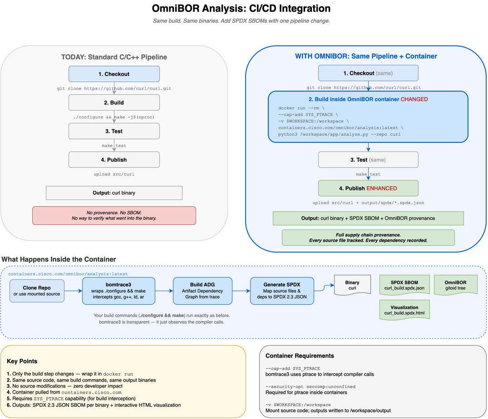

# CI/CD Integration Guide

How to add OmniBOR build provenance to an existing CI/CD pipeline.



---

## The One-Sentence Summary

Your build commands run **inside** the OmniBOR container instead of
directly on the CI agent. Everything else stays the same. You get the
same binaries **plus** SPDX SBOMs.

---

## Jenkins: Side-by-Side Comparison

### TODAY — Standard curl Build (Jenkinsfile)

```groovy
pipeline {
    agent { label 'linux' }

    stages {
        stage('Checkout') {
            steps {
                git url: 'https://github.com/curl/curl.git',
                    branch: 'curl-8_12_1'
            }
        }

        stage('Build') {
            steps {
                sh './configure'
                sh 'make -j$(nproc)'
            }
        }

        stage('Test') {
            steps {
                sh 'make test'
            }
        }

        stage('Publish') {
            steps {
                archiveArtifacts artifacts: 'src/curl'
            }
        }
    }
}
```

**Output:** `src/curl` binary. No provenance. No SBOM.

---

### WITH OMNIBOR — Same curl Build + SPDX SBOM (Jenkinsfile)

```groovy
pipeline {
    agent { label 'linux' }

    environment {
        OMNIBOR = 'containers.cisco.com/omnibor/analysis:latest'
    }

    stages {
        stage('Checkout') {                            // SAME
            steps {
                git url: 'https://github.com/curl/curl.git',
                    branch: 'curl-8_12_1'
            }
        }

        stage('Build') {                               // CHANGED
            steps {
                sh """
                    docker run --rm \\
                        --cap-add SYS_PTRACE \\
                        --security-opt seccomp:unconfined \\
                        -v \${WORKSPACE}:/workspace/repos/curl \\
                        -v \${WORKSPACE}/output:/workspace/output \\
                        \${OMNIBOR} \\
                        python3 /workspace/app/analyze.py \\
                            --repo curl --skip-clone
                """
            }
        }

        stage('Test') {                                // SAME
            steps {
                sh 'make test'
            }
        }

        stage('Publish') {                             // ENHANCED
            steps {
                archiveArtifacts artifacts: 'src/curl'
                archiveArtifacts artifacts: 'output/spdx/**/*.spdx.json'
            }
        }
    }
}
```

**Output:** `src/curl` binary **+** `curl_build.spdx.json` SBOM **+** `curl_build.spdx.html` visualization.

---

### What Changed?

| Stage | Standard | With OmniBOR | Delta |
|---|---|---|---|
| **Checkout** | `git clone` | `git clone` | None |
| **Build** | `./configure && make` | Same commands, inside container | Wrap in `docker run` |
| **Test** | `make test` | `make test` | None |
| **Publish** | Upload binary | Upload binary + SPDX JSON | Add one `archiveArtifacts` line |

**Total changes: 2 lines** — the build step wraps in `docker run`, and publish
adds the SPDX artifact.

---

## GitHub Actions: Side-by-Side Comparison

### TODAY — Standard curl Build

```yaml
name: Build curl

on: [push, pull_request]

jobs:
  build:
    runs-on: ubuntu-latest
    steps:
      - uses: actions/checkout@v4
        with:
          repository: curl/curl
          ref: curl-8_12_1

      - name: Build
        run: |
          ./configure
          make -j$(nproc)

      - name: Test
        run: make test

      - name: Upload binary
        uses: actions/upload-artifact@v4
        with:
          name: curl-binary
          path: src/curl
```

### WITH OMNIBOR — Same curl Build + SPDX SBOM

```yaml
name: Build curl with SBOM

on: [push, pull_request]

jobs:
  build:
    runs-on: ubuntu-latest
    steps:
      - uses: actions/checkout@v4                      # SAME
        with:
          repository: curl/curl
          ref: curl-8_12_1

      - name: Build with provenance                    # CHANGED
        run: |
          docker run --rm \
            --cap-add SYS_PTRACE \
            --security-opt seccomp:unconfined \
            -v ${{ github.workspace }}:/workspace/repos/curl \
            -v ${{ github.workspace }}/output:/workspace/output \
            containers.cisco.com/omnibor/analysis:latest \
            python3 /workspace/app/analyze.py \
              --repo curl --skip-clone

      - name: Test                                     # SAME
        run: make test

      - name: Upload binary                            # SAME
        uses: actions/upload-artifact@v4
        with:
          name: curl-binary
          path: src/curl

      - name: Upload SBOM                              # ADDED
        uses: actions/upload-artifact@v4
        with:
          name: spdx-sbom
          path: output/spdx/**/*.spdx.json
```

---

## What Happens Inside the Container

```
┌─────────────────────────────────────────────────────────────┐
│  containers.cisco.com/omnibor/analysis:latest               │
│                                                             │
│  1. Read config.yaml for build steps                        │
│     → ./configure                                           │
│     → make -j$(nproc)                                       │
│                                                             │
│  2. bomtrace3 wraps the build commands                      │
│     → Intercepts every gcc, g++, ld, ar invocation          │
│     → Records: which .c/.h files → which .o → which binary  │
│     → Zero overhead on build output (same binaries)         │
│                                                             │
│  3. Build Artifact Dependency Graph (ADG)                   │
│     → Maps every source file to its output binary           │
│     → Detects vendored libraries (e.g., bundled zlib)       │
│                                                             │
│  4. Generate SPDX 2.3 JSON                                  │
│     → Per-binary SBOM with SHA256 checksums                 │
│     → Source file inventory with GENERATED_FROM relations   │
│     → Interactive HTML visualization                        │
│                                                             │
│  Output written to mounted volume:                          │
│  /workspace/output/spdx/c-cpp/curl/2026-04-28_1234/         │
│    ├── curl_build.spdx.json                                 │
│    ├── curl_analyzed.spdx.json                              │
│    └── curl_build.spdx.html                                 │
└─────────────────────────────────────────────────────────────┘
```

## Container Requirements

| Flag | Required | Why |
|---|---|---|
| `--cap-add SYS_PTRACE` | Yes | `bomtrace3` uses `ptrace` to intercept compiler calls |
| `--security-opt seccomp:unconfined` | Yes | Default seccomp profile blocks `ptrace` |
| `-v source:/workspace/repos/<name>` | Yes | Mount source code into container |
| `-v output:/workspace/output` | Yes | Container writes SBOMs here |

## Configuration

The container reads `app/config.yaml` to know how to build each project:

```yaml
repos:
  curl:
    url: https://github.com/curl/curl.git
    branch: curl-8_12_1
    language: c-cpp
    build_steps:
      - ./configure
      - make -j$(nproc)
    clean_cmd: make clean
    output_binaries:
      - src/curl
```

- **`build_steps`** — your normal build commands (executed inside the container)
- **`output_binaries`** — which binaries to generate SBOMs for
- **`--skip-clone`** — use when source is already mounted (CI already checked it out)
