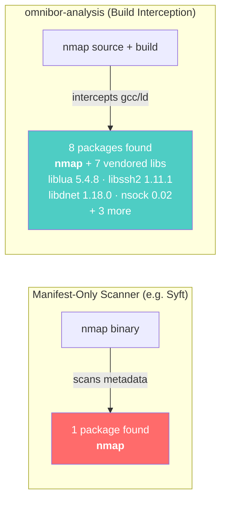
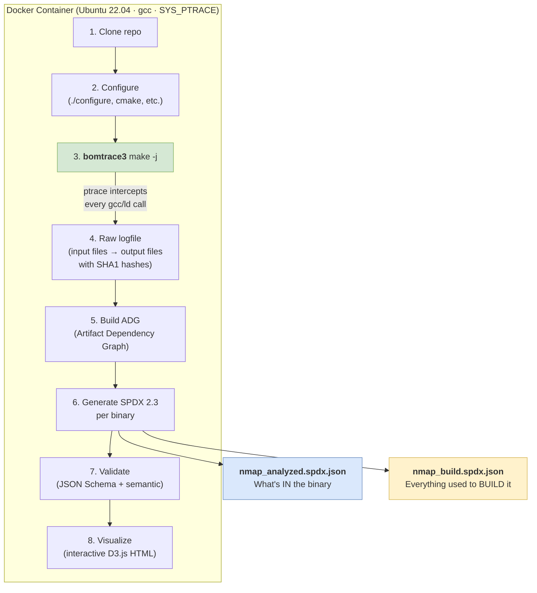
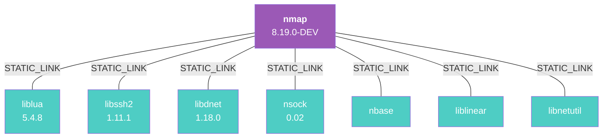

# omnibor-analysis: Build-Time SPDX SBOMs for C/C++

## The Problem: Manifest-Only SBOMs Miss What's Actually in Your Binary

Traditional SBOM generators (Syft, Trivy, BDBA) scan package manifests or binary
signatures. For C/C++ software, this approach has a fundamental gap: **vendored
libraries compiled directly into the binary are invisible to manifest scanners.**

When a project like nmap copies the source code for liblua, libssh2, and libdnet
into its own tree and statically links them, no package manager is involved. The
libraries become part of the binary — but no scanner knows they are there.



**This matters for security.** If liblua 5.4.8 has a CVE, a manifest-only SBOM
will never flag it — because it doesn't know liblua is inside nmap.

---

## How It Works: ptrace Build Interception

omnibor-analysis uses [OmniBOR/Bomsh](https://github.com/omnibor/bomsh) to
intercept every compiler and linker invocation during a real build via Linux
`ptrace`. This captures the ground truth of what source files produce what
binaries — not what a manifest says *should* be there, but what *actually is*.



---

## Two SBOMs Per Binary: Analyzed vs. Build

Following [CISA SBOM type taxonomy](https://www.cisa.gov/sbom), omnibor-analysis
produces **two** SPDX 2.3 JSON documents per binary artifact:

| | Analyzed SBOM | Build SBOM |
|---|---|---|
| **CISA Type** | Analyzed | Build |
| **Contains** | Only code compiled *into* the binary | Everything used to *produce* the binary |
| **Vendored libs** | Yes (STATIC_LINK) | Yes (STATIC_LINK) |
| **System .so libs** | No | Yes (DYNAMIC_LINK) |
| **Compiler (gcc)** | No | Yes (BUILD_TOOL_OF) |
| **Use case** | Vulnerability scanning, license compliance | Build reproducibility, supply chain audit |

### Why two files?

A vulnerability scanner using the **analyzed** SBOM gets zero false positives from
system libraries that are patched independently. A build auditor using the **build**
SBOM gets the complete picture for reproducibility. One file cannot serve both
audiences without confusion.

---

## Real Results: C/C++ Projects

### nmap — 7 vendored libraries detected



| SBOM Type | Packages | Versioned | Relationships |
|-----------|----------|-----------|---------------|
| **Analyzed** | 8 | 5 of 8 | 7 STATIC_LINK |
| **Build** | 23 | 20 of 23 | 7 STATIC_LINK + 14 DYNAMIC_LINK + 1 BUILD_TOOL_OF |

### redis — 8 vendored libraries detected

| Vendored Library | Version | Detection Strategy |
|-----------------|---------|-------------------|
| jemalloc | 5.3.0 | VERSION file |
| lua | 5.1.5 | `#define LUA_RELEASE "Lua 5.1.5"` |
| hiredis | 1.2.0 | `#define HIREDIS_MAJOR/MINOR/PATCH` |
| xxhash | 0.8.3 | `#define XXH_VERSION_MAJOR/MINOR/RELEASE` |
| linenoise | 1.0 | Header comment |
| fpconv | 1.0 | Header comment |
| fast_float | — | No standard version marker |
| hdr_histogram | — | No standard version marker |

| SBOM Type | Packages | Versioned | Relationships |
|-----------|----------|-----------|---------------|
| **Analyzed** (redis-server) | 9 | 7 of 9 | 8 STATIC_LINK |
| **Build** (redis-server) | 12 | 10 of 12 | 8 STATIC_LINK + 2 DYNAMIC_LINK + 1 BUILD_TOOL_OF |

### All C/C++ projects at a glance

| Project | Binaries | Analyzed Pkgs | Build Pkgs | Source Files Traced |
|---------|----------|---------------|------------|---------------------|
| **nmap** | nmap, ncat, nping | 8 each | 20-23 each | 404 |
| **redis** | redis-server, redis-cli | 9 each | 11-12 each | 272 |
| **curl** | curl, libcurl.so | 1 each | 5-12 each | 441 |
| **ffmpeg** | ffmpeg, ffprobe, 4 .so libs | 1 each | 4-14 each | 3,331 |

---

## Vendored Version Detection: 12 Strategies

C/C++ vendored libraries declare versions in ad-hoc ways. omnibor-analysis
implements 12 detection strategies, ordered most-reliable first:


**First match wins.** A VERSION file (most reliable) always beats a regex in a
Makefile (least reliable). Handles quoted strings (`"5"`), RELEASE/MICRO as PATCH
aliases, and flexible `lib` prefix stripping (`liblua` → `LUA_` prefix matching).

---

## Interactive Dependency Visualization

Every SPDX output includes a standalone HTML file with a **D3.js force-directed
dependency graph**:

- **Purple nodes** — root binary
- **Teal nodes** — vendored/static libraries (STATIC_LINK)
- **Red nodes** — dynamic system libraries (DYNAMIC_LINK)
- **Yellow nodes** — build tools (BUILD_TOOL_OF)
- **Node size** scales by source file count
- Click-to-highlight, search, zoom/pan — no server needed

<!-- TODO: Add screenshot of nmap_build.spdx.html visualization here -->
<!-- Export from: output/spdx/c-cpp/nmap/ latest timestamp /nmap_build.spdx.html -->
<!-- Save as: docs/architecture/images/nmap-build-visualization.png -->

---

## What Makes This Different

| Capability | Manifest Scanner (Syft/Trivy) | Binary Scanner (BDBA) | **omnibor-analysis** |
|------------|-------------------------------|----------------------|----------------------|
| Detects vendored C/C++ libs | No | Partial (signature match) | **Yes — from actual build** |
| Versions for vendored libs | No | Sometimes | **Yes — 12 strategies** |
| Cryptographic build provenance | No | No | **Yes — OmniBOR gitoid chain** |
| Source file → binary tracing | No | No | **Yes — every .c → .o → binary** |
| SPDX 2.3 compliant | Yes | Proprietary + export | **Yes — validated** |
| Distinguishes embedded vs. runtime | No | No | **Yes — Analyzed vs. Build SBOMs** |
| Works without source access | Yes | Yes | No — requires build |

---

## Architecture Summary

> **Workflow diagram:** Open [`omnibor-analysis-workflow.drawio`](omnibor-analysis-workflow.drawio)
> in [draw.io](https://app.diagrams.net/) for the full visual pipeline diagram.

```
Source code → bomtrace3 (ptrace) → raw logfile → OmniBOR ADG → SPDX 2.3 JSON
                                                                    ↓
                                                          Analyzed + Build SBOMs
                                                          + HTML visualization
                                                          + golden file regression tests
```

**Key components:**
- **bomtrace3** — modified strace that intercepts gcc/ld via ptrace
- **bomsh_create_bom.py** — builds the OmniBOR Artifact Dependency Graph
- **app/spdx/emitter.py** — generates per-binary SPDX with vendored detection
- **app/version_detection/** — 12-strategy vendored version detection
- **app/spdx_visualize.py** — D3.js interactive dependency graphs

**Quality gates:** 670 tests, 97% code coverage, golden file regression baselines
for all 18 C/C++ binary artifacts across 4 projects.

---

## References

- [OmniBOR Specification](https://omnibor.io)
- [omnibor/bomsh](https://github.com/omnibor/bomsh) — build interception toolchain
- [SPDX 2.3 Specification](https://spdx.github.io/spdx-spec/v2.3/)
- [CISA SBOM Types](https://www.cisa.gov/sbom) — Analyzed vs. Build taxonomy

---

*omnibor-analysis — [github.com/tedg-dev/omnibor-analysis](https://github.com/tedg-dev/omnibor-analysis)*
