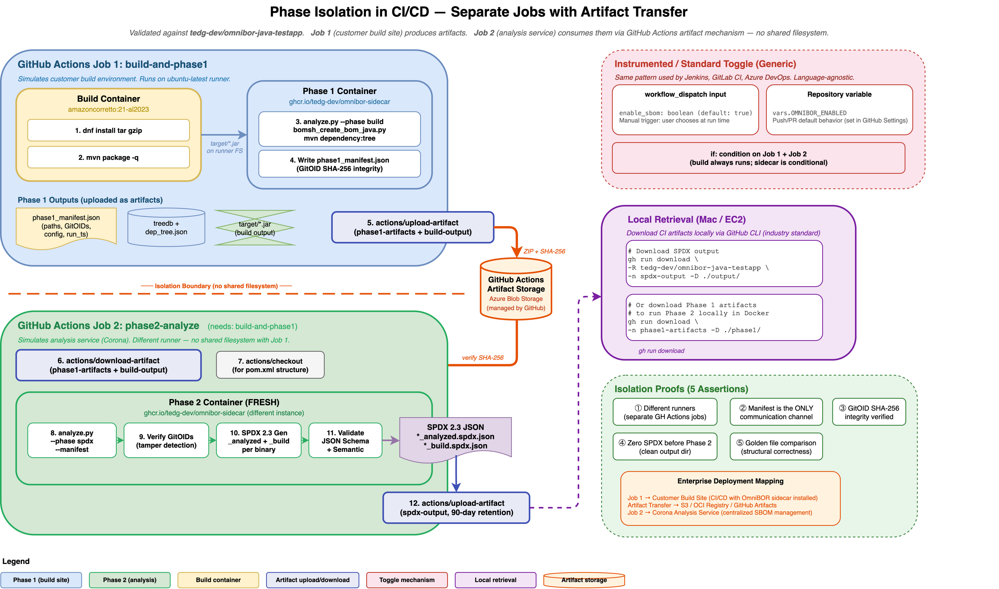
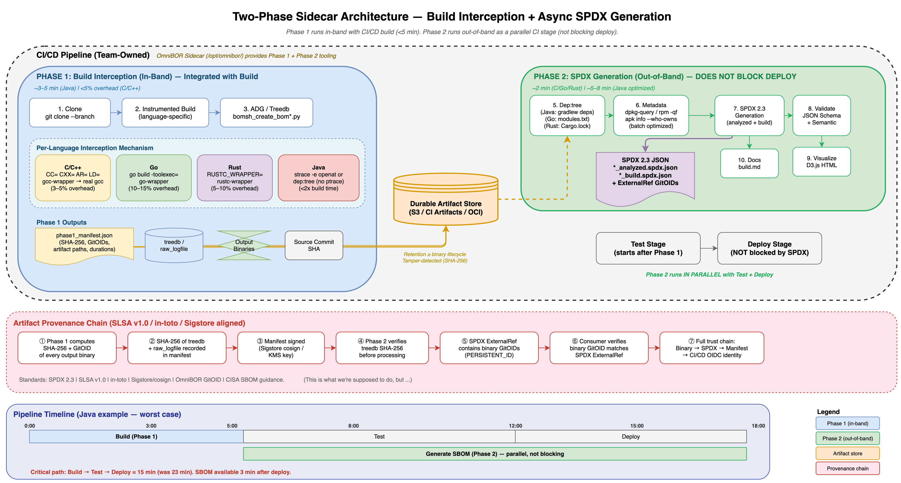

# Phase Isolation System Test

## Architecture Overview

<a href="phase-isolation-ci-cd.png"></a>

*Click image to enlarge. Source: [phase-isolation-ci-cd.drawio](phase-isolation-ci-cd.drawio)*

Shows the two-job CI/CD architecture: Job 1 (build + Phase 1) uploads
artifacts → Job 2 (Phase 2) downloads and generates SPDX. No shared
filesystem between jobs.

## Purpose

Proves that Phase 1 (build) and Phase 2 (SPDX generation) can run in
**completely separate execution contexts**, communicating only via:

1. The **manifest file** (`phase1_manifest.json`) — written by Phase 1,
   read by Phase 2
2. **Explicit artifact transfer** — Phase 1's build artifacts are
   uploaded and downloaded between contexts (no shared filesystem)

This validates the enterprise deployment model where Phase 1 runs in a
customer's build environment and Phase 2 runs in a separate analysis
service (e.g., Corona).

### Execution Patterns

| Pattern | Phase 1 | Artifact Transfer | Phase 2 | Use Case |
|---------|---------|-------------------|---------|----------|
| **Local Docker** | Container A | Shared volume | Container B | Development / validation |
| **CI/CD (GitHub Actions)** | Job 1 runner | `actions/upload-artifact` / `actions/download-artifact` | Job 2 runner | Automated pipeline |
| **Enterprise (Corona)** | Customer CI | S3 / OCI registry | Corona agent | Production deployment |

All three patterns use the same CLI interface (`--phase build`,
`--phase spdx --manifest <path>`) and the same manifest format.

## Location

- **Test script**: `scripts/run_phase_isolation_test.sh`
- **Phase 1 dispatch**: `app/pipeline/runners.py` → `_run_phase1_only()`
- **Phase 2 dispatch**: `app/pipeline/runners.py` → `_run_phase2_only()`
- **Manifest module**: `app/pipeline/manifest.py`
- **Unit tests**: `tests/test_phase_isolation.py` (13 tests)
- **Golden files**: `tests/golden/spdx/<lang>/<repo>/`
- **Comparison script**: `scripts/compare_golden.py`
- **Drawio source**: `docs/features/phase-isolation/phase-isolation-ci-cd.drawio`

## How It Works

### Phase 1 — Container A (build + manifest)

```bash
docker compose run --rm -T omnibor-sidecar \
  bash -c "echo CONTAINER_ID=\$(hostname) && \
    cd /workspace && python3 app/analyze.py \
    --repo <repo> --mode sidecar --phase build \
    --skip-clone"
```

1. Builds the repo inside a fresh sidecar container
2. Writes `phase1_manifest.json` to
   `output/omnibor/<lang>/<repo>/<ts>/`
3. The manifest includes:
   - `version` — manifest schema version (`"1.0"`)
   - `repo_name` — repository name
   - `language` — language string (e.g. `"java"`)
   - `mode` — execution mode (`"sidecar"`)
   - `tracer` — interception method used (e.g. `"maven-dep-tree"`)
   - `run_ts` — timestamp for consistent output directory naming
   - `commit_sha` — git commit of the target repo
   - `vcs_uri` — source repository URL
   - `artifacts` — paths to build outputs (`bom_dir`, `binaries`)
   - `paths` — directory paths (`repos_dir`, `output_dir`, `spdx_dir`)
   - `gitoids` — SHA-256 gitoid hashes for artifact integrity verification
   - `repo_cfg` — subset of `config.yaml` for Phase 2 (optional)
   - `omnibor_cfg` — OmniBOR tool configuration (optional)
4. Prints `[OK] Phase 1 manifest: <path>` to stdout
5. Container A exits and is removed (`--rm`)

### Manifest Discovery

The test script parses the Phase 1 log for:

```
Phase 1 manifest: /workspace/output/omnibor/<lang>/<repo>/<ts>/phase1_manifest.json
```

### Pre-Phase 2 Assertions

Before starting Container B, the test:

1. **Validates manifest exists** on the shared volume
2. **Logs manifest summary** (`run_ts`, `commit_sha`, gitoid count)
3. **Archives manifest** to the test log directory
4. **Deletes any pre-existing SPDX files** in the output directory
5. **Asserts zero SPDX files** exist — proving that any files found
   after Phase 2 were produced by Container B, not leftover from
   a prior run

### Phase 2 — Container B (SPDX generation)

```bash
docker compose run --rm -T omnibor-sidecar \
  bash -c "echo CONTAINER_ID=\$(hostname) && \
    cd /workspace && python3 app/analyze.py \
    --repo <repo> --mode sidecar --phase spdx \
    --manifest <path> --skip-clone"
```

1. A **fresh, separate** sidecar container starts (hostname captured)
2. Reads the manifest from the shared volume
3. Verifies artifact integrity via gitoid SHA-256 hashes
4. Reuses Phase 1's `run_ts` so all output goes to the same
   directory tree (see `run_ts` reuse below)
5. Runs full Phase 2 pipeline:
   - OmniBOR SBOM generation
   - Metadata collection
   - Per-binary SPDX generation (`_analyzed` + `_build`)
   - SPDX validation (JSON Schema + semantic)
   - Binary collection
6. Container B exits and is removed

### `run_ts` Reuse

When `--phase spdx` is used, `main()` reads the manifest early and
uses Phase 1's `run_ts` instead of generating a new timestamp. This
ensures SPDX output, docs, and runtime files all land in the same
directory tree as Phase 1's artifacts.

```python
if args.phase == "spdx" and args.manifest:
    _m = json.loads(Path(args.manifest).read_text())
    run_ts = _m.get("run_ts", timestamp())
else:
    run_ts = timestamp()
```

### Post-Phase 2 Proof Assertions

After Phase 2 completes, the test verifies five proofs:

| # | Proof | How |
|---|-------|-----|
| 1 | **Different containers** | Container A hostname ≠ Container B hostname |
| 2 | **Manifest is the communication channel** | Manifest file validated and archived between phases |
| 3 | **Artifact integrity preserved** | Phase 2 log contains `[OK] N artifact(s) verified via gitoid` |
| 4 | **SPDX produced by Phase 2 only** | Zero SPDX files before Phase 2; N files after |
| 5 | **Correct SPDX content** | Golden file comparison shows structural match |

If any proof fails, the test reports `[FAIL]` and exits non-zero.

### Golden File Comparison

After the proof assertions:

1. Reads `run_ts` from the manifest
2. Locates SPDX output at `output/spdx/<lang>/<repo>/<run_ts>/`
3. Compares against `tests/golden/spdx/<lang>/<repo>/`
   using `scripts/compare_golden.py`
4. Reports all differences (package counts, names, versions,
   relationships, added/removed entries)
5. Differences are **reported** but not treated as test failures
   (user decides whether to update golden files)

### Proof Summary Output

At the end of each repo test, a proof summary is printed:

```
[OK] jsoup: Phase isolation test PASSED

[INFO]   === Proof Summary ===
[INFO]   Container A (Phase 1): a1b2c3d4e5f6
[INFO]   Container B (Phase 2): f6e5d4c3b2a1
[INFO]   Containers differ: YES
[INFO]   Manifest written: /workspace/output/.../phase1_manifest.json
[INFO]   Gitoid verification: 3 artifacts
[INFO]   SPDX files produced: 2
[INFO]   Phase 1 wall time: 42s
[INFO]   Phase 2 wall time: 8s
[INFO]   Total wall time: 50s
[INFO]   Logs: /tmp/phase_isolation_test/jsoup/
```

### Timing Report

- Wall-clock time for Phase 1 and Phase 2 separately
- Internal timing extracted from pipeline logs
- Total combined time

## CI/CD Integration (GitHub Actions)

Phase isolation maps to GitHub Actions as **two separate jobs**
connected by artifact upload/download. This is the industry-standard
pattern for staged CI/CD pipelines (analogous to Jenkins parameterized
builds, GitLab CI stages, Azure DevOps pipeline stages).

### Job Structure

```
baseline          → always runs (standard build, timing reference)
build-and-phase1  → conditional: build + Phase 1 sidecar → upload artifacts
phase2-analyze    → conditional: download artifacts → Phase 2 → upload SPDX
```

### Instrumented / Standard Toggle

The sidecar jobs are controlled by a generic, language-agnostic toggle:

| Source | Mechanism | Scope |
|--------|-----------|-------|
| **Manual trigger** | `workflow_dispatch` input `enable_sbom` (boolean) | Per-run choice |
| **Default** | Repository variable `vars.OMNIBOR_ENABLED` | Push/PR triggers |

This is the same pattern used by Jenkins, GitLab CI, and Azure DevOps
for optional pipeline stages. The toggle has zero knowledge of language
or build system — it only controls whether sidecar jobs run.

### What Phase 2 Needs

Phase 2 runs in a separate GitHub Actions job (different runner,
no shared filesystem). It receives only:

| Data | Source | Why |
|------|--------|-----|
| `phase1_manifest.json` | Phase 1 artifact upload | Locates artifacts, carries config |
| `bomsh_omnibor_treedb` | Phase 1 artifact upload | Source→binary provenance chain |
| Language-specific deps | Phase 1 artifact upload | Dependency graph resolution |
| Build output binaries | Build artifact upload | Binary collection + SPDX fileInfo |
| Source tree | `actions/checkout` | Build system structure discovery |

> **Example (Java/Maven)**: deps = `dep_tree.json`, binaries = `target/*.jar`,
> structure = `pom.xml`. Other languages produce equivalent artifacts
> via their native dependency resolution tools.

### Local Retrieval

CI artifacts can be downloaded to a local Mac or EC2 via the GitHub
CLI (industry standard):

```bash
# Download SPDX output
gh run download <run-id> \
  -R <owner>/<repo> \
  -n spdx-output -D ./output/

# Download Phase 1 artifacts to run Phase 2 locally
gh run download <run-id> \
  -n phase1-artifacts -D ./phase1/
```

## Golden Files Available

Golden files exist under `tests/golden/spdx/<lang>/<repo>/` for all
supported languages. Each repo has `_analyzed` + `_build` SPDX pairs
per output binary.

| Language | Repo | Golden Files |
|----------|------|-------------|
| Java | jsoup | 2 |
| Java | checkstyle | 2 |
| Java | crawler4j | 2 |
| Java | dependency-check | 4 |
| Java | logging-log4j2 | 4 |
| Java | spring-boot | 6 |
| Java | bc-java | 4 |
| C/C++ | curl, ffmpeg, nmap, redis | 26 total |
| Go | lazygit | 2 total |
| Rust | oxipng, dura | 4 total |

## Usage

```bash
# Default: test jsoup (fast, ~1 min)
bash scripts/run_phase_isolation_test.sh

# Specific repo
bash scripts/run_phase_isolation_test.sh jsoup

# Multiple repos
bash scripts/run_phase_isolation_test.sh "jsoup checkstyle"
```

> **Note**: The test script currently hardcodes `java` in golden file
> and SPDX output paths. It only works for Java repos until the script
> is generalized to detect language from the manifest or config.

## Unit Tests

`tests/test_phase_isolation.py` contains 13 tests covering:

- **CLI validation**: `--phase` requires `--mode sidecar`,
  `--phase spdx` requires `--manifest`
- **Phase 1**: manifest writing, build failure handling
- **Phase 2**: manifest reading, missing manifest errors,
  tampered artifact warnings
- **Round-trip**: Phase 1 writes → Phase 2 reads → SPDX generated
- **`run_ts` reuse**: Phase 2 uses Phase 1's timestamp, not a new one

## Log Artifacts

All test logs are preserved in `/tmp/phase_isolation_test/<repo>/`:

| File | Contents |
|------|----------|
| `phase1.log` | Full Phase 1 stdout/stderr including container ID |
| `phase2.log` | Full Phase 2 stdout/stderr including container ID |
| `manifest.json` | Archived copy of the Phase 1 manifest |
| `golden_diff.log` | Golden file comparison output |

## Architecture Context

- **Standalone mode** always runs full pipeline (Phase 1 + Phase 2)
  in a single container. No phase split.
- **Sidecar mode** supports phase isolation: Phase 1 only, with
  Phase 2 running separately.
- Only sidecar mode is valid for `--phase build` or `--phase spdx`.

### Related Diagrams

<a href="sidecar-two-phase-corona-p1.png"></a>

*Click image to enlarge. Source: [sidecar-two-phase-corona.drawio](sidecar-two-phase-corona.drawio)*

**Two-Phase Sidecar Architecture** — General Phase 1/Phase 2 pipeline
with per-language interception, artifact store, and provenance chain.
