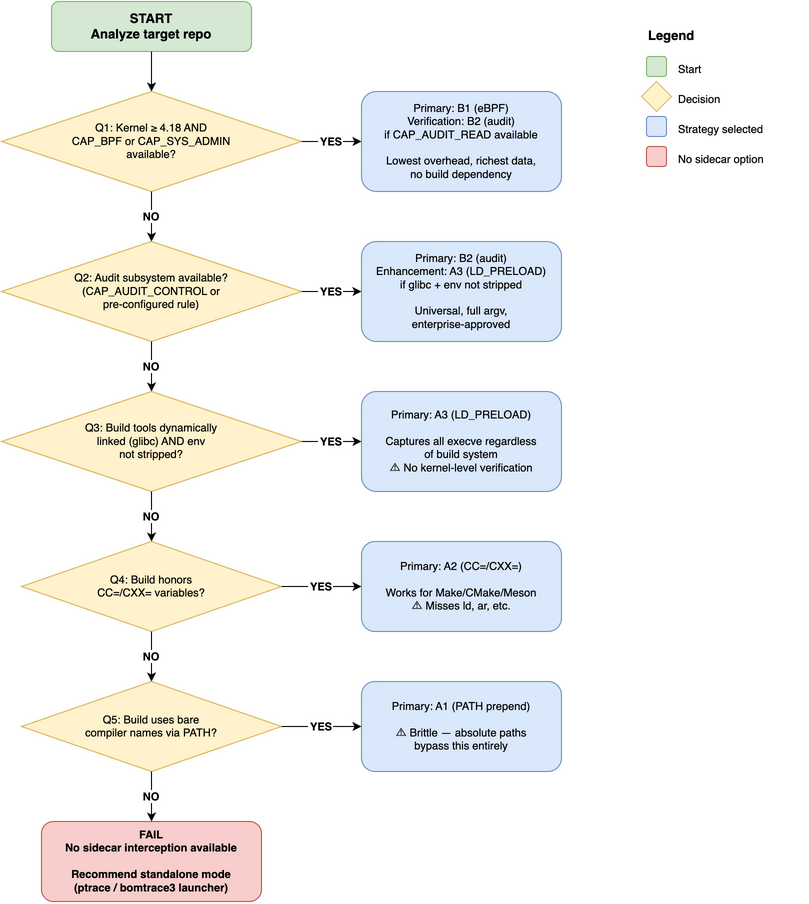

# C/C++ Sidecar Build Interception: Exhaustive Strategy Analysis

> **Date**: June 16, 2026
> 
> **Status**: Deep investigation — enterprise deployment scenarios
> 
> **Context**: Which observation-only interception approaches work for which combinations of build system, OS, and enterprise environment?

---

## Executive Summary

> **Reconciled 2026-07-23 — read `sidecar-design.md` as canonical.** This
> guide is the deep strategy *reference* (coverage matrices, OS/kernel
> landscape). Its original §8 ranked Linux audit as the "primary" tier; that
> ranking is **corrected** here. For the project's **ephemeral CI/CD
> build-step model** — matching the delivered, golden-clean Java sidecar —
> the primary tier is the **`LD_PRELOAD` shim injected via two pipeline-YAML
> env vars**, because it needs **no node-level capabilities or daemons**.
> Kernel observers (eBPF, audit) are **fallbacks** for `LD_PRELOAD`-blind
> builds on self-managed build nodes. `ptrace` is standalone-only, never a
> sidecar tier (see §1).

For true sidecar C/C++ build interception there are **two categories of
approach**: environment-level interception (`LD_PRELOAD`) and kernel-level
observation (eBPF, audit). Which is primary depends on the **deployment
model**:

- **Ephemeral CI/CD runner (the target here)** — an ephemeral runner cannot
  load a node daemon or add audit rules, so `LD_PRELOAD` (pipeline-YAML env
  vars) is the only portable sidecar mechanism, and is the **primary** tier.
- **Self-managed build farm (operator-owned nodes)** — kernel observers become
  available as **fallbacks** for the minority of builds that defeat
  `LD_PRELOAD` (statically-linked tools, musl/Alpine, `env -i`).

All seven strategies compared (assuming a **30-minute baseline build
with `make -j16`** on a 16-core machine, where `-jN` tells Make to run
up to N compilation jobs in parallel). Build-time overhead includes
**both** event capture **and** per-unit inline hashing of input/output
files — the complete cost added to the build step:

| Strategy | Category | Build-Time Overhead | Impact on 30-min Build | Scales with `-jN`? | Inline Hashing? |
|----------|----------|--------------------|-----------------------|-------------------|-----------------|
| **eBPF** | A (universal) | 1-3% | **+20-55 sec** | Yes — per-CPU BPF; per-unit hashing in userspace daemon | Yes — on `sched_process_exit` |
| **audit** | A (universal) | 2-5% | **+35 sec to +1.5 min** | Yes — kernel logs per-CPU; hashing in log consumer | Yes — on execve exit log entry |
| **fanotify** | A (universal) | 1-3% | **+20-55 sec** | Partial — single notification fd | Yes — but no argv (cannot identify input files) |
| `LD_PRELOAD` | B (limited) | 1-3% | **+20-55 sec** | Yes — per-process; hashing in exit handler | Yes — in interposed `_exit()`/`wait()` |
| `CC=`/`CXX=` | B (limited) | 1-3% | **+20-55 sec** | Yes — per-wrapper-process | Yes — wrapper hashes after compiler exits |
| PATH prepend | B (limited) | 1-3% | **+20-55 sec** | Yes — per-wrapper-process | Yes — wrapper hashes after compiler exits |

**Key insight**: Once per-unit inline hashing is accounted for, **all
strategies have similar build-time overhead** (1-3%). The event-capture
mechanism (kernel tracepoint vs. wrapper exec vs. `LD_PRELOAD`
interposition) adds negligible time compared to the per-unit file I/O
and SHA-256 hashing that all strategies must perform. The strategies
differ primarily in **applicability**, not overhead.

---

## Table of Contents

1. [Fundamental Constraint: True Sidecar Definition](#sidecar-constraint)
2. [Viable Strategies: Deep Analysis](#strategies)
3. [Enterprise Build System Landscape](#build-systems)
4. [Enterprise OS and Kernel Landscape](#os-constraints)
5. [Compatibility Matrix: Strategy × OS × Build System](#matrix)
6. [Devil's Advocate: Challenging Each Strategy](#devils-advocate)
7. [What Data Does Each Strategy Capture?](#data-capture)
8. [Recommendation](#recommendation)
9. [Strategy Classification — Full Catalog](#strategy-catalog)
10. [Appendix A: Strategy Selection Decision Framework](#appendix-a)
11. [Appendix B: Enterprise Adoption Data and Real-World Estimates](#appendix-b)
12. [Appendix C: Per-Invocation Behavior — What Actually Happens](#appendix-c)

---

<a id="sidecar-constraint"></a>

## 1. Fundamental Constraint: True Sidecar Definition

A true sidecar solution **CANNOT alter files or binaries on the build
host** — no replacing compilers, no modifying Makefiles, no changing
on-disk build scripts. The build host's code and tools remain untouched.

The sidecar has two categories of interception available. It can
attempt **environment-level overrides** (PATH, CC=, `LD_PRELOAD`) that
wrap build commands with observation logic — but these only work when
the build system cooperates, and many enterprise builds will ignore
or override them. The reliable approach is **kernel-level observation**
(eBPF, audit subsystem, fanotify), which captures all process
execution regardless of how the build is orchestrated.

### What the sidecar CAN and CANNOT do:

| Action | Allowed? | Rationale |
|--------|----------|-----------|
| Replace `/usr/bin/gcc` with a wrapper on disk | ❌ | Modifies build host filesystem |
| Modify Makefiles or build scripts on host | ❌ | Modifies build host code |
| Bind-mount over compiler binaries | ❌ | Modifies filesystem view permanently |
| Set `PATH` to prepend a wrapper directory | ✅ (limited) | Sidecar env override; real commands still execute |
| Set `CC=` / `CXX=` to a wrapper | ✅ (limited) | Sidecar env override; wrapper calls real compiler |
| Set `LD_PRELOAD` to an interposition library | ✅ (limited) | Sidecar env override; real commands still execute |
| Observe via kernel interfaces (eBPF, audit, fanotify) | ✅ (universal) | Pure observation, no modification |

> **Note on ptrace**: ptrace is NOT a sidecar option. It requires the
> tracer to be the **parent** of the traced process (`PTRACE_TRACEME`) or
> to attach from the same PID namespace with Yama `ptrace_scope=0` — a
> configuration most enterprises disable. A sidecar is neither the
> build's parent nor in the same PID namespace. ptrace is used in
> **standalone mode** (bomtrace3 wraps the build command) for
> development and testing only.

### Two Strategy Categories

**Category A: Kernel-level observation (universal applicability)**

The sidecar observes `execve()` events via kernel interfaces. Works
regardless of how the build invokes compilers — the build runs with
zero awareness of the sidecar.

**Category B: Environment-level interception (limited applicability)**

The sidecar injects environment overrides that add observation logic.
The actual build host commands still execute unmodified. Valid where
the build system respects the injected variables.

### Category B Fragility Warning

Environment-level strategies (PATH, CC=, `LD_PRELOAD`) work for a
**subset** of builds but are fragile in enterprise environments where
build orchestrations commonly override externally-set variables:

- Build scripts that hard-set PATH: `export PATH=/opt/toolchain/bin:/usr/bin:/bin`
- CI pipelines (Jenkins, TeamCity) that reset PATH at each stage
- Environment setup scripts: `source /opt/rh/devtoolset-9/enable` (overwrites PATH)
- Docker entrypoints with fixed PATH declarations
- Makefiles that export their own PATH: `export PATH := /specific/dirs`
- Recipes that invoke compilers by absolute path (`/usr/bin/gcc`)
- Nested shell invocations that inherit a sanitized environment
- Make's `override` directive that ignores command-line CC= overrides

These strategies work when the build cooperates; they fail silently
when it doesn't. Kernel-level observation is the universal fallback.

### All Viable Strategies

**Category A — Kernel Observation (universal):**

| Strategy | Mechanism | Works When | Build-Time Overhead |
|----------|-----------|-----------|---------------------|
| **eBPF tracepoints** | In-kernel BPF program on `sys_enter_execve` | Kernel 4.18+, `CAP_BPF` or `CAP_SYS_ADMIN` | 1-3% (event capture + inline hashing in userspace daemon) |
| **Linux audit subsystem** | Kernel logs all `execve` to audit log | `CAP_AUDIT_CONTROL` or pre-configured rules | 2-5% (event capture + log parsing + inline hashing) |
| **fanotify** | Kernel notifies on file exec events | Kernel 5.1+, `CAP_SYS_ADMIN` | 1-3% (but no argv — cannot identify input files for hashing) |

**Category B — Environment Interception (limited):**

| Strategy | Mechanism | Works When | Build-Time Overhead |
|----------|-----------|-----------|---------------------|
| PATH prepend | Wrapper dir first in PATH; wrapper calls real tool | Build uses bare `gcc` (PATH lookup) and doesn't override PATH | 1-3% (wrapper exec + inline hashing after compiler exits) |
| `CC=` / `CXX=` override | Wrapper script as CC; calls real compiler | Build uses `$(CC)` variable and doesn't use `override` | 1-3% (wrapper exec + inline hashing after compiler exits) |
| `LD_PRELOAD` | Shared lib intercepts `execve()` / `posix_spawn()` | Build tool is dynamically linked; doesn't unset `LD_PRELOAD` | 1-3% (interposition + inline hashing in exit handler) |

<a id="strategies"></a>

## 2. Viable Strategies: Deep Analysis

### Category A: Kernel-Level Observation

### 2.A.1 eBPF Tracepoints

**How it works**: A BPF program is loaded into the kernel and attached
to the `tracepoint/syscalls/sys_enter_execve` tracepoint. When any
process calls `execve`, the BPF program executes in-kernel, captures
data (PID, filename, partial argv), and writes to a ring buffer. A
userspace daemon reads the ring buffer asynchronously.

**The tracee is NEVER stopped.** The BPF program runs in the kernel's
syscall entry path with negligible overhead. The compiler process
continues executing without any delay.

| Aspect | Assessment |
|--------|-----------|
| **Modifies build?** | No — completely transparent |
| **Overhead** | <3% — BPF program runs in-kernel, no context switches |
| **Capability** | `CAP_BPF` + `CAP_PERFMON` (kernel 5.8+, released August 2, 2020) or `CAP_SYS_ADMIN` (4.18-5.7) |
| **Min kernel** | 4.18+ for tracepoint BPF programs (RHEL 8 baseline) |
| **Process model** | Per-CPU BPF execution + async userspace reader |
| **Data richness** | Moderate: filename + PID in-kernel; full argv from `/proc/PID/cmdline` |
| **Parallelism** | Native: BPF runs on each CPU independently |
| **Enterprise acceptance** | Variable — `CAP_BPF` is new; `CAP_SYS_ADMIN` is very sensitive |

**eBPF data capture limitations**:
- Cannot read full argv in-kernel (512-byte stack limit, variable-length arrays)
- Must read `/proc/PID/cmdline` from userspace (race: process may exit first)
- Cannot hash files in-kernel (must be done in userspace post-exit)
- Needs additional tracepoints for full picture: `sched_process_exit`,
  `sys_enter_openat` (for file I/O tracking)

### 2.A.2 Linux Audit Subsystem (auditd)

**How it works**: The kernel audit framework logs specified syscalls to
the audit log. Configure with:
```bash
auditctl -a always,exit -F arch=b64 -S execve -k build-interception
```

Every `execve` on the system is logged with full argv, working
directory, exit code, PID, PPID, and UID. The sidecar reads
`/var/log/audit/audit.log` or connects to the audit dispatcher.

**Key advantage**: auditd is **already deployed and approved** in most
enterprise Linux environments for security compliance (PCI-DSS, SOC 2,
FedRAMP). Adding an execve rule is a routine audit policy change, not
a new technology deployment.

| Aspect | Assessment |
|--------|-----------|
| **Modifies build?** | No — audit is pure observation |
| **Overhead** | 1-5% — kernel logs events asynchronously |
| **Capability** | `CAP_AUDIT_CONTROL` (to add rules) + `CAP_AUDIT_READ` (to read) |
| **Min kernel** | 2.6.6+ (effectively all enterprise Linux) |
| **Process model** | Kernel → audit buffer → auditd → log file/socket |
| **Data richness** | Excellent: full argv (unlimited length), cwd, uid, exit code, ppid |
| **Parallelism** | Native: kernel logs per-CPU, auditd serializes writing |
| **Enterprise acceptance** | **HIGH** — already approved for compliance in most orgs |

**Audit subsystem advantages for sidecar**:
- Already running on the build host (no new daemon to deploy)
- Security teams understand it (routine compliance tool)
- Full argv logged regardless of length (no 512-byte BPF limit)
- Works on ALL enterprise Linux versions (RHEL 6+, Ubuntu 14.04+)
- No need for `CAP_BPF` or `CAP_SYS_ADMIN`
- Produces structured log entries with all necessary context

**Audit subsystem challenges**:
- Must filter sidecar's view to only the build's process tree (noisy)
- Audit log is shared with security monitoring (may have retention policies)
- Adding/removing audit rules requires `CAP_AUDIT_CONTROL` (root-level)
- No file content hashing — only records the fact of execution
- High-volume builds generate large audit logs
- Audit backlog under heavy syscall load may drop events (`-b` buffer size)

### 2.A.3 fanotify (Filesystem Access Notification)

**How it works**: The `fanotify_init()` + `fanotify_mark()` API
registers interest in filesystem events. With `FAN_OPEN_EXEC_PERM`
(kernel 5.1+), the kernel notifies the monitoring process whenever a
file is opened for execution.

| Aspect | Assessment |
|--------|-----------|
| **Modifies build?** | No — pure observation (permission events can be auto-allowed) |
| **Overhead** | 1-3% — notification is async unless using permission events |
| **Capability** | `CAP_SYS_ADMIN` (always required for fanotify) |
| **Min kernel** | 5.1+ for `FAN_OPEN_EXEC_PERM`; 5.13+ for `FAN_REPORT_PIDFD` |
| **Process model** | Kernel → fanotify fd → userspace reader |
| **Data richness** | Limited: filename + PID + FD. No argv, no cwd, no exit code |
| **Parallelism** | Sequential notification (one fd to read) |
| **Enterprise acceptance** | Low — `CAP_SYS_ADMIN` required; less familiar to security teams |

**fanotify limitations for build interception**:
- **No argv capture**: knows THAT gcc ran, not WHAT it compiled
- Must combine with `/proc/PID/cmdline` reading (race condition)
- `CAP_SYS_ADMIN` is a very broad capability — enterprise security
  teams may reject it
- `FAN_OPEN_EXEC_PERM` can block the execve until the monitor responds
  (permission mode) — potential deadlock risk if monitor is slow
- `FAN_OPEN_EXEC` (notify-only, no permission) requires kernel 5.9+

---

### Category B: Environment-Level Interception

#### 2.B.1 PATH Prepend (Masquerade)

**How it works**: The sidecar creates wrapper scripts named `gcc`,
`g++`, `cc`, `c++`, `ld`, `ar` in a directory and prepends that
directory to PATH. When the build invokes `gcc` by name (without an
absolute path), the shell finds the wrapper first. The wrapper logs
the invocation, then calls the real compiler at its original path.

This is the **ccache masquerade** pattern — proven in production for
20+ years.

| Aspect | Assessment |
|--------|-----------|
| **Works when** | Build invokes compilers by bare name via PATH lookup |
| **Fails when** | Build uses absolute paths, overrides PATH, or uses `override CC` |
| **Overhead** | <1% — one extra exec per compilation |
| **Capability** | None — pure userspace |
| **Enterprise coverage** | **Limited** — many enterprise builds override PATH or use absolute paths |

#### 2.B.2 CC= / CXX= Override

**How it works**: The sidecar sets `CC=/sidecar/wrapper/gcc` and
`CXX=/sidecar/wrapper/g++`. The wrapper logs the invocation then
exec's the real compiler with the same arguments.

GNU Make variable precedence: command-line overrides > environment
(with `-e` flag or `?=` assignment) > Makefile assignment. So
`make CC=/wrapper/gcc` overrides most `CC=gcc` lines in Makefiles.

**Exception**: `override CC := /usr/bin/gcc` in a Makefile cannot be
overridden from the command line. This is rare but exists.

| Aspect | Assessment |
|--------|-----------|
| **Works when** | Build uses `$(CC)` variable with standard Make precedence |
| **Fails when** | Build uses `override`, hardcodes in recipes, or ignores CC entirely |
| **Overhead** | <1% |
| **Capability** | None |
| **Enterprise coverage** | **Moderate for autoconf/CMake projects; poor for legacy/custom builds** |

#### 2.B.3 `LD_PRELOAD` Interposition

**How it works**: The sidecar sets `LD_PRELOAD=/sidecar/libintercept.so`.
The shared library interposes on `execve()`, `execvp()`, and
`posix_spawn()` — logging every process spawn, then calling the real
libc function. This works regardless of whether the build uses `$(CC)`,
absolute paths, or PATH — it catches ALL process creation in dynamically
linked programs.

This is the **Bear** (Build EAR) pattern — the default on Linux for
generating `compile_commands.json`.

| Aspect | Assessment |
|--------|-----------|
| **Works when** | Build tools (make, shell, etc.) are dynamically linked |
| **Fails when** | Build tools are statically linked (e.g., Go-based build tools); musl libc (Alpine); programs that unset `LD_PRELOAD`; setuid binaries |
| **Overhead** | <1% — thin wrapper around libc calls |
| **Capability** | None |
| **Enterprise coverage** | **Good** — most build tools on glibc systems are dynamically linked. Catches absolute-path invocations that PATH/CC= miss. |
| **Key advantage** | Works even with absolute paths like `/opt/rh/devtoolset-9/root/usr/bin/gcc` |

**`LD_PRELOAD` is the strongest Category B strategy** because it operates
at the libc level — below the build system's variable/PATH handling.
If `make` is dynamically linked (it always is on glibc), `LD_PRELOAD`
will see every `execve` that `make` performs, regardless of whether
the Makefile uses `$(CC)` or hardcodes `/usr/bin/gcc`.

**Critical limitation**: If a build script does
`env -i /usr/bin/make` (clean environment) or if the child process
is spawned via a statically-linked intermediary, `LD_PRELOAD` will not
propagate.

---

<a id="build-systems"></a>

## 3. Enterprise Build System Landscape

Enterprise C/C++ projects use diverse build orchestration. None of
this diversity matters for kernel-level observation — **all builds
invoke compilers via `execve()`** regardless of how they get there.
This is why kernel-level interception is the only universal approach.

### 3.1 Build Systems and How They Invoke Compilers

| Build System | Age | Compiler Invocation | Prevalence |
|-------------|-----|--------------------|----|
| **GNU Make (raw)** | 40+ years | Recipe shell commands → `execve` | Very common |
| **GNU Make via autoconf** | 30+ years | `$(CC)` variable → `execve` | Very common (open-source) |
| **CMake → Make/Ninja** | 20+ years | Configured compiler path → `execve` | Common (modern) |
| **Ninja** | 12+ years | Commands from build.ninja → `execve` | Common (via CMake/Meson) |
| **Meson → Ninja** | 10+ years | Configured compiler → `execve` | Growing |
| **Bazel** | 10+ years | Sandboxed actions → `execve` in sandbox | Growing (Google ecosystem) |
| **Buck/Buck2** | 10+ years | Similar to Bazel | Moderate (Meta ecosystem) |
| **SCons** | 20+ years | Python calls subprocess → `execve` | Moderate |
| **Waf** | 15+ years | Python calls subprocess → `execve` | Moderate |
| **QMake** | 25+ years | Generated Makefile → `execve` | Moderate (Qt projects) |
| **Yocto/BitBake** | 20+ years | Recipe tasks → `execve` | Embedded Linux |
| **Buildroot** | 20+ years | Package Makefiles → `execve` | Embedded Linux |
| **ClearCase clearmake** | 30+ years | Proprietary make → `execve` | Legacy enterprise |
| **ElectricAccelerator (eMake)** | 20+ years | Distributed make → `execve` | Enterprise (CloudBees) |
| **IncrediBuild** | 20+ years | Distributed compilation → `execve` (local + remote) | Enterprise (Windows-origin) |
| **Custom shell scripts** | Infinite | Direct `gcc` calls → `execve` | Very common (enterprise) |
| **Proprietary in-house tools** | Variable | Unknown internals → `execve` | Enterprise |

**Key observation**: Every single build system, regardless of age,
architecture, or complexity, ultimately invokes the compiler via the
`execve()` system call. This is not a coincidence — it is a
fundamental property of Unix process creation. There is no other way
to run a program on Linux.

This means **any mechanism that observes `execve` will see every
compiler invocation**, regardless of:
- Whether the Makefile uses `$(CC)` or hardcodes `/usr/bin/gcc`
- Whether the build system is Make, Ninja, Bazel, or proprietary
- Whether the build is 30 years old or brand new
- Whether the build uses distributed compilation
- Whether the build spawns compilers directly or through wrapper layers

### 3.2 Enterprise Build Complexity Patterns

| Pattern | Description | Impact on Observation |
|---------|------------|---------------------|
| **Multi-layer orchestration** | CI → script → Make → compiler | No impact — kernel sees all execve's |
| **Distributed builds** | IncrediBuild/distcc farms | Only local execve's visible; remote compilations happen on other hosts |
| **Containerized builds** | Docker/Podman build containers | Sidecar must share PID namespace or run on host |
| **Cross-compilation** | ARM/MIPS target from x86 host | Kernel sees cross-compiler execve same as native |
| **Toolchain versioning** | devtoolset, Software Collections | Absolute paths like `/opt/rh/devtoolset-9/root/usr/bin/gcc` — still execve |
| **Parallel builds** | `make -j64` on 64-core machines | High event volume; kernel handles it, sidecar must keep up |
| **Incremental builds** | Only changed files recompiled | Fewer execve events to observe |
| **Unity/amalgamation builds** | All sources in one TU | Very few compiler invocations (possibly just one) |

### 3.3 Distributed Build Problem

The one scenario where kernel-level observation has a fundamental
gap: **distributed builds where compilation happens on remote hosts**.

| Tool | Local Observation Sees | Remote (Missing) |
|------|----------------------|-----------------|
| **distcc** | `distcc gcc -c foo.c` on coordinator | Actual `gcc` on remote agent |
| **IncrediBuild** | Build coordinator commands | Compilation on remote agents |
| **icecream/icecc** | Client-side distribution | Remote compilation |
| **Bazel Remote Execution** | Local action spawning | Remote workers |

For distributed builds, the sidecar would need an agent on each
build node, or it would observe only the coordinator's actions.

---

<a id="os-constraints"></a>

## 4. Enterprise OS and Kernel Landscape

### 4.1 OS Version Distribution in Enterprise C/C++ Build Environments

| OS | Kernel | eBPF Tracepoints | `CAP_BPF` | Audit | fanotify (exec) | Still in Use |
|----|--------|-----------------|---------|-------|----------------|-------------|
| **RHEL 7** | 3.10 | ❌ | ❌ | ✅ | ❌ | Yes (ELS until 2028) |
| **RHEL 8** | 4.18 | ✅ (backported) | ❌ (needs `SYS_ADMIN`) | ✅ | ❌ (kernel too old) | Yes (until 2029) |
| **RHEL 9** | 5.14 | ✅ | ✅ | ✅ | ✅ | Yes (until 2032) |
| **Ubuntu 18.04** | 4.15 | ❌ (too old) | ❌ | ✅ | ❌ | ESM only |
| **Ubuntu 20.04** | 5.4 | ✅ (needs `SYS_ADMIN`) | ❌ | ✅ | ✅ (5.1+) | Yes (ESM 2030) |
| **Ubuntu 22.04** | 5.15 | ✅ | ✅ | ✅ | ✅ | Yes (2027) |
| **Ubuntu 24.04** | 6.8 | ✅ | ✅ | ✅ | ✅ | Yes (2029) |
| **SLES 12** | 4.4 | ❌ | ❌ | ✅ | ❌ | LTSS (legacy) |
| **SLES 15** | 5.3+ | ✅ (needs `SYS_ADMIN`) | ❌ | ✅ | ✅ | Yes |
| **Amazon Linux 2** | 4.14/5.10 | ✅ (5.10 AMI) | ❌/✅ | ✅ | ✅ (5.10) | Yes (2025 EOL) |
| **Amazon Linux 2023** | 6.1 | ✅ | ✅ | ✅ | ✅ | Yes |
| **CentOS 7** | 3.10 | ❌ | ❌ | ✅ | ❌ | EOL (still in use) |

### 4.2 Universal Coverage Analysis

| Sidecar Strategy | Covers RHEL 7? | Covers RHEL 8? | Covers RHEL 9? | Covers ALL enterprise Linux? |
|-----------------|---------------|---------------|---------------|----------------------------|
| **`LD_PRELOAD`** | ✅ (glibc) | ✅ (glibc) | ✅ (glibc) | YES on glibc — fails on musl (Alpine) and env-stripped builds |
| **eBPF** | ❌ | ✅ (with `CAP_SYS_ADMIN`) | ✅ | No — RHEL 7, older SLES, Ubuntu 18.04 excluded |
| **audit** | ✅ | ✅ | ✅ | **YES — works on every enterprise Linux** |
| **fanotify** | ❌ | ❌ | ✅ | No — only kernel 5.1+ (RHEL 9, Ubuntu 20.04+) |

*ptrace omitted — not sidecar-viable (requires launcher/parent model)*

**For sidecar, only audit provides truly universal coverage.** `LD_PRELOAD`
covers most glibc-based systems but can fail silently. The combination
of `LD_PRELOAD` + audit provides the best coverage with the lowest
overhead: `LD_PRELOAD` for primary interception, audit as verification.

### 4.3 Security Policy Constraints on Customer Build Machines

*ptrace omitted — not sidecar-viable (see §1.1)*

| Constraint | Blocks `LD_PRELOAD`? | Blocks eBPF? | Blocks audit? | Blocks fanotify? |
|-----------|-------------------|-------------|--------------|-----------------|
| No capabilities granted | No (none needed) | **YES** | Blocks rule add | **YES** |
| No `CAP_SYS_ADMIN` | No | **YES** (kernel <5.8) | No | **YES** |
| No `CAP_BPF` | No | **YES** (kernel 5.8+) | No | No |
| SELinux enforcing | Unlikely | Maybe | Unlikely (audit is SELinux-integrated) | Maybe |
| Seccomp deny `bpf()` | No | **YES** | No | No |
| AppArmor restrictive | Maybe | Maybe | Unlikely | Maybe |
| No root access | No | Blocks load | Blocks rule add | **YES** |
| Build strips env (`env -i`) | **YES** | No | No | No |
| Static build tools (musl) | **YES** | No | No | No |
| Audit already in use | No | No | **Possible conflict** | No |

---

<a id="matrix"></a>

## 5. Compatibility Matrix: Strategy × OS × Build System

Since all build systems ultimately call `execve()`, the build system
dimension is irrelevant for kernel-level observation. The real matrix
is **Sidecar Strategy × OS × Security Policy** (ptrace excluded —
not sidecar-viable):

| Scenario | `LD_PRELOAD` | eBPF | audit | fanotify |
|----------|-----------|------|-------|----------|
| RHEL 7, glibc | ✅ | ❌ | ✅ | ❌ |
| RHEL 7, static build tools | ❌ | ❌ | ✅ | ❌ |
| RHEL 8, `CAP_SYS_ADMIN` granted | ✅ | ✅ | ✅ | ❌ |
| RHEL 8, no `SYS_ADMIN` | ✅ | ❌ | ✅ | ❌ |
| RHEL 9, `CAP_BPF` granted | ✅ | ✅ | ✅ | ✅ |
| RHEL 9, no caps granted | ✅* | ❌ | ✅** | ❌ |
| Ubuntu 20.04, `CAP_SYS_ADMIN` granted | ✅ | ✅ | ✅ | ✅ |
| Ubuntu 22.04+, `CAP_BPF` granted | ✅ | ✅ | ✅ | ✅ |
| Any Linux, only `CAP_AUDIT_CONTROL` | ✅* | ❌ | ✅ | ❌ |
| Alpine (musl libc) | ❌ | ✅ (if caps) | ✅ | ✅ (if caps) |
| Fully locked down (no caps, env stripped) | ❌ | ❌ | ❌ | ❌ |

*\* `LD_PRELOAD` needs no capabilities but may fail if the build strips
the environment or uses statically-linked tools*

*\*\* audit rules may already be configured by security team; sidecar
only needs read access to audit log (`CAP_AUDIT_READ`)*

**The audit subsystem is the ONLY kernel-level strategy that works in
the most restrictive enterprise environments** (where no BPF and no
`SYS_ADMIN` are granted). `LD_PRELOAD` is the only **zero-capability**
option but depends on the build not stripping the environment.

---

<a id="devils-advocate"></a>

## 6. Devil's Advocate: Challenging Each Strategy

### 6.1 Challenging eBPF

**Claim**: eBPF provides near-zero overhead transparent observation.

**Counter-arguments**:
- **Capability requirements are HIGH**: `CAP_SYS_ADMIN` on RHEL 8
  (the most common current enterprise Linux). Enterprise security teams
  treat this as effectively root access.
- **Not available on RHEL 7**: Still in use under Extended Life Support.
  Any customer on RHEL 7 cannot use eBPF.
- **SELinux may block bpf() syscall**: RHEL's default SELinux policy
  may deny the `bpf()` syscall for non-system processes.
- **BPF verifier rejects complex programs**: The kernel verifier is
  strict — loops, large stack usage, and complex control flow may be
  rejected. Building a reliable interception program is non-trivial.
- **argv capture is incomplete in-kernel**: The BPF stack is 512 bytes.
  Cannot read full argv arrays of unknown length. Must fall back to
  `/proc/PID/cmdline` from userspace — but the process may have already
  exited by the time userspace reads it.
- **Limited production precedent for SBOM**: `build-observer` from the
  sbom-observer project (https://github.com/sbom-observer/build-observer)
  is an open-source, Apache 2.0, government-funded tool that uses eBPF
  for build interception to generate SBOMs. It requires root for eBPF
  load (then drops privileges), targets Linux 5.8+, and produces
  **CycloneDX** (not SPDX). Its existence validates the eBPF approach
  as production-viable, though an adapter layer would be needed for
  our SPDX 2.3 pipeline.
- **Kernel version fragmentation**: BPF features vary significantly
  between 4.18 and 6.8. Must use CO-RE (Compile Once, Run Everywhere)
  or ship multiple BPF programs.
- **Ring buffer overflow**: Under heavy build load (`make -j64` on
  large projects), the ring buffer may overflow and drop events if
  the userspace daemon cannot keep up.

**Verdict**: eBPF is the optimal long-term solution for newer kernels
but has significant deployment barriers on current enterprise Linux
(RHEL 8 capability requirements, RHEL 7 exclusion, SELinux).

### 6.2 Challenging Linux Audit

**Claim**: Audit is universally available and already approved.

**Counter-arguments**:
- **Noise**: Audit logs ALL execve on the system, not just the build.
  The sidecar must filter by process tree (PPID tracking) to isolate
  build events from system activity.
- **Audit rule conflicts**: If the security team already has execve
  audit rules, adding another may conflict or exceed the rule limit.
- **Audit backlog drops**: Under extreme syscall load, the audit buffer
  may fill and drop events. The default buffer (`-b 8192`) may be
  insufficient for `make -j64` on large projects. Increasing it
  requires root.
- **`CAP_AUDIT_CONTROL` to add rules**: The sidecar needs this capability
  to add the execve audit rule. If the security team pre-configures
  the rule, the sidecar only needs `CAP_AUDIT_READ`.
- **No file hashing**: Audit only logs the FACT of execution and its
  arguments. It does not hash input/output files. The sidecar must
  independently discover and hash files post-build.
- **Log parsing complexity**: Audit log format is multi-line, encoded,
  and requires decoding (hex-encoded argv for long commands).
- **Shared resource**: The audit log is a shared system resource. The
  sidecar must not interfere with security monitoring that depends on it.
- **Latency**: Audit events are written asynchronously. There may be a
  delay between execve and the event appearing in the log.

**Verdict**: Audit has the best enterprise acceptance profile but
requires careful engineering (process tree filtering, buffer tuning,
shared resource management). It captures metadata only — not file
content hashes.

### 6.3 Challenging fanotify

**Claim**: fanotify provides lightweight exec monitoring.

**Counter-arguments**:
- **Requires `CAP_SYS_ADMIN`**: The broadest, most sensitive capability.
  If the enterprise won't grant `CAP_BPF`, they certainly won't grant
  `CAP_SYS_ADMIN`.
- **No argv capture**: fanotify reports THAT a file was executed, not
  what arguments it received. Useless for knowing which `.c` file was
  compiled into which `.o` file.
- **Kernel 5.1+ for FAN_OPEN_EXEC_PERM**: Excludes RHEL 7, RHEL 8,
  Ubuntu 18.04, SLES 12.
- **Permission events can block the build**: If using `FAN_OPEN_EXEC_PERM`,
  the kernel blocks the exec until the monitor responds. If the sidecar
  is slow or crashes, the build hangs.
- **System-wide scope**: Like audit, fanotify monitors all execs on the
  filesystem/mount, not just the build. Must filter by PID.
- **Less data than audit**: Audit provides full argv, cwd, uid, ppid.
  fanotify provides only the filename and PID.

**Verdict**: fanotify is **the weakest option** for build interception.
It provides less data than audit, requires a more sensitive capability,
and has narrower kernel support. Eliminate from consideration.

---

<a id="data-capture"></a>

## 7. What Data Does Each Strategy Capture?

For build interception to produce an SPDX SBOM, the sidecar needs:

| Required Data | `LD_PRELOAD` | eBPF | audit | fanotify |
|---------------|-----------|------|-------|----------|
| **Program path** (e.g., `/usr/bin/gcc`) | ✅ | ✅ | ✅ | ✅ |
| **Full argv** (e.g., `gcc -c -o foo.o foo.c`) | ✅ | ⚠️ race | ✅ | ❌ |
| **Working directory** | ✅ | ⚠️ via /proc | ✅ | ❌ |
| **PID / PPID** (process tree reconstruction) | ✅ | ✅ | ✅ | ✅ (PID only) |
| **Exit code** | ✅ (via wait) | ✅ | ✅ | ❌ |
| **Timestamp** | ✅ | ✅ | ✅ | ✅ |
| **Input files** (which .c was compiled) | ✅ (from argv) | ⚠️ | ✅ (from argv) | ❌ |
| **Output files** (which .o was produced) | ✅ (from argv) | ⚠️ | ✅ (from argv) | ❌ |
| **File content hashing** (gitoid) | ❌ (post-build) | ❌ (post-build) | ❌ (post-build) | ❌ (post-build) |
| **Parent/child relationships** | ✅ | ✅ | ✅ | ❌ |

**For SPDX generation, we need argv** to determine input→output file
mappings. This eliminates fanotify. The remaining sidecar options are:

- **`LD_PRELOAD`**: Full data, near-zero overhead — but limited applicability
- **eBPF**: Full data possible but races on argv/cwd capture
- **audit**: Full data including argv — enterprise-friendly, universal

---

<a id="recommendation"></a>

## 8. Recommendation: Tiered Strategy

The recommended tiering follows the **deployment model** (see the Executive
Summary). For the project's ephemeral CI/CD build-step target — matching the
delivered Java sidecar — `LD_PRELOAD` is primary; kernel observers are
fallbacks for the minority of builds it cannot see, on self-managed nodes.

### Tier 1: `LD_PRELOAD` shim (Primary — portable, zero node infra)

- Deploys as **two pipeline-YAML env vars** (`LD_PRELOAD` + a config-driven
  capture/raw-logfile path) before the **unchanged** build command — the
  only sidecar mechanism that needs **no** node-level capability or daemon,
  so it works in ephemeral hosted runners.
- Captures full argv directly at `execve`/`posix_spawn`; hashes inputs and
  outputs inline in the exit handler (blocks the build only minimally).
- Covers ~80–90% of enterprise builds (all dynamically-linked, glibc,
  environment-propagating builds), independent of `$(CC)` vs hardcoded `gcc`.
- **Proven**: this is exactly the delivered, golden-clean Java sidecar
  pattern (`../java/reference/inline-hashing-interception-design.md`).

**Fails when**: statically-linked build tools, musl libc/Alpine, or builds
that run `env -i`/unset `LD_PRELOAD`. Those fall through to a kernel observer.

### Tier 2: eBPF node observer (Fallback — optimal on self-managed nodes)

- Near-zero build impact (tracee never paused; hashing async in the daemon).
- Requires `CAP_BPF` + `CAP_PERFMON` (kernel 5.8+) or `CAP_SYS_ADMIN`;
  excludes RHEL 7. Needs a privileged node daemon — **not** available in an
  ephemeral hosted runner.
- `sched_process_exit` doubles as reliable build-completion detection.

**Implementation**: Load BPF on `sys_enter_execve` + `sched_process_exit`;
read `/proc/PID/cmdline` before the process exits.

### Tier 3: Linux audit (Fallback — universal on self-managed Linux)

- Works on **every** self-managed enterprise Linux (RHEL 7+, no `CAP_BPF`);
  usually already approved for compliance. Captures full argv (no race).
- Higher overhead (+2–5%), system-wide noise (filter by process tree), and
  audit-buffer tuning under `-j64`. Needs `CAP_AUDIT_READ` (and
  `CAP_AUDIT_CONTROL` unless the rule is pre-configured) — node-level, so
  not available in an ephemeral hosted runner.

**Implementation**: Add an `execve` audit rule scoped to the build session;
parse the log; reconstruct the process tree from PPID; hash files in the
post-build capture window.

### Standalone escape hatch: `ptrace` (not a sidecar tier)

For hermetic builds that defeat every sidecar tier, drop the repo into
standalone mode (`bomtrace3`). `ptrace` is **not** sidecar-viable (§1).

### Strategy Selection Logic

The sidecar should auto-detect capabilities and select the best
available strategy. Category A and B can be **combined** — use
`LD_PRELOAD` for low-overhead interception plus audit/eBPF as a
verification layer to catch anything `LD_PRELOAD` missed.

```text
# Primary selection (best single strategy):
if LD_PRELOAD viable (glibc system, build tools dynamically linked):
    use LD_PRELOAD (Category B — lowest overhead, no caps needed)
    optionally combine with audit for verification
elif kernel >= 5.8 AND CAP_BPF available:
    use eBPF (Category A — near-zero overhead)
elif kernel >= 4.18 AND CAP_SYS_ADMIN available:
    use eBPF with CAP_SYS_ADMIN (Category A, legacy path)
elif CAP_AUDIT_CONTROL available OR execve audit rule pre-configured:
    use audit (Category A — universal)
else:
    FAIL: no sidecar interception available — report to user
    # ptrace is NOT an option here; it requires launcher (standalone) mode
```

### Per-Unit Inline Hashing (Architecturally Mandatory)

Build interception's core value is capturing the **exact content** of
input and output files at the moment each compilation unit completes.
This is what makes build interception superior to static-analysis SBOM
tools — it provides cryptographic proof that *this exact source file*
produced *this exact object file*.

**Hashing cannot be deferred to a post-build batch phase — for two
independent reasons:**

1. **The workspace is destroyed after the build stage exits.** In all
   modern enterprise CI/CD platforms (GitHub Actions, GitLab CI, Jenkins
   with Kubernetes agents, Harness CI), the build runs in an ephemeral
   VM, container, or pod that is **destroyed immediately** when the
   build stage completes. Source files, object files, intermediate
   artifacts — all gone. There is nothing left to hash. See
   [CI/CD Workspace Lifecycle](../cicd-workspace-lifecycle.md) for the
   full industry analysis.

2. **Phase 2 runs in a different process with no filesystem access.**
   Per the [phase isolation architecture](../infrastructure.md),
   Phase 2 (SPDX generation) runs in a separate container, host, or
   Corona daemon. It communicates with Phase 1 exclusively through
   `phase1_manifest.json` and the treedb. Phase 2 **cannot read source
   files or object files** — they no longer exist.

The inline hash at completion of each compilation unit IS the proof of
provenance. It is the **only opportunity** to capture file content —
the files will not exist later.

**Per-unit hashing sequence** (applies to all strategies):

1. Compilation unit completes (e.g., `gcc -c -o foo.o foo.c` exits)
2. Interception detects the exit (via hook script, `LD_PRELOAD` exit
   handler, eBPF `sched_process_exit`, or audit log entry)
3. Hash all **input files** referenced in the command argv (`.c`,
   `.h` includes from `-I` paths or `.d` dependency file)
4. Hash all **output files** (`.o`, `.a`, `.so`, binary)
5. Write the hash record to the treedb / ADG
6. Overall build continues — other parallel compilation units are
   unaffected

**In the standalone (ptrace) mode**, this is exactly what
`bomsh_hook2.py` does — bomtrace3 invokes it after each traced
process exits, and it hashes input/output files inline.

**For sidecar strategies**, the same per-unit hashing pattern applies.
The trigger mechanism differs by strategy, but the hashing work is
identical. See [Appendix C](#appendix-c) for the detailed
per-invocation sequence for each strategy.

**Per-unit hashing overhead is small** because:

- Source files are typically 10-50 KB; SHA-256 at ~1 GB/s = ~50 μs
- Output `.o` files are typically 50-500 KB = ~500 μs
- Files are in the page cache (just read/written by the compiler)
- Hashing runs in the same parallel slot as the compilation — no
  shared bottleneck across `-jN` jobs
- For 10,000 compilation units at `-j16`: ~20-60 seconds wall time
  added to a 30-minute build (1-3% overhead)

### Performance Scaling with Parallelism

The CI/CD impact is heavily influenced by build parallelism (`-jN`).
Enterprise build machines are typically 16-64 cores running highly
parallel builds. This is where the strategies diverge most sharply:

**Example: Large C project (10,000 .c files, 30-min baseline at -j16)**

All times include **both** event capture **and** per-unit inline
hashing (SHA-256 of input/output files after each compilation unit):

| Strategy | -j1 Impact | -j16 Impact | -j64 Impact | Why |
|----------|-----------|------------|------------|-----|
| `LD_PRELOAD` | +50 sec | +20 sec | +15 sec | Per-process hashing; parallelizes with `-jN` |
| PATH/CC= | +50 sec | +20 sec | +15 sec | Per-process hashing; parallelizes with `-jN` |
| eBPF | +55 sec | +25 sec | +20 sec | Per-CPU event capture + async userspace hashing |
| audit | +60 sec | +35 sec | +25 sec | Per-CPU logging + parsing + hashing; audit buffer contention at scale |
| ptrace (standalone only) | +3.5 min | +8.5 min | **+25 min** | **Not sidecar-viable; shown for comparison** |

**Why all sidecar strategies converge at `-j16`+**: The per-unit
hashing cost (~2-5 ms per compilation unit including file I/O + SHA)
is the dominant overhead for all strategies. The event-capture
mechanism (BPF tracepoint vs. wrapper exec vs. `LD_PRELOAD`
interposition) adds only microseconds. Since hashing runs in parallel
across `-jN` jobs, higher parallelism amortizes the cost.

**Why ptrace is dramatically worse**: Every traced syscall stops the
tracee process and context-switches to the single tracer thread. With
`-j64`, 64 compiler processes compete for one tracer. The tracer
serializes all events, effectively limiting parallelism. The build
machine's cores sit idle waiting for the tracer to process events.
The per-unit hashing also runs through the single tracer thread.

### Total CI/CD Pipeline Impact

Build interception (event capture + inline hashing) adds time to only
the **build step** of CI/CD. Typical enterprise C/C++ CI/CD pipeline
time distribution:

| Step | % of Total | Interception Impact |
|------|-----------|---------------------|
| Checkout/SCM | 5-10% | None |
| Configure | 5-15% | None |
| **Build** | **40-60%** | **1-3% overhead (event capture + inline hashing)** |
| Test | 20-30% | None |
| Package | 5-10% | None |
| Deploy | 5-10% | None |

So a 1-3% build overhead on a step that's 50% of CI/CD =
**~0.5-1.5% total pipeline overhead**.

For ptrace at 40% build overhead on the 50% build step = **~20%
total pipeline overhead** — engineering teams will notice and complain.

---

<a id="strategy-catalog"></a>

## 9. Strategy Classification — Full Catalog

### Valid for Sidecar (Category A — Universal)

| Strategy | How Sidecar Uses It | Works When | Fails When |
|----------|-------------------|-----------|-----------|
| ptrace | **NOT sidecar viable** — requires launcher/parent model | Standalone mode only (bomtrace3 wraps build) | Sidecar: separate PID namespace, Yama `ptrace_scope` blocks attach |
| eBPF | Sidecar loads BPF program on tracepoints | Kernel 4.18+, capability granted | RHEL 7, no `CAP_BPF`/`SYS_ADMIN`, SELinux |
| audit | Sidecar reads audit log for execve events | Any Linux, audit rule configured | Audit disabled, buffer overflow under load |
| fanotify | Sidecar monitors exec events via fanotify fd | Kernel 5.1+, `CAP_SYS_ADMIN` | No argv data, older kernels |

### Valid for Sidecar (Category B — Limited Applicability)

| Strategy | How Sidecar Uses It | Works When | Fails When |
|----------|-------------------|-----------|-----------|
| PATH prepend | Sidecar creates wrapper dir, prepends to PATH | Build uses bare `gcc` via PATH lookup | Build overrides PATH or uses absolute paths |
| `CC=` / `CXX=` override | Sidecar sets CC to wrapper that calls real compiler | Build uses `$(CC)` variable | Build hardcodes compiler, uses `override`, or ignores env |
| `LD_PRELOAD` | Sidecar injects shared lib that intercepts `execve` | Build tools are dynamically linked | Statically linked tools, musl libc (Alpine), tools that unset `LD_PRELOAD` |

These are **valid sidecar approaches** — the sidecar injects
environment overrides but the real build host commands still execute.
They cover a subset of enterprise builds (primarily well-structured
projects that use standard Make conventions).

### NOT Valid for Sidecar (Host Modification Required)

| Strategy | Why Invalid | Who Uses It (non-sidecar) |
|----------|------------|--------------------------|
| Binary replacement (swap `/usr/bin/gcc`) | Modifies host filesystem | Coverity cov-build |
| Modify Makefiles/build scripts | Modifies host code | Manual integration |
| Bind-mount over compiler binaries | Modifies filesystem view | Container tooling |
| FUSE overlay filesystem | Modifies filesystem view | sandboxfs (Bazel) |
| Install wrapper at compiler path | Modifies host filesystem | update-alternatives |

These require altering the build host itself and are incompatible
with a sidecar deployment model.

<hr style="page-break-after: always;">

<a id="appendix-a"></a>

## Appendix A: Strategy Selection Decision Framework

This appendix provides a concrete decision procedure for selecting
which specific interception sub-strategy (or combination) to use after
analyzing a target repository's build orchestration, OS environment,
and security policy.

### A.1 The Six Candidate Sub-Strategies

There are six distinct sub-strategies, not two categories. Each has
specific prerequisites that determine applicability:

| ID | Sub-Strategy | Category | Prerequisites |
|----|-------------|----------|---------------|
| B1 | PATH prepend | B (env) | Build uses bare compiler names via PATH lookup |
| B2 | `CC=`/`CXX=` override | B (env) | Build honors `$(CC)` variable without `override` |
| B3 | `LD_PRELOAD` | B (env) | Build tools are dynamically linked (glibc); build does not strip env |
| A1 | eBPF tracepoints | A (kernel) | Kernel 4.18+; `CAP_BPF`+`CAP_PERFMON` (5.8+) or `CAP_SYS_ADMIN` (4.18-5.7) |
| A2 | Linux audit | A (kernel) | `CAP_AUDIT_CONTROL` to add rules (or pre-configured); `CAP_AUDIT_READ` |
| A3 | fanotify | A (kernel) | Kernel 5.1+; `CAP_SYS_ADMIN`; **cannot capture argv — insufficient alone** |

### A.2 Build Orchestration Analysis: What to Look For

Before selecting a strategy, the sidecar must analyze the target
repo's build system. The following signals determine which Category B
strategies are viable:

**Step 1 — Identify the build system:**

| Signal | Detection Method |
|--------|-----------------|
| autoconf/automake | `configure.ac` or `configure` script present |
| CMake | `CMakeLists.txt` present |
| Meson | `meson.build` present |
| Raw Makefile | `Makefile` or `GNUmakefile` without `configure.ac` or `CMakeLists.txt` |
| Bazel | `BUILD` or `BUILD.bazel` files, `WORKSPACE` |
| Ninja (standalone) | `build.ninja` without CMake/Meson wrappers |
| Custom scripts | Shell scripts invoking compilers directly |
| Unknown/proprietary | None of the above |

**Step 2 — Analyze compiler invocation pattern:**

| Pattern | Implication for Category B |
|---------|--------------------------|
| Build uses `$(CC)` variable | B2 (`CC=` override) likely works |
| Build has `override CC :=` | B2 will NOT work |
| Build uses bare `gcc`/`g++` via PATH | B1 (PATH prepend) likely works |
| Build uses absolute paths (`/usr/bin/gcc`) | B1 will NOT work; B3 (`LD_PRELOAD`) still works |
| Build uses `env -i` (clean environment) | B1, B2, and B3 all fail |
| Build tools are statically linked | B3 will NOT work |

**Step 3 — Check environment propagation:**

| Check | How to verify | Impact if fails |
|-------|--------------|----------------|
| Does the build inherit `PATH`? | Run build with modified PATH; verify wrapper is called | B1 fails |
| Does the build honor `CC=`? | Run `make CC=/tmp/test-wrapper` and check if wrapper is called | B2 fails |
| Does `LD_PRELOAD` propagate to child processes? | Set `LD_PRELOAD` and check `/proc/PID/environ` of compiler process | B3 fails |
| Does the build run `env -i` or `unset LD_PRELOAD`? | Grep build scripts for `env -i`, `unset LD_PRELOAD`, `exec -c` | All Category B fails |

### A.3 Decision Tree

After gathering the build and environment signals, apply this
decision tree. The tree selects the **primary** strategy and optional
**verification layer**:

<a href="../strategy-selection-decision-tree.png"></a>

*Click image to enlarge. Source: [strategy-selection-decision-tree.drawio](../strategy-selection-decision-tree.drawio)*

### A.4 Why Each Sub-Strategy Gets Eliminated

When the sidecar reports "strategy X not available," it should explain
**why**. This table maps failure reasons to sub-strategies:

| Sub-Strategy | Not selected because | Specific scenario |
|-------------|---------------------|-------------------|
| **B1** (PATH prepend) | Build uses absolute compiler paths | `/opt/rh/devtoolset-11/root/usr/bin/gcc` in Makefile |
| **B1** (PATH prepend) | Build overrides PATH | `env -i PATH=/usr/bin make` |
| **B2** (`CC=` override) | Build uses `override CC :=` | `override CC := /usr/bin/gcc` in Makefile |
| **B2** (`CC=` override) | Build ignores CC entirely | Hardcoded compiler in recipe lines |
| **B2** (`CC=` override) | Build system doesn't use CC | Bazel, Ninja standalone, custom scripts |
| **B3** (`LD_PRELOAD`) | musl libc (Alpine) | `LD_PRELOAD` not supported on musl |
| **B3** (`LD_PRELOAD`) | Build strips environment | `env -i make` or `unset LD_PRELOAD` in script |
| **B3** (`LD_PRELOAD`) | Statically linked build tools | Go-based build tools (e.g., Bazel's Go binary) |
| **B3** (`LD_PRELOAD`) | setuid binaries in build chain | `LD_PRELOAD` ignored for setuid programs |
| **A1** (eBPF) | Kernel too old | RHEL 7 (3.10), Ubuntu 18.04 (4.15), SLES 12 (4.4) |
| **A1** (eBPF) | No capability granted | `CAP_BPF` and `CAP_SYS_ADMIN` both denied |
| **A1** (eBPF) | SELinux blocks `bpf()` syscall | RHEL with restrictive SELinux policy |
| **A1** (eBPF) | Seccomp denies `bpf()` | Container seccomp profile blocks BPF |
| **A2** (audit) | No `CAP_AUDIT_CONTROL` and no pre-configured rule | Locked-down container with no audit access |
| **A2** (audit) | Audit subsystem disabled | Kernel compiled without `CONFIG_AUDIT` (rare) |
| **A3** (fanotify) | No argv capture | Cannot determine what was compiled — **always eliminated for SPDX** |
| **A3** (fanotify) | Kernel too old | Requires 5.1+ for `FAN_OPEN_EXEC_PERM` |
| **A3** (fanotify) | Requires `CAP_SYS_ADMIN` | Broadest capability — if `CAP_BPF` is denied, this will be too |

### A.5 Recommended Combinations

Single strategies have gaps. The strongest sidecar deployments
**combine** a Category B strategy with a Category A strategy:

| Combination | Coverage | Overhead | When to use |
|------------|----------|----------|-------------|
| **B3 + A1** (`LD_PRELOAD` + eBPF) | Excellent | <3% | Modern kernels with `CAP_BPF`; primary interception via `LD_PRELOAD`, eBPF as verification |
| **B3 + A2** (`LD_PRELOAD` + audit) | Excellent | 1-5% | Any Linux; `LD_PRELOAD` for primary, audit catches anything `LD_PRELOAD` missed |
| **A1 alone** (eBPF) | Good | <3% | When `LD_PRELOAD` is not viable (musl, env-stripped builds) and `CAP_BPF` is available |
| **A2 alone** (audit) | Good | 1-5% | When no Category B is viable and no `CAP_BPF`; maximum compatibility |
| **B3 alone** (`LD_PRELOAD`) | Moderate | <1% | When no kernel capabilities are granted; glibc system with cooperative build |
| **B1 or B2 alone** | Poor | <1% | Last resort; only for well-known build systems where the pattern is verified |

<hr style="page-break-after: always;">

<a id="appendix-b"></a>

## Appendix B: Enterprise Adoption Data and Real-World Estimates

This appendix provides industry data on build system adoption, OS
distribution, and project age — establishing what percentage of
enterprise C/C++ projects each sub-strategy can realistically cover.

### B.1 Build System Market Share (2023-2025)

Data synthesized from JetBrains Developer Ecosystem Survey (2023,
n≈26,000), Modern C++ DevOps Survey (2024, n≈1,300), C++ Foundation
Annual Survey, and Fedora package build-dependency analysis.

| Build System | Survey Share | Enterprise Estimate | Trend |
|-------------|-------------|--------------------| ------|
| **CMake** (→ Make or Ninja) | 80-83% | 50-60% | Stable (peak saturation) |
| **GNU Make** (raw/autoconf) | 36% | 40-55% | Declining slowly |
| **Ninja** (via CMake/Meson) | 45% | 25-35% | Growing |
| **Meson** (→ Ninja) | 5-8% | 3-5% | Growing (30% of Fedora C/C++ packages) |
| **MSBuild** (Windows) | 30% | 20-30% | Stable (Windows-only) |
| **Bazel** | 3-5% | 5-10% (Google/Meta ecosystem) | Growing |
| **Autotools** (autoconf/automake) | (included in Make) | 25-35% of Make projects | Declining |
| **Custom scripts / proprietary** | not surveyed | 10-20% | Stable |

**Notes on survey vs enterprise reality:**

- Survey respondents skew toward modern, open-source-oriented
  developers. Enterprise codebases — especially those 10+ years old —
  are disproportionately autotools/raw Make.
- CMake's 80%+ survey share reflects **new project starts**. The
  installed base of long-lived enterprise projects is more diverse.
- Many respondents selected multiple build systems (multi-select
  questions), so percentages exceed 100%.
- Embedded Linux (Yocto/BitBake, Buildroot) is underrepresented in
  developer surveys but represents a significant enterprise segment
  (33% of C++ respondents target embedded systems).

### B.2 Project Age and Build System Correlation

Enterprise C/C++ projects have long lifespans. The build system
correlates strongly with the era when the project was created:

| Project Era | Dominant Build System | Category B Viability | Estimated % of Enterprise Base |
|------------|---------------------|---------------------|-------------------------------|
| **Pre-2005** (20+ years) | Raw Makefile, autotools | B2 moderate (honors `$(CC)` if autoconf); B1 poor (often absolute paths) | 15-25% |
| **2005-2015** (10-20 years) | autotools, early CMake, raw Makefile | B2 good (CMake/autoconf honor CC); B1 moderate | 30-40% |
| **2015-2020** (5-10 years) | CMake, some Meson | B2 good; B1 moderate; B3 good | 20-25% |
| **Post-2020** (current) | CMake, Meson, Bazel | B2 good (CMake/Meson); B1 moderate; B3 good | 15-20% |

**Key insight**: The oldest projects (20+ years) are the hardest for
Category B interception. They often use hardcoded paths, custom
compiler wrappers, and non-standard Make patterns. These are also the
projects most likely running on RHEL 7 or CentOS 7 — where eBPF is
unavailable and audit is the only kernel option.

### B.3 Enterprise Linux Distribution Market Share (2025)

| Distribution | Enterprise Server Share | Kernel | Best Sidecar Strategy |
|-------------|------------------------|--------|----------------------|
| **RHEL** (7/8/9) | 43.1% | 3.10 / 4.18 / 5.14 | RHEL 7: audit only; RHEL 8: audit + `LD_PRELOAD`; RHEL 9: all options |
| **Ubuntu** (20.04/22.04/24.04) | 33.9% | 5.4 / 5.15 / 6.8 | All options on 22.04+; audit + `LD_PRELOAD` on 20.04 |
| **SUSE/SLES** (12/15) | 11.2% | 4.4 / 5.3 | SLES 12: audit only; SLES 15: audit + `LD_PRELOAD` + eBPF (with `SYS_ADMIN`) |
| **Debian** | 16.0% (general) | Varies | Similar to Ubuntu of same era |
| **CentOS/AlmaLinux/Rocky** | 9.3% (combined) | Matches RHEL | Same as corresponding RHEL version |
| **Amazon Linux** (2/2023) | Significant (AWS) | 5.10 / 6.1 | AL2: audit + `LD_PRELOAD`; AL2023: all options |

*Source: commandlinux.com/statistics (2025), Red Hat annual report,
Canonical market data.*

### B.4 Estimated Strategy Coverage Across the Enterprise Landscape

Combining build system data, OS distribution, and project age, we can
estimate what percentage of enterprise C/C++ build environments each
sub-strategy covers:

<table>
<tr>
  <th style="width:15%">Sub-Strategy</th>
  <th style="width:15%">Estimated Coverage</th>
  <th style="width:35%">Covers</th>
  <th style="width:35%">Misses</th>
</tr>
<tr>
  <td><strong>A2</strong> (audit)</td>
  <td><strong>95-98%</strong></td>
  <td>All glibc Linux with audit enabled (virtually all enterprise Linux)</td>
  <td>Containers with audit disabled; <code>CONFIG_AUDIT=n</code> kernels (extremely rare)</td>
</tr>
<tr>
  <td><strong>B3</strong> (<code>LD_PRELOAD</code>)</td>
  <td><strong>80-90%</strong></td>
  <td>All glibc Linux where build tools are dynamically linked and env propagates</td>
  <td>Alpine/musl (~2-3%); builds that strip env (~5-10%); statically linked tools (~2-5%)</td>
</tr>
<tr>
  <td><strong>A1</strong> (eBPF)</td>
  <td><strong>60-70%</strong></td>
  <td>RHEL 8+, Ubuntu 20.04+, SLES 15, AL2 (5.10)+, AL2023 — with capability granted</td>
  <td>RHEL 7 (~15% of enterprise); capability denied (~20-30% of eligible systems); SELinux blocks</td>
</tr>
<tr>
  <td><strong>B2</strong> (<code>CC=</code> override)</td>
  <td><strong>50-65%</strong></td>
  <td>autoconf, CMake, Meson projects that honor <code>$(CC)</code></td>
  <td>Raw Makefiles with hardcoded compilers; Bazel; custom scripts; <code>override CC</code></td>
</tr>
<tr>
  <td><strong>B1</strong> (PATH prepend)</td>
  <td><strong>30-45%</strong></td>
  <td>Projects that invoke compilers by bare name via PATH</td>
  <td>Projects using absolute paths (devtoolset, custom toolchains); PATH-overriding builds</td>
</tr>
<tr>
  <td><strong>A3</strong> (fanotify)</td>
  <td><strong>0%</strong> (for SPDX)</td>
  <td>N/A — cannot capture argv, insufficient for SBOM generation</td>
  <td>Everything — eliminated due to missing argv data</td>
</tr>
</table>

### B.5 Combined Strategy Coverage

| Combination | Estimated Coverage | Rationale |
|------------|-------------------|-----------|
| **A2 + B3** (audit + `LD_PRELOAD`) | **97-99%** | Audit covers everything; `LD_PRELOAD` provides richer data with lower overhead where available |
| **A1 + A2** (eBPF + audit fallback) | **95-98%** | eBPF where available for best performance; audit fallback for older kernels |
| **A1 + B3** (eBPF + `LD_PRELOAD`) | **85-92%** | Good on modern kernels; misses RHEL 7 entirely and env-stripped builds |
| **A2 alone** (audit only) | **95-98%** | Universal but higher overhead and noisier than combinations |
| **B3 alone** (`LD_PRELOAD` only) | **80-90%** | No kernel dependency but silent failures possible |

### B.6 The "Fully Locked Down" Gap

An estimated **1-3%** of enterprise build environments cannot be
intercepted by any sidecar strategy:

- No capabilities granted (blocks all Category A)
- Build strips environment (blocks all Category B)
- Container with audit disabled and no BPF access

For these environments, the only option is **standalone mode** where
bomtrace3 (ptrace-based launcher) wraps the build command. This
requires the build to be launched through the OmniBOR tooling rather
than observed from a sidecar.

### B.7 Data Sources and Methodology

| Source | Year | Sample | What it tells us |
|--------|------|--------|-----------------|
| JetBrains Developer Ecosystem Survey | 2023 | ~26,000 developers | Build system preferences, IDE usage, companion languages |
| Modern C++ DevOps Survey | 2024 | ~1,300 developers | Build tools, CI/CD, platforms, embedded share |
| C++ Foundation Annual Survey ("Lite") | 2023 | ~1,700 developers | Build systems, dependency management pain points |
| Fedora package build-dependency analysis | 2021 | ~9,000 C/C++ packages | Autotools vs CMake vs Meson vs SCons adoption in actual packages |
| commandlinux.com / Red Hat / Canonical | 2025 | Market analysis | Enterprise Linux distribution market share |

**Methodological caveats:**

- Developer surveys are self-selected and skew toward active community
  participants. Enterprise developers at large firms (defense,
  telecom, finance) are underrepresented.
- "Market share" for build systems uses multi-select survey questions,
  so totals exceed 100%. A developer using CMake to generate Ninja
  files may select both.
- Enterprise "installed base" estimates (the middle columns in the
  tables above) are the author's synthesis based on survey data,
  package manager analysis, and industry experience. They are
  directional, not precise.
- The "legacy tail" — projects 15+ years old still in active use — is
  systematically underrepresented in surveys but represents a
  significant fraction of enterprise build environments. These
  projects disproportionately use raw Makefiles, autotools, and
  hardcoded compiler paths.

---

<a id="appendix-c"></a>

## Appendix C: Per-Invocation Behavior — What Actually Happens

This appendix describes, in exact detail, what occurs for **each
compilation unit** during build interception. The example command is:

```bash
gcc -c -I/usr/include -o foo.o foo.c
```

For every strategy, the goal is identical: capture that `foo.c` (and
its included headers) were compiled into `foo.o`, and produce
cryptographic hashes (gitoid SHA-256) of all input and output files
**at the exact moment the compilation completes**.

### C.1 Standalone: ptrace (bomtrace3 + `bomsh_hook2.py`)

**What the developer runs:**

```bash
bomtrace3 make -j16
```

**Per-invocation sequence:**

1. `make` calls `execve("/usr/bin/gcc", ["gcc", "-c", "-I/usr/include", "-o", "foo.o", "foo.c"])`
2. bomtrace3 intercepts the `execve` syscall via `PTRACE_SYSCALL`
3. bomtrace3 records: PID, program path, full argv, cwd, timestamp
4. bomtrace3 allows the `execve` to proceed — gcc runs normally
5. bomtrace3 intercepts subsequent syscalls (open, read, write, etc.)
   but only logs them to the raw logfile — no stopping for hashing
6. gcc finishes — bomtrace3 intercepts the exit
7. **bomtrace3 invokes `bomsh_hook2.py`** with the process metadata
8. `bomsh_hook2.py` parses argv to identify input files (`foo.c`) and
   output files (`foo.o`)
9. `bomsh_hook2.py` reads the `.d` dependency file (if `-MD`/`-MMD`
   was used) or the `-I` paths to identify header dependencies
10. **`bomsh_hook2.py` hashes every input and output file (inline)**:
    - `sha256(foo.c)` → gitoid of input source
    - `sha256(foo.o)` → gitoid of output object
    - `sha256(header1.h)`, `sha256(header2.h)`, ... → gitoid of each
      included header
11. `bomsh_hook2.py` writes the hash record to the treedb:
    `output_gitoid ← [input_gitoid_1, input_gitoid_2, ...]`
12. Control returns to bomtrace3; other parallel compilation units
    continue unaffected

**Overhead per invocation**: ~2-5 ms (dominated by file I/O for
hashing; SHA-256 computation is ~50-500 μs for typical file sizes)

**Why ptrace is slow at scale**: Step 2-6 above happen for EVERY
syscall, not just execve. A single `gcc` invocation makes thousands
of syscalls (open, read, write, mmap, etc.). Each one stops the
process and context-switches to the tracer. At `-j64`, this
serialization destroys parallelism.

### C.2 Sidecar Category B: `LD_PRELOAD`

**What the sidecar injects:**

```bash
export LD_PRELOAD=/sidecar/libintercept.so
```

**Per-invocation sequence:**

1. `make` calls `execve("/usr/bin/gcc", [...])`
2. The dynamic linker loads `libintercept.so` before gcc's own code
3. `libintercept.so` interposes on libc functions:
   - `execve()` / `execvp()` / `posix_spawn()` — to detect child
     process creation
   - `_exit()` / `exit()` — to detect process completion
4. The interposed `execve()` logs the event: program path, full argv,
   PID, PPID, cwd, timestamp → writes to shared log (file or socket)
5. The interposed `execve()` calls the **real** `execve()` — gcc runs
6. gcc compiles `foo.c` → `foo.o` (normal compilation, unaffected)
7. gcc calls `_exit(0)` — the interposed `_exit()` fires
8. **The exit handler hashes input and output files (inline)**:
   - Parse argv to identify `foo.c` (input) and `foo.o` (output)
   - Read `.d` dependency file or scan `-I` paths for headers
   - `sha256(foo.c)`, `sha256(foo.o)`, `sha256(header*.h)`
   - Write hash record to treedb/ADG via shared memory or socket
9. The real `_exit(0)` is called — gcc process terminates
10. `make` sees gcc exited with status 0 and proceeds to next unit

**Overhead per invocation**: ~2-5 ms (same hashing cost as ptrace,
but NO per-syscall interception — only execve entry and process exit)

**Key difference from ptrace**: `LD_PRELOAD` only interposes on
specific libc calls, not every syscall. gcc runs at full speed
between the interposed `execve()` and `_exit()`. No tracing overhead
during the actual compilation.

**Limitation**: If gcc spawns child processes (e.g., `cc1`, `as`),
`LD_PRELOAD` propagates to them via the environment. But if any
process in the chain calls `execve()` after clearing the environment
or is statically linked, the interposition is lost.

### C.3 Sidecar Category B: CC= / PATH Wrappers

**What the sidecar injects:**

```bash
export CC=/sidecar/wrappers/gcc   # CC= override
# or
export PATH=/sidecar/wrappers:$PATH   # PATH prepend
```

**Per-invocation sequence:**

1. `make` invokes `gcc -c -o foo.o foo.c`
2. Shell/make finds `/sidecar/wrappers/gcc` (via CC= or PATH)
3. The wrapper script executes:
   ```bash
   #!/bin/bash
   # Log the invocation
   echo "$$ $(date +%s.%N) $PWD $@" >> /sidecar/event.log
   # Call the real compiler and capture exit status
   /usr/bin/gcc "$@"
   status=$?
   ```
4. The real `gcc` compiles `foo.c` → `foo.o` (normal compilation)
5. gcc exits — the wrapper script regains control
6. **The wrapper hashes input and output files (inline)**:
   ```bash
   # Parse argv for -o flag to find output file
   # Parse argv for input .c files
   # Read .d file for header dependencies
   /sidecar/hasher --input foo.c --output foo.o \
       --deps foo.d --treedb /sidecar/treedb
   ```
7. The wrapper exits with gcc's original exit status
8. `make` sees exit status 0 and proceeds to next unit

**Overhead per invocation**: ~3-8 ms (shell script startup ~1-2 ms +
hashing ~2-5 ms). Slightly higher than `LD_PRELOAD` due to the
shell script overhead.

**Key difference from `LD_PRELOAD`**: The wrapper is a separate
process, not an injected library. This means:

- **Advantage**: Simpler to implement and debug (it's a shell script)
- **Disadvantage**: Extra fork+exec for the wrapper process itself
- **Disadvantage**: Only intercepts the top-level compiler call, not
  child processes spawned by gcc (e.g., `cc1`, `as`) unless those
  also go through PATH

### C.4 Sidecar Category A: eBPF

**What the sidecar loads:**

```bash
# Sidecar daemon loads BPF program into kernel
bpf_load(tracepoint/syscalls/sys_enter_execve, program)
bpf_load(tracepoint/sched/sched_process_exit, program)
```

**Per-invocation sequence:**

1. `make` calls `execve("/usr/bin/gcc", [...])`
2. Kernel hits `sys_enter_execve` tracepoint — BPF program fires
3. BPF program (in-kernel, ~microseconds):
   - Reads PID from task struct
   - Reads filename (first arg to execve) — limited to ~256 bytes
   - Writes `{pid, filename, timestamp}` to BPF ring buffer
   - **Cannot read full argv in-kernel** (512-byte BPF stack limit,
     argv is variable-length array in user memory)
4. Kernel completes execve — gcc runs at full speed (zero overhead)
5. Sidecar userspace daemon reads ring buffer entry asynchronously
6. Daemon reads `/proc/PID/cmdline` to get full argv (race: must
   read before gcc exits)
7. Daemon reads `/proc/PID/cwd` for working directory
8. gcc compiles `foo.c` → `foo.o` (unaffected by BPF)
9. gcc exits — kernel hits `sched_process_exit` tracepoint
10. BPF program writes `{pid, exit_code, timestamp}` to ring buffer
11. **Sidecar daemon detects gcc exit and hashes files (inline)**:
    - Uses previously captured argv to identify `foo.c` and `foo.o`
    - `sha256(foo.c)`, `sha256(foo.o)`, `sha256(header*.h)`
    - Writes hash record to treedb/ADG
12. `make` proceeds to next unit (gcc already exited in step 9 — make
    doesn't wait for the sidecar daemon's hashing)

**Overhead per invocation**: ~2-5 ms for hashing (same as other
strategies), but **the hashing does not block the build**. The sidecar
daemon hashes asynchronously after gcc exits. `make` sees gcc's exit
immediately and can launch the next compilation unit.

**This is eBPF's key advantage**: The build is never blocked by
interception or hashing. The sidecar daemon does its work in parallel
with ongoing compilation. **Critical constraint**: the daemon MUST
keep up with compilation throughput. If it falls behind, files may be
deleted (e.g., `make clean` at end of build script) or the workspace
may be destroyed (ephemeral CI/CD) before the daemon can hash them.
The daemon must complete all hashing before the build stage exits —
there is no "catch up later" in ephemeral environments.

**argv race condition**: If gcc exits before the daemon reads
`/proc/PID/cmdline`, the data is lost. Mitigation: monitor
`sched_process_exit` and prioritize cmdline reads for short-lived
processes, or capture argv via `sys_enter_execve` args (partial, up
to BPF stack limit).

### C.5 Sidecar Category A: Linux Audit

**What the sidecar configures:**

```bash
auditctl -a always,exit -F arch=b64 -S execve -k omnibor
```

**Per-invocation sequence:**

1. `make` calls `execve("/usr/bin/gcc", [...])`
2. Kernel audit subsystem logs the event to the audit buffer:
   ```text
   type=EXECVE msg=audit(1718464800.123:4567):
     argc=6 a0="gcc" a1="-c" a2="-I/usr/include"
     a3="-o" a4="foo.o" a5="foo.c"
   type=CWD msg=audit(...): cwd="/build/src"
   type=PATH msg=audit(...): name="/usr/bin/gcc"
   type=SYSCALL msg=audit(...): pid=12345 ppid=12300
     uid=1000 exit=0
   ```
3. gcc runs at full speed (audit logging is asynchronous)
4. gcc finishes — the exit is also logged (exit code, timestamp)
5. auditd writes the audit record to `/var/log/audit/audit.log`
6. **Sidecar log consumer reads the audit log entry**:
   - Parses the structured log to extract argv, cwd, PID, exit code
   - Filters to only compiler-related execve events (gcc, g++, cc,
     ar, ld, as) using the process executable path
   - Identifies input files (`foo.c`) and output files (`foo.o`)
     from parsed argv
7. **Sidecar hashes input and output files (inline)**:
   - `sha256(foo.c)`, `sha256(foo.o)`, `sha256(header*.h)`
   - Writes hash record to treedb/ADG
8. `make` has already moved on (audit is non-blocking)

**Overhead per invocation**: ~3-8 ms (audit log parsing ~1-3 ms +
hashing ~2-5 ms). The parsing overhead is higher than eBPF because
audit log entries are text-based and require string parsing.

**Key advantage over eBPF**: Full argv is logged by the kernel —
no race condition, no `/proc/PID/cmdline` read needed. The audit
record contains the complete command line regardless of length.

**Key advantage over all other strategies**: audit works on **every
enterprise Linux** from RHEL 7 (kernel 3.10) onward. No minimum
kernel version. No `CAP_BPF`. auditd is already running in most
enterprise environments for security compliance.

**Key disadvantage**: The audit log is system-wide. On a busy build
machine, the sidecar must filter thousands of non-build-related
execve events (shells, CI/CD tooling, monitoring agents). This
filtering overhead grows with system load.

### C.6 Sidecar Category A: fanotify

**Per-invocation sequence:**

1. `make` calls `execve("/usr/bin/gcc", [...])`
2. Kernel sends `FAN_OPEN_EXEC` notification to the sidecar's
   fanotify fd: `{pid, fd_to_executable}`
3. Sidecar reads the notification — knows that PID 12345 executed
   `/usr/bin/gcc`
4. **Sidecar does NOT know argv** — fanotify provides no command-line
   data. Cannot determine that `foo.c` was compiled into `foo.o`.
5. gcc compiles and exits
6. Sidecar cannot hash input files because it doesn't know which
   input files were used

**Verdict**: fanotify **cannot perform inline hashing** of input
files because it lacks argv data. It knows THAT gcc ran but not WHAT
it compiled. This makes it **insufficient for SPDX generation** as
a standalone strategy. Eliminated from consideration.

### C.7 Summary: Per-Unit Overhead Comparison

<table>
<tr>
  <th style="width:18%">Strategy</th>
  <th style="width:12%">Per-Unit Cost</th>
  <th style="width:35%">What Happens Inline</th>
  <th style="width:15%">Blocks Build?</th>
  <th style="width:20%">Has Full Argv?</th>
</tr>
<tr>
  <td><strong>ptrace</strong> (standalone)</td>
  <td>2-5 ms + per-syscall tracing</td>
  <td>Every syscall intercepted; <code>bomsh_hook2.py</code> hashes on exit</td>
  <td><strong>Yes</strong> — every syscall pauses the process</td>
  <td>Yes — captured via ptrace</td>
</tr>
<tr>
  <td><strong><code>LD_PRELOAD</code></strong></td>
  <td>2-5 ms</td>
  <td>Log execve at entry; hash files in <code>_exit()</code> handler</td>
  <td>Minimal — only at execve entry and process exit</td>
  <td>Yes — captured at execve interposition</td>
</tr>
<tr>
  <td><strong>CC= / PATH</strong></td>
  <td>3-8 ms</td>
  <td>Wrapper logs args; calls real compiler; hashes on return</td>
  <td>Yes — wrapper holds the process slot until hashing completes</td>
  <td>Yes — wrapper receives full argv</td>
</tr>
<tr>
  <td><strong>eBPF</strong></td>
  <td>2-5 ms</td>
  <td>BPF captures PID+filename; daemon hashes after exit event</td>
  <td><strong>No</strong> — hashing is async in daemon</td>
  <td>Partial — race on <code>/proc/PID/cmdline</code></td>
</tr>
<tr>
  <td><strong>audit</strong></td>
  <td>3-8 ms</td>
  <td>Kernel logs full entry; daemon parses + hashes</td>
  <td><strong>No</strong> — hashing is async in log consumer</td>
  <td>Yes — kernel logs full argv</td>
</tr>
<tr>
  <td><strong>fanotify</strong></td>
  <td>N/A</td>
  <td>Kernel notifies exec event; no argv available</td>
  <td>No</td>
  <td><strong>No</strong> — eliminated for SPDX</td>
</tr>
</table>

**Key takeaway**: The per-unit hashing cost (2-8 ms) is similar
across all viable strategies. The strategies differ in:

- **Whether hashing blocks the build**: CC= wrappers block (the
  wrapper holds make's process slot). `LD_PRELOAD` blocks minimally
  (exit handler). eBPF and audit do not block at all.
- **Argv reliability**: audit provides the strongest guarantee (kernel
  logs full argv). `LD_PRELOAD` and wrappers capture argv directly.
  eBPF has a race condition on `/proc/PID/cmdline`.
- **Applicability**: Category A works universally. Category B requires
  build system cooperation.

---

*Investigation conducted June 10, 2026. Updated June 16, 2026 with
build-observer (sbom-observer) external validation, kernel 5.8
release date context, per-invocation hashing analysis, and CI/CD
workspace lifecycle constraints (inline hashing is architecturally
mandatory — ephemeral build environments destroy all files on exit).*
*Constraint: true sidecar = no host filesystem modification.*
*Environment overrides valid but limited; kernel observation universal.*
