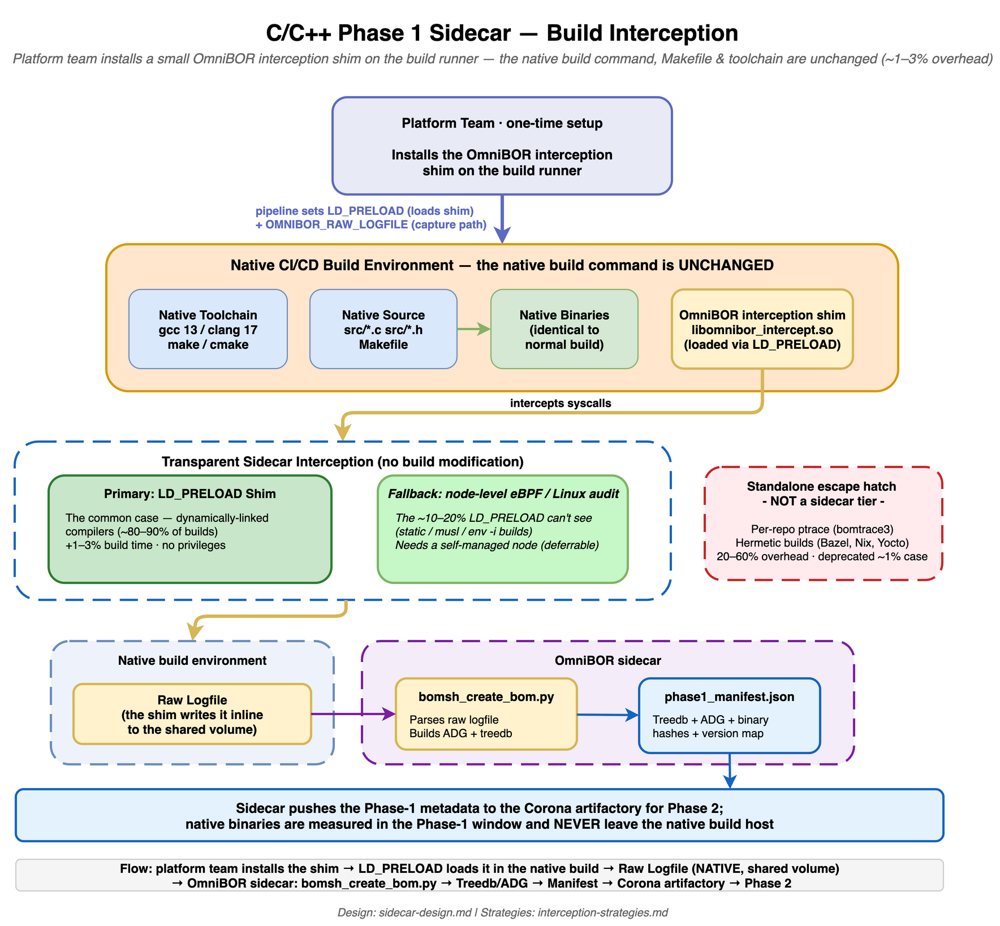

# Sidecar & Phase Isolation — C/C++

<table>
<colgroup><col style="width:16%"><col style="width:84%"></colgroup>
<tbody>
<tr><td><strong>Parent doc</strong></td><td><code>../infrastructure.md</code></td></tr>
<tr><td><strong>Reference guide</strong></td><td><code>interception-strategies.md</code> — strategy analysis, coverage matrices, and the enterprise OS/kernel landscape</td></tr>
<tr><td><strong>Status</strong></td><td>Proposed design (sidecar). Follows the <strong>delivered, golden-clean Java <code>LD_PRELOAD</code> inline-hashing sidecar</strong> (<code>../java/reference/inline-hashing-interception-design.md</code>) as its proven template.</td></tr>
<tr><td><strong>Date</strong></td><td>2026-06-12 (revised 2026-07-24)</td></tr>
</tbody>
</table>

---

> **Supported mode — Sidecar only.** See `../infrastructure.md` §1.
> Sidecar is the sole supported mode; **standalone is deprecated** — the
> initial ptrace-based implementation, retained only for a rare ~1%
> embedded corner case — and must not be offered as an option.

---

## Architecture Diagram

<a href="c-cpp-sidecar-mode.png"></a>

*Click image to enlarge. Source: [c-cpp-sidecar-mode.drawio](c-cpp-sidecar-mode.drawio)*

---

## 1. Scope and design constraints

This document describes the **design** of C/C++ build interception and
phase isolation in sidecar mode. Implementation status, work-item
breakdown, effort, and test plans live with the issue tracker and the
planning notes
(`../../planning/c-cpp/interception-phase-isolation-subissues.md`) — not here.

**Sidecar is the only supported mode.** The goal is to capture a complete,
accurate bill of materials from a normal C/C++ build **without changing that
build**: the build command, `Makefile`/`CMakeLists.txt`, compilers, and
linkers are byte-for-byte unchanged.

Achieving that still requires two things that are **not** part of the native
build and must be stated explicitly:

- **A one-time platform prerequisite** — the `LD_PRELOAD` interception shim
  (`libomnibor_intercept.so`) is a **precompiled binary**, built by the
  OmniBOR tooling (never by the native build) and simply placed on the
  runner — baked into the runner image or mounted read-only ([§6.1.1](#611-installing-the-shim--what-why-where-how)).
- **A per-build CI/CD change** — the pipeline YAML adds the environment
  variables that load the shim (`LD_PRELOAD` pointing at that path) and set
  the capture-log location ([§2.3](#23-primary-tier--ld_preload-shim-opt-in-via-cicd-yaml)). No build command, build file, or
  toolchain is touched.

So the footprint is precisely: **the native build is unchanged; the shim is
installed once by the platform team; and a few environment variables are
added to the CI/CD pipeline YAML.**

| Design constraint | Statement |
|---|---|
| **Native build unchanged** | The native build command, build files, and toolchain are never modified. |
| **Ephemeral-runner-first** | The primary mechanism must work in a hosted, ephemeral build runner with no node-level infrastructure or elevated capabilities. |
| **Phase isolation** | Phase 2 (SPDX generation) operates only on Phase 1 artifacts; it never reads the source tree, which no longer exists when Phase 2 runs. |
| **Proven precedent** | The design follows the delivered, golden-clean Java `LD_PRELOAD` inline-hashing sidecar (`../java/reference/inline-hashing-interception-design.md`). |
| **Standalone out of scope** | The legacy `ptrace`/`bomtrace3` standalone path is deprecated (~1% hermetic corner case) and is not part of this design ([§2.5](#25-standalone-mode--out-of-scope)). |

---

## 2. Interception Strategies

C/C++ is the hardest sidecar case and the most important — legacy
enterprise platforms are overwhelmingly C/C++. Getting the phase-isolation
model right here is the priority. Full strategy analysis, coverage
matrices, and the enterprise OS/kernel landscape live in the reference
guide `interception-strategies.md`.

**Interception model.** The sidecar mechanism is **transparent
kernel/dynamic-linker interception** that observes the compiler and linker
calls the native build already makes — it never modifies the build
invocation. Anything that changes the build command, its environment, or its
build files (for example `CC=`/`CXX=` compiler wrappers, or a `ptrace`
runner) is **not** sidecar; those belong to the deprecated standalone path
and are out of scope here ([§2.5](#25-standalone-mode--out-of-scope)).

### 2.1 Two interception families

| Family | How it observes the build | Changes the build? | In scope? |
|---|---|---|---|
| **Transparent sidecar** | Dynamic-linker preload, or a node-level kernel observer, intercepts `execve`/file events below the build system | **No** — injected by infrastructure | **Yes** |
| **Build-invocation modification** | Compiler wrappers or a `ptrace` runner wrap the build | **Yes** — sets build env vars or wraps the command | No — standalone ([§2.5](#25-standalone-mode--out-of-scope)) |

The sidecar must intercept at the kernel or dynamic-linker level,
transparent to the build system (industry precedent: Istio, Dynatrace, and
Vault all inject via mutating webhooks + `LD_PRELOAD`).

### 2.2 Sidecar tier model

The primary sidecar mechanism is the `LD_PRELOAD` shim, because it is the
only tier that deploys as **CI/CD-YAML environment variables** and therefore
works in an **ephemeral** build runner with no node-level infrastructure or
elevated capabilities. Node-level kernel observers (eBPF, Linux audit) are
**fallbacks** for `LD_PRELOAD`-blind builds, and apply only when the native
build runs on a self-managed build node — they need capabilities/daemons an
ephemeral hosted runner does not grant.

<table>
<colgroup><col style="width:11%"><col style="width:23%"><col style="width:18%"><col style="width:22%"><col style="width:14%"><col style="width:12%"></colgroup>
<thead>
<tr><th>Tier</th><th>Mechanism</th><th>Deploys as</th><th>Coverage</th><th>In-band overhead</th><th>Static binaries?</th></tr>
</thead>
<tbody>
<tr><td><strong>Primary</strong></td><td><code>LD_PRELOAD</code> shim (<code>libomnibor_intercept.so</code>)</td><td>2 CI/CD-YAML env vars</td><td>~80–90% — dynamically-linked compilers/linkers, any build system</td><td>+1–3% (inline hashing only)</td><td>No</td></tr>
<tr><td><strong>Fallback A</strong></td><td>Node-level <strong>eBPF</strong> on kernel tracepoints</td><td>privileged node daemon (<code>CAP_BPF</code>/<code>CAP_SYS_ADMIN</code>)</td><td>static + dynamic builds</td><td>minimal (async hashing)</td><td>Yes</td></tr>
<tr><td><strong>Fallback B</strong></td><td>Node-level <strong>Linux audit</strong> <code>execve</code> rule</td><td>audit rule + reader (<code>CAP_AUDIT_READ</code>)</td><td>universal on self-managed Linux (RHEL 7+)</td><td>+2–5% (noisier, log parsing)</td><td>Yes</td></tr>
<tr><td><strong>Escape hatch</strong></td><td>Per-repo <code>interception: ptrace</code> (<code>bomtrace3</code>) — <strong>standalone, not sidecar</strong></td><td>build-command wrapper (<code>SYS_PTRACE</code>)</td><td>hermetic builds (Bazel, Nix, Yocto)</td><td>20–60%</td><td>Yes</td></tr>
</tbody>
</table>

Resolution order: per-repo `interception` override > global `mode` >
default (`ld_preload`). Hermetic build systems that defeat every sidecar
tier opt into the standalone `ptrace` escape hatch per-project without
affecting others.

### 2.3 Primary tier — `LD_PRELOAD` shim (opt-in via CI/CD YAML)

**What the native build team changes: one pipeline step. What the native
build changes: nothing.** The native build command,
`Makefile`/`CMakeLists.txt`, compilers, and linkers are byte-for-byte
unchanged.

Interception is performed by a small *observability library* (industry
term: a **"shim"**) that the native build team's platform team installs
on the build runner ([§6.1.1](#611-installing-the-shim--what-why-where-how) covers what, why, where, and how).
The native build opts into it through `LD_PRELOAD`, the standard Linux
dynamic-linker mechanism for loading a library **alongside** the existing
toolchain — never in place of it. At runtime the library observes the
compiler/linker calls the native build already makes, hashes the inputs and
outputs the native build already produces, then hands control to the real
tool. It does not change compiler inputs, outputs, or the resulting native
binaries.

The **only** change the native build team makes is two environment variables
set in the pipeline YAML (Jenkins/GitHub Actions), before the unchanged native
build command — the same pattern already delivered for Java
(`../java/reference/inline-hashing-interception-design.md`):

```yaml
- name: Build (unchanged)
  run: |
    export LD_PRELOAD=/opt/omnibor/lib/libomnibor_intercept.so
    export OMNIBOR_RAW_LOGFILE="$PWD/.omnibor/bomsh_hook_raw_logfile.sha1"
    make -j"$(nproc)"        # ← identical to the native build's existing command
```

The `Makefile`/`CMakeLists.txt`/build scripts and the native build command
are byte-for-byte unchanged; only two env vars are added, in the pipeline YAML
(`OMNIBOR_RAW_LOGFILE` is config-driven, never hardcoded). On a self-managed
cluster the same env vars may alternatively be injected by a K8s
`MutatingAdmissionWebhook` + init container (transparent to the pipeline),
but that is an optional platform convenience, not a requirement. The shim
interposes `execve`/`posix_spawn` (compiler/linker argv capture) and
`close`/`rename` (artifact finalization) to:

1. Record each compiler/linker `argv` to the raw-logfile format consumed
   by `bomsh_create_bom.py`.
2. Hash compilation inputs and outputs **inline** (gitoid), keeping the
   data on the native build's critical path minimal.
3. `exec()` the real tool so the native build environment is otherwise
   identical.

Failure isolation: the library must never fail the native build — on any
internal error it logs and lets the real tool proceed; the SBOM is
reported incomplete rather than the native build broken.

### 2.4 Fallback tiers — node-level kernel observers (eBPF, audit)

The fallback tiers apply **only** when `LD_PRELOAD` cannot interpose
(statically-linked build tools, musl libc/Alpine, or builds that run
`env -i`) **and** the native build runs on a **self-managed build node**.

**These fallbacks require altering the build environment.** Unlike the
primary tier — a pure CI/CD-YAML env-var change that adds nothing to the
build node — each fallback requires the platform team to install a
**privileged, node-level component** (a BPF-loading daemon, or an `execve`
audit rule plus a reader) and to grant it **elevated Linux capabilities**
(`CAP_BPF`/`CAP_SYS_ADMIN`, or `CAP_AUDIT_READ`/`CAP_AUDIT_CONTROL`). That
is an infrastructure change to the build node itself: the native build
command and files remain unchanged, but the **node no longer runs
unmodified**, and an ephemeral hosted runner will not permit it. They are
therefore fallbacks, never the default.

- **eBPF** (`Fallback A`): a privileged node daemon loads BPF programs on
  `sched_process_exec`, `sched_process_exit`, and `sys_enter_openat`,
  observing compiler invocations system-wide with no pod modification.
  `sched_process_exit` also gives reliable **build-completion detection**
  for the post-build capture window. Needs `CAP_BPF`/`CAP_PERFMON`
  (kernel 5.8+) or `CAP_SYS_ADMIN` (4.18–5.7); excludes RHEL 7.
- **Linux audit** (`Fallback B`): an `execve` audit rule logs full argv for
  every process; a reader reconstructs the build process tree. This is the
  **universal** fallback on self-managed Linux (RHEL 7+, no `CAP_BPF`) and
  is usually already approved for compliance — at the cost of higher
  overhead (+2–5%), system-wide noise (must filter by process tree), and
  audit-buffer tuning under `-j64`. Needs `CAP_AUDIT_READ` (and
  `CAP_AUDIT_CONTROL` unless the rule is pre-configured).

See `interception-strategies.md` for the full eBPF/audit coverage and
capability analysis.

### 2.5 Standalone mode — out of scope

Two older approaches change the build and are therefore **not sidecar**:
per-repo `ptrace` (`bomtrace3`), which requires the tracer to be the build's
parent or share its PID namespace; and `CC=`/`CXX=`/`AR=`/`LD=` compiler
wrappers, which set build environment variables. Both belong to the
deprecated standalone path, retained only for the ~1% hermetic corner case
(Bazel, Nix, Yocto). Neither is offered as a sidecar option; for details,
see the reference guide `interception-strategies.md`.

---

## 3. Phase 1 artifacts

Phase 1 runs inside the ephemeral build environment, where two actors share
one workspace volume: the **native build** (its unchanged toolchain, source
tree, and output binaries) and the **OmniBOR sidecar** (the companion process
that performs interception and post-build capture on that same volume). The
table shows where each artifact originates. Every artifact uses the format
the ADG tooling already reads, so no downstream tool changes.

<table>
<colgroup><col style="width:26%"><col style="width:34%"><col style="width:20%"><col style="width:20%"></colgroup>
<thead>
<tr><th>Artifact</th><th>Produced by</th><th>Resides on</th><th>Location</th></tr>
</thead>
<tbody>
<tr><td>Native source tree</td><td>The native build (unchanged)</td><td><strong>Native build</strong></td><td>build workspace (shared volume)</td></tr>
<tr><td>Output binaries (ELF)</td><td>The native build (unchanged)</td><td><strong>Native build</strong></td><td>per <code>output_binaries</code> config (measured in place; not shipped off-host)</td></tr>
<tr><td>Raw logfile</td><td>The interception shim (or node observer), inline during the build</td><td><strong>Native build</strong> (written to the shared volume)</td><td>config-driven raw-logfile path</td></tr>
<tr><td>Treedb + document mapping</td><td>Sidecar — ADG generation over the raw logfile</td><td><strong>Sidecar</strong></td><td><code>bom_dir/metadata/bomsh/</code></td></tr>
<tr><td>Archived raw logfile</td><td>Sidecar — copied into the BOM directory for provenance</td><td><strong>Sidecar</strong></td><td><code>bom_dir/metadata/bomsh/</code></td></tr>
<tr><td>Binary-derived facts + version map</td><td>Sidecar — captured in the Phase-1 window while binary and source still exist ([§4.1](#41-version-detection-across-the-phase-boundary), [§4.2](#42-binary-derived-facts-belong-in-phase-1-not-phase-2))</td><td><strong>Sidecar</strong></td><td><code>bom_dir</code> / manifest</td></tr>
<tr><td>Phase 1 manifest</td><td>Sidecar — written by the CLI phase layer</td><td><strong>Sidecar</strong></td><td><code>bom_dir/phase1_manifest.json</code></td></tr>
</tbody>
</table>

Before the ephemeral build environment is destroyed, the sidecar pushes the
Phase-1 **metadata** (treedb, manifest, per-artifact SPDX) to the **Corona
artifactory** (its S3 intake bucket / durable storage). **Native binaries are
measured in the Phase-1 window and never leave the native build host — no
binary egress** ([§4.2](#42-binary-derived-facts-belong-in-phase-1-not-phase-2)).
Phase 2 (the Corona agent) runs on a different host and reads **only** from
the artifactory; it never touches the native build workspace.

---

## 4. Phase 2 requirements

Phase 2 assembles the SPDX documents. The design question is which inputs
each step needs, so that anything requiring the **binary** or the **source
tree** is moved into the Phase-1 capture window (where both still exist),
leaving Phase 2 needing only Phase-1 metadata.

<table>
<colgroup><col style="width:46%"><col style="width:18%"><col style="width:18%"><col style="width:18%"></colgroup>
<thead>
<tr><th>Operation</th><th>Needs binary?</th><th>Needs source tree?</th><th>Needs treedb?</th></tr>
</thead>
<tbody>
<tr><td>Artifact hashing / OmniBOR SBOM</td><td>Yes</td><td>No</td><td>Yes</td></tr>
<tr><td>Dynamic-dependency capture (<code>ldd</code>/<code>readelf</code>)</td><td>Yes</td><td>No</td><td>No</td></tr>
<tr><td>Per-binary SPDX assembly</td><td>No</td><td>Yes (version detection)</td><td>Yes</td></tr>
<tr><td>OmniBOR external-reference injection</td><td>No</td><td>No</td><td>Yes</td></tr>
<tr><td>Archival binary copy</td><td>Yes</td><td>No</td><td>No</td></tr>
</tbody>
</table>

Only artifact hashing and the `ldd`/`readelf` capture actually read the
binary; SPDX assembly and reference injection are already metadata-driven.
The two source-tree/binary needs — version detection ([§4.1](#41-version-detection-across-the-phase-boundary)) and
binary-derived facts ([§4.2](#42-binary-derived-facts-belong-in-phase-1-not-phase-2)) — are the only things that must move into
Phase 1.

### 4.1 Version detection across the phase boundary

Version detection reads source files (`VERSION`/`RELEASE` files, structured
manifests, `configure.ac`, `CMakeLists.txt`, `meson.build`, `*.pc.in`,
`#define *_VERSION` macros, `Makefile` `VERSION=`), in priority order. That
source dependency is the **primary reason** a naive Phase 2 would need the
source tree for C/C++.

**Design resolution — pre-compute in Phase 1, consult the map in Phase 2.**
The vendored libraries and their source paths are already derivable in
Phase 1 from the same grouping the SPDX emitter uses. Run the **existing**
version detector over them while the source tree is still present, and
record a generic `{library: version}` map in the Phase 1 manifest. Phase 2
then prefers that map before any source scan. This reuses the detector
unchanged — no new version logic, nothing repo-specific — and moves only
*when* detection runs (Phase 1 instead of Phase 2).

### 4.2 Binary-derived facts belong in Phase 1 (not Phase 2)

The phase boundary is defined by **the binary**: any step that reads the
binary must run where the binary is guaranteed present — the Phase-1 capture
window in the ephemeral build environment. Re-reading the artifact at
Phase 2 is a standalone-mode assumption that must not cross into the sidecar
phase split, because:

1. **Phase 1 already hashes the binary.** The raw logfile and document
   mapping already resolve the full `binary → gitoid → ADG-document` chain
   in Phase-1 artifacts; re-hashing at Phase 2 is redundant.
2. **No artifact-derived fact needs Phase 2.** The SBOM identity
   (`SHA-256` raw + `SHA-256` gitOID), size, ELF metadata, and dynamic
   dependencies are all capturable while the artifact still exists in
   Phase 1. (bomsh's internal `SHA-1` treedb is topology lookup only and
   never surfaces in the SBOM — see the design of record,
   `.windsurf/rules/project/artifact-identity.md`.)
3. **Binaries are often proprietary customer IP.** Egressing them to an
   analysis host is a data-exfiltration surface (CWE-200); capturing facts
   in Phase 1 keeps binaries on the build host.

**Design resolution — assemble the SPDX in the Phase-1 window.** The SBOM
step runs where the treedb and the binaries are both local, emits the small
per-artifact SPDX plus metadata, and Phase 2 performs only the
metadata-driven merge, patch, and validation it already does. This removes
the binary dependency with **zero binary egress**. A future refinement —
capturing a structured facts-map in Phase 1 and assembling the SPDX in
Phase 2 — remains possible but is not required.

This mirrors the **delivered Java Phase 1**, which already persists artifact
identity while build intermediates still exist and verifies those identities
from the manifest in Phase 2 — a working precedent for capturing
binary-derived facts in Phase 1. Because build outputs can be large
(hundreds of MB for media or runtime builds), keeping them on the build host
avoids both the egress cost and the exfiltration risk.

---

## 5. Configuration contract

Configuration is **nested by mode**; sidecar mode selects the `sidecar`
sub-key. A per-repo `interception` override picks a specific tier for
hermetic or statically-linked builds. No repo names ever appear in
executable code — behavior is entirely config-driven.

```yaml
omnibor:
  sidecar:
    preload_lib: /opt/omnibor/lib/libomnibor_intercept.so
    interception: ld_preload      # ld_preload (default) | ebpf | audit
    create_bom_script: bomsh_create_bom.py
    sbom_script: bomsh_sbom.py
    raw_logfile: <config-driven path>
  standalone:                     # deprecated, out of scope (§2.5)
    tracer: bomtrace3
```

The config layer auto-selects the sub-key from the active mode and remains
backward-compatible with the legacy flat format.

---

## 6. Interception components

### 6.1 Truly-sidecar — `LD_PRELOAD` shim (primary)

The transparent sidecar mechanism is an `LD_PRELOAD` shim
(`libomnibor_intercept.so`) loaded via two CI/CD-YAML env vars (or, on a
self-managed cluster, by an optional mutating webhook), never by editing the
build command (see [§2.3](#23-primary-tier--ld_preload-shim-opt-in-via-cicd-yaml)). The platform team installs the shim on the build
runner once ([§6.1.1](#611-installing-the-shim--what-why-where-how)); `LD_PRELOAD` then references it by path. Because it
interposes at the exec/dynamic-linker level,
it captures compiler **and** linker invocations regardless of whether the
Makefile uses `$(CC)` or hardcodes `gcc` — avoiding the wrapper option's
biggest coverage gap. It writes the **same raw logfile format** as
`bomtrace3` so `bomsh_create_bom.py` works unchanged. It mirrors the
delivered, golden-clean Java `LD_PRELOAD` shim
(`docker/shim/omnibor_java_intercept.c`) and is a component of this repo, not
part of upstream `bomsh` — its only `bomsh` coupling is the raw-logfile
format above, which the ADG step consumes unchanged.

#### 6.1.1 Installing the shim — what, why, where, how

The diagram's *"Platform Team · one-time setup — installs the OmniBOR
interception shim on the build runner"* box maps to the following. This is a
**one-time platform action**, entirely separate from — and invisible to —
any build:

| Question | Answer |
|---|---|
| **What** | `libomnibor_intercept.so` — a small `LD_PRELOAD` interposer (tens of KB), **not** the full OmniBOR toolchain. It records compiler/linker `argv`, inline-hashes inputs/outputs, then `exec()`s the real tool. |
| **Why** | The dynamic loader honours `LD_PRELOAD` by loading a `.so` **by path** into every compiler/linker process, so the file must already exist on the build runner before the pipeline sets the env var. Installing it once keeps the per-build change to just two env vars and leaves the native build byte-for-byte unchanged. |
| **Where** | A known, stable path on the build runner — e.g. `/opt/omnibor/lib/libomnibor_intercept.so`, the config-driven `preload_lib` value from [§5](#5-configuration-contract). Never hardcoded in the build. |

**How** — the platform team picks one placement option (preference order):

1. **Baked into the CI runner image** — `COPY`/package-install the `.so`
   into the image the pipeline already runs on. Best for ephemeral hosted
   runners: the shim ships with the image, with no runtime mount.
2. **Mounted read-only at the known path** — for self-managed runners or
   K8s pods with a fixed image, a host mount / volume provides the `.so`
   at the `preload_lib` path.
3. **K8s `MutatingAdmissionWebhook` + init container** — injects both the
   `.so` and the two env vars transparently on a self-managed cluster
   (optional convenience, not a requirement).

The native build never compiles, links, or bundles the shim — it only
references an already-present file via `LD_PRELOAD` ([§2.3](#23-primary-tier--ld_preload-shim-opt-in-via-cicd-yaml)).

### 6.2 Standalone wrappers — out of scope

The `CC=`/`CXX=`/`AR=`/`LD=` compiler wrappers belong to the deprecated
standalone-without-ptrace path ([§2.5](#25-standalone-mode--out-of-scope)), not to the sidecar design. Their
mechanism and build-system compatibility are documented in the reference
guide `interception-strategies.md`.

---

## 7. Phase-split design

Sidecar mode splits the pipeline into two independently-runnable phases that
communicate only through the Phase 1 manifest and the artifacts it
enumerates. The building blocks already exist and are **reused generically**,
not reinvented:

- A **manifest** carries the run identity, artifact paths, and per-artifact
  `SHA-256` gitoids, written, read, and verified by a shared,
  language-agnostic layer.
- **Per-language phase runners** do build/capture (Phase 1) and SPDX
  assembly (Phase 2) only; they do not own the manifest.
- The **CLI phase layer** owns the manifest and the `--mode` / `--phase` /
  `--manifest` flags (`--phase` requires sidecar mode; `--phase spdx`
  requires a manifest).

| Phase | Responsibility | Constraint |
|---|---|---|
| **Phase 1** (`--phase build`) | Build + capture; binary-fact capture ([§4.2](#42-binary-derived-facts-belong-in-phase-1-not-phase-2)) and version pre-computation ([§4.1](#41-version-detection-across-the-phase-boundary)) run here, while binary and source still exist | Mirrors the delivered Java Phase 1 |
| **Phase 2** (`--phase spdx`) | Metadata-driven SPDX assembly, validation, and hand-off | Reads only the manifest + Phase-1 artifacts; never the source tree |

**DRY across languages.** The CLI phase layer dispatches to the per-language
phase runner keyed by the language it already resolves, so the manifest
logic, gitoid verification, and flag validation are shared unchanged — C/C++
adds its two phase runners, not a parallel manifest path. The single-pass
entry point stays backward-compatible: with no `--phase`, it runs both
phases in sequence exactly as today.

---

## 8. Design decisions

1. **Injection vector — CI/CD-YAML environment variables.** The delivered
   Java sidecar injects the shim purely via environment: the build command
   is returned unchanged plus the `LD_PRELOAD` and capture-log variables.
   C/C++ uses the identical vector. The K8s mutating-webhook + init-container
   path is an optional self-managed-cluster convenience, not a requirement.
2. **Shim ownership — this repo, not upstream `bomsh`.** The proven Java
   shim lives in this repo and is built into the image; the C/C++ shim
   follows that precedent, extending the same scaffold with
   `execve`/`posix_spawn` argv capture. Its only `bomsh` coupling is the
   raw-logfile format.
3. **Go/Rust — classification settled; primary tier validated per language.**
   Transparent exec/linker interception is the sidecar mechanism;
   `-toolexec`/`RUSTC_WRAPPER` are standalone-without-ptrace. Because a
   statically-linked toolchain (Go especially) can defeat `LD_PRELOAD` and
   push capture to a node observer, the concrete Go/Rust primary tier is
   decided in their own docs. This does not block C/C++.
4. **Binaries vs metadata — assemble SPDX in the Phase-1 window; no binary
   egress.** Grounded by the delivered Java Phase 1, which persists artifact
   identity while intermediates exist and verifies it from the manifest in
   Phase 2. C/C++ runs the binary-reading steps in the Phase-1 capture window
   and ships metadata only ([§4.2](#42-binary-derived-facts-belong-in-phase-1-not-phase-2)).
