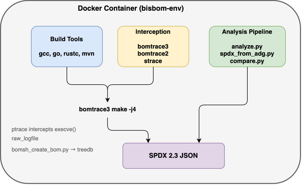
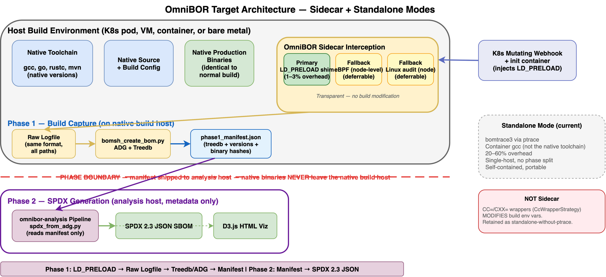
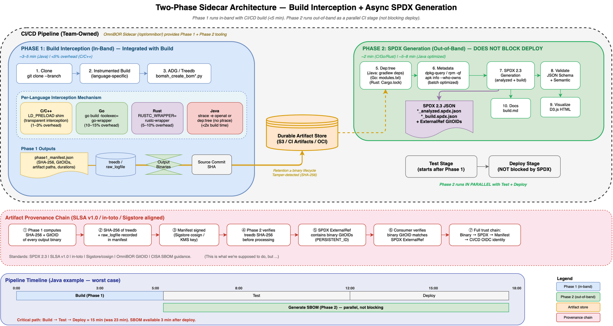
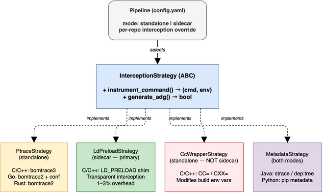
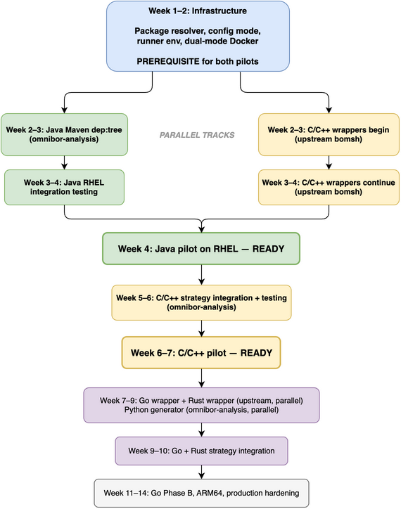
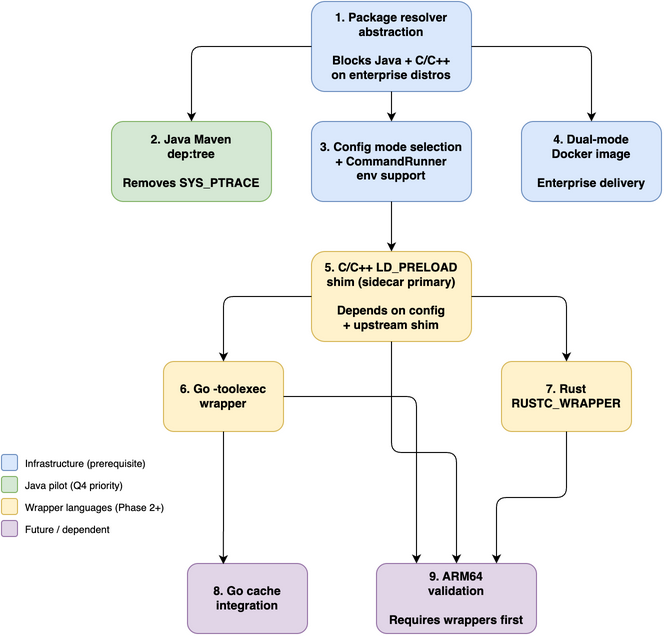

# Sidecar & Phase Isolation — Shared Infrastructure

> **Status**: Partially implemented — Phase I (manifest, CLI, Java phase split) complete and validated in CI/CD
> 
> **Date**: 2026-06-12 (design) · Updated 2026-05-14 (implementation status)
> 
> **Prerequisite docs**: `sidecar-refactoring-plan.md`, `sidecar-implementation-design.md`,
> `phase2-binary-artifact-dependencies.md`, `sidecar-async-spdx-architecture.md`

---

## Per-Language Design Documents

This document covers the **shared components** that all languages use:
manifest format, CLI flags, config schema, Corona integration, Docker
setup, and the testing framework. Each language has its own design doc
with strategy details, Phase 1/2 artifacts, and implementation tasks:

- **`c-cpp/sidecar-design.md`** — truly-sidecar interception (`LD_PRELOAD` shim primary via CI/CD-YAML env; eBPF/audit node-observer fallbacks; `ptrace` = standalone escape hatch) and version pre-computation. Strategy rationale lives in the reference guide `c-cpp/interception-strategies.md`
- **`java/sidecar-design.md`** — `MavenDepTreeStrategy`/`GradleDepTreeStrategy` (already implemented)
- **`go/sidecar-design.md`** — `GoToolexecStrategy`, `-a` flag interaction
- **`rust/sidecar-design.md`** — `RustcWrapperStrategy`, `RUSTC_WRAPPER` vs `RUSTC_WORKSPACE_WRAPPER`
- **`python/sidecar-design.md`** — metadata-only pipeline (future)

---

## 1. Executive Summary

**Sidecar is the only supported execution mode** for `omnibor-analysis`.
It uses the customer's native toolchains, requires no `SYS_PTRACE`, and is
the authoritative mode for all enterprise repository build-interception
SBOM generation — and the baseline from which golden files are generated.

> **Standalone mode is deprecated — do not offer it as an option.** It was
> the initial implementation of the core omnibor/bomsh repositories and the
> earliest `omnibor-analysis` testing (ptrace-based `bomtrace3`/`bomtrace2`,
> requiring `SYS_PTRACE`). It is **no longer used** for enterprise work. The
> only remaining possibility is a rare (~1%) embedded-systems corner case;
> it is not part of the enterprise flow and must not be presented as a
> co-equal choice. Legacy standalone code paths may still exist in the tree
> but are not a supported deployment.

**Sidecar** can run either way:
- **Sidecar full** — Phase 1 + Phase 2 in one container (primary customer mode)
- **Sidecar Phase 1 only** — Phase 1 produces artifacts and exits;
  Phase 2 runs in a separate process, host, or Corona daemon

This document describes the shared infrastructure:

1. **Sidecar interception (the supported mode)** — transparent interception
   that does not modify the build invocation and does **not** require
   `SYS_PTRACE`: build-system-native for Java (`dep:tree`), or
   kernel/linker-level for C/C++ (`LD_PRELOAD`, eBPF). The specific
   mechanism varies by language — see per-language design docs for details.
   (The deprecated standalone path used ptrace `bomtrace3`/`bomtrace2` with
   `SYS_PTRACE`.)
2. **Phase isolation (Sidecar)** — Phase 1 (build interception) and
   Phase 2 (SPDX generation) can run independently, connected only by a
   well-defined artifact contract (`phase1_manifest.json`).
3. **Multiple Phase 2 executors** — Phase 2 can run in the sidecar
   container, on a different host, or on a Corona daemon.
4. **CLI, config, and module changes** that apply to all languages.

Language-specific strategy wiring, artifacts, and testing are in the
per-language docs listed above.

---

## 2. Current State Analysis

### 2.1 What Exists Today

| Component | File | Status |
|-----------|------|--------|
| `InterceptionStrategy` ABC | `app/pipeline/interception.py` | ✅ Complete |
| `PtraceStrategy` (standalone) | `app/pipeline/interception.py` | ✅ Complete |
| `CcWrapperStrategy` (C/C++) † | `app/pipeline/interception.py` | ✅ Skeleton — not wired |
| `GoToolexecStrategy` (Go) † | `app/pipeline/interception.py` | ✅ Skeleton — not wired |
| `RustcWrapperStrategy` (Rust) † | `app/pipeline/interception.py` | ✅ Skeleton — not wired |
| `MavenDepTreeStrategy` (Java sidecar) | `app/pipeline/interception.py` | ✅ Fully wired and tested |
| `GradleDepTreeStrategy` (Java sidecar) | `app/pipeline/interception.py` | ✅ Fully wired and tested |
| Phase 1/2 timing tags | `app/pipeline/timing.py` | ✅ `StepMetrics.phase` ∈ {`phase1`, `phase2`} |
| Dual-mode config resolution | `app/config.py` | ✅ `resolve_omnibor_cfg()` handles nested format |
| `--mode` CLI flag | `app/pipeline/runners.py` | ✅ Parsed, but only passed to Java |
| `BomtraceBuilder.build()` `strategy=` param | `app/pipeline/builder.py` | ✅ Accepts strategy, delegates to it |
| `--phase` CLI flag (`build` / `spdx`) | `app/pipeline/runners.py` | ✅ Complete — Java only |
| `--manifest` CLI flag | `app/pipeline/runners.py` | ✅ Complete — required with `--phase spdx` |
| `_validate_phase_args()` | `app/pipeline/runners.py` | ✅ Complete — enforces sidecar + manifest constraints |
| `_run_phase1_only()` | `app/pipeline/runners.py` | ✅ Complete — Java; writes manifest after build |
| `_run_phase2_only()` | `app/pipeline/runners.py` | ✅ Complete — Java; reads manifest, verifies gitoids |
| `run_java_phase1()` / `run_java_phase2()` | `app/pipeline/lang_runners.py` | ✅ Complete — Java runner split into phase1/phase2/pipeline |
| `write_manifest()` / `read_manifest()` | `app/pipeline/manifest.py` | ✅ Complete — function-based API with gitoid verification |
| `verify_gitoids()` | `app/pipeline/manifest.py` | ✅ Complete — SHA-256 gitoid integrity check |
| Phase isolation system test script | `scripts/run_phase_isolation_test.sh` | ✅ Complete — two-container Docker test |
| Phase isolation unit tests (13 tests) | `tests/test_phase_isolation.py` | ✅ Complete |
| Manifest unit tests (22 tests) | `tests/test_manifest.py` | ✅ Complete |
| Sidecar Docker image (multi-stage target) | `docker/Dockerfile` (`AS sidecar`) | ✅ Complete — published to GHCR |
| Sidecar publish workflow | `.github/workflows/publish-sidecar.yml` | ✅ Complete — auto-publishes on push to main |
| CI/CD proof of execution | `phase-isolation-cicd-results_2026-05-13.md` | ✅ Validated 2026-05-13 — 3 runners, 3 Azure regions |

> **† Wrapper-vs-sidecar note:**
>
> The `*WrapperStrategy` classes above (`CcWrapperStrategy`,
> `GoToolexecStrategy`, `RustcWrapperStrategy`) each set a build variable
> (`CC=`/`CXX=`/`AR=`/`LD=`, `-toolexec`, `RUSTC_WRAPPER`) and therefore
> **modify the build invocation** — which the sidecar model forbids. They
> are valid **standalone-without-ptrace** options, *not* sidecar
> mechanisms. The truly-sidecar C/C++ path is transparent kernel/linker
> interception: **`LD_PRELOAD` shim (primary)** injected via two CI/CD-YAML
> env vars (the Java-proven vector), with node-level **eBPF or Linux audit**
> as *fallbacks* for `LD_PRELOAD`-blind builds. Per-repo `ptrace` is a
> **standalone escape hatch, not a sidecar tier**. See `c-cpp/sidecar-design.md`
> and the reference guide
> `c-cpp/interception-strategies.md`. The
> analogous Go/Rust re-framing is tracked as an open question and is out
> of scope here.

### 2.2 What's Missing

| Gap | Impact | Status |
|-----|--------|--------|
| ~~No `--phase` CLI flag~~ | ~~Cannot run Phase 1 or Phase 2 independently~~ | ✅ Implemented (Java) |
| ~~No `phase1_manifest.json` writer/reader~~ | ~~Phase 2 cannot discover Phase 1 artifacts~~ | ✅ Implemented |
| **C/C++, Go, Rust sidecar strategies not wired** | `--mode sidecar` only works for Java | ❌ Pending |
| **C/C++, Go, Rust phase split not implemented** | `--phase build`/`--phase spdx` only works for Java | ❌ Pending |
| **Phase 2 requires the source tree (C/C++/Go/Rust)** | `ldd`, `readelf`, `bomsh_sbom.py` read binaries from `repo_dir` | ❌ Pending |
| **No Corona integration** | Phase 2 can only run inside the same container or via artifact transfer | ❌ Deferred |
| **`_run_post_build()` is monolithic (C/C++/Go/Rust)** | Java is split into phase1/phase2; other languages still coupled | ⚠️ Partial |

### 2.3 Architecture Diagram Reference

The following existing diagrams illustrate the target architecture:

#### Standalone Architecture (current flow)

<a href="sidecar-standalone-architecture.png"></a>

*Click image to enlarge. Source: [sidecar-standalone-architecture.drawio](sidecar-standalone-architecture.drawio)*

#### Target Dual-Mode Architecture

<a href="sidecar-target-architecture.png"></a>

*Click image to enlarge. Source: [sidecar-target-architecture.drawio](sidecar-target-architecture.drawio)*

#### Two-Phase Sidecar with Corona

<a href="sidecar-two-phase-corona-p1.png"></a>

*Click image to enlarge. Source: [sidecar-two-phase-corona.drawio](sidecar-two-phase-corona.drawio)*

#### Strategy Pattern Class Hierarchy

<a href="sidecar-strategy-pattern.png"></a>

*Click image to enlarge. Source: [sidecar-strategy-pattern.drawio](sidecar-strategy-pattern.drawio)*

#### CI/CD Critical Path Reduction

<a href="sidecar-critical-path.png"></a>

*Click image to enlarge. Source: [sidecar-critical-path.drawio](sidecar-critical-path.drawio)*

#### Module Dependency Graph

<a href="sidecar-dependency-graph.png"></a>

*Click image to enlarge. Source: [sidecar-dependency-graph.drawio](sidecar-dependency-graph.drawio)*

---

## 3. Design Principles

1. **Backward compatibility** — `python3 -m app.analyze --repo curl` continues to
   work identically (standalone, both phases, sequential).
2. **Artifact-based decoupling** — Phase 1 and Phase 2 communicate exclusively
   through `phase1_manifest.json` plus the artifacts it references.
3. **Strategy pattern** — interception mechanism is selected via config/CLI, not
   hardcoded per-language `if/else` branches.
4. **Config-driven** — no repo-specific logic in executable code; all behavior
   differences come from `config.yaml` fields.
5. **Fail-safe defaults** — if `--mode` is omitted, use standalone; if `--phase`
   is omitted, run both phases.
6. **Single Responsibility** — each new module has exactly one concern.

---

## 4. Artifact Contract: `phase1_manifest.json`

The `phase1_manifest.json` is a small pointer file (~1-2 KB) that records
the paths to the existing artifacts (treedb, raw logfile, binaries,
bom_dir, etc.) plus metadata (repo name, language, commit SHA, run
timestamp). The actual artifact files stay in their original format and
location — nothing is converted or bundled.

The purpose is purely for **Sidecar Phase 1 only** mode: when Phase 2
runs in a different process or on a different host, it needs to know
where all the Phase 1 artifacts are. Today that information is derived
from `config.yaml` + convention, which requires the entire config and
source tree to be available. The manifest decouples that.

The manifest is written after Phase 1 completes (after the build and
treedb generation), before Phase 2 starts. It is a single `json.dump()`
call — effectively zero build-time overhead.

In Standalone mode and Sidecar full mode, where Phase 1 and Phase 2 run
in the same process, the manifest is not needed — Phase 2 already has
everything in memory.

### 4.1 Schema

```json
{
  "$schema": "https://json-schema.org/draft/2020-12/schema",
  "type": "object",
  "required": [
    "version", "repo_name", "language", "mode", "tracer",
    "run_ts", "commit_sha", "vcs_uri",
    "artifacts", "paths"
  ],
  "properties": {
    "version": {
      "type": "string",
      "const": "1.0",
      "description": "Manifest schema version"
    },
    "repo_name": { "type": "string" },
    "language": {
      "type": "string",
      "enum": ["c-cpp", "go", "rust", "java", "python"]
    },
    "mode": {
      "type": "string",
      "enum": ["standalone", "sidecar"]
    },
    "tracer": {
      "type": "string",
      "description": "Interception method used (bomtrace3, cc-wrapper, maven-dep-tree, etc.)"
    },
    "run_ts": {
      "type": "string",
      "pattern": "^\\d{4}-\\d{2}-\\d{2}_\\d{4}$"
    },
    "commit_sha": { "type": ["string", "null"] },
    "vcs_uri": { "type": "string" },
    "artifacts": {
      "type": "object",
      "properties": {
        "bom_dir": {
          "type": "string",
          "description": "Absolute path to OmniBOR ADG output directory"
        },
        "treedb": {
          "type": ["string", "null"],
          "description": "Absolute path to bomsh_omnibor_treedb"
        },
        "raw_logfile": {
          "type": ["string", "null"],
          "description": "Absolute path to bomsh_hook_raw_logfile"
        },
        "strace_log": {
          "type": ["string", "null"],
          "description": "Absolute path to strace log (Java standalone only)"
        },
        "dep_tree_json": {
          "type": ["string", "null"],
          "description": "Absolute path to maven_deps.json or gradle_deps.json (Java sidecar)"
        },
        "binaries": {
          "type": "array",
          "items": { "type": "string" },
          "description": "Absolute paths to output binaries/JARs"
        }
      },
      "required": ["bom_dir", "binaries"]
    },
    "paths": {
      "type": "object",
      "properties": {
        "repos_dir": { "type": "string" },
        "output_dir": { "type": "string" },
        "spdx_dir": { "type": "string" }
      },
      "required": ["repos_dir", "output_dir", "spdx_dir"]
    },
    "repo_cfg": {
      "type": "object",
      "description": "Subset of repo config needed by Phase 2 (output_binaries, vendored_dirs, language, description)"
    },
    "omnibor_cfg": {
      "type": "object",
      "description": "Resolved omnibor config section for this language/mode"
    },
    "gitoids": {
      "type": "object",
      "description": "Map of artifact path → SHA-256 gitoid for provenance verification",
      "additionalProperties": { "type": "string" }
    }
  }
}
```

### 4.2 Manifest Location

```
output/omnibor/{lang}/{repo}/{run_ts}/phase1_manifest.json
```

This is inside `bom_dir`, co-located with the OmniBOR ADG artifacts.

### 4.3 When the Manifest Is Written

The manifest is written **after** Phase 1 completes — after the build,
treedb generation, and ADG creation have all finished. It does not run
during the build and has zero impact on build time.

| Mode | Manifest written? | Manifest read? |
|------|------------------|----------------|
| **Standalone** | No | No — Phase 2 has everything in memory |
| **Sidecar full** | No | No — Phase 2 has everything in memory |
| **Sidecar Phase 1 only** | Yes — `json.dump()` after build | No — Phase 2 runs in a separate invocation |
| **Phase 2 from manifest** | No — Phase 1 already ran | Yes — reads manifest to locate artifacts |

### 4.4 Why Not Reuse `config.yaml`?

Today, Phase 2 derives artifact locations from `config.yaml` paths plus
naming conventions (e.g., `output/omnibor/{lang}/{repo}/{run_ts}/`). This
works when both phases run in the same process because the config, source
tree, and build environment are all available.

In Sidecar Phase 1 only mode, Phase 2 runs in a different process or on
a different host. It may not have access to:
- `config.yaml` (the sidecar container may be destroyed after Phase 1)
- The source tree (not transferred to the analysis host)
- The build environment (compiler paths, environment variables)

The manifest captures exactly what Phase 2 needs — artifact paths,
repo metadata, and resolved config — in a single self-contained file
that can be transferred alongside the artifacts.

### 4.5 Provenance Integrity

Each artifact path in the manifest includes a SHA-256 gitoid computed at
Phase 1 completion time. Phase 2 can optionally verify these gitoids
before processing to detect tampering or corruption during transfer.

> **Design of record**: gitOID + raw SHA are `SHA-256` for every artifact
> (files, objects, packages), and are distinct values. bomsh's `SHA-1`
> treedb is a topology bridge only and never surfaces in the SBOM. See
> `.windsurf/rules/project/artifact-identity.md`.

---

## 5. Phase Isolation Architecture

### 5.1 CLI Interface Changes

```bash
# Standalone (always full pipeline — Phase 1 + Phase 2)
python3 -m app.analyze --repo curl
python3 -m app.analyze --repo curl --mode standalone  # explicit, same effect

# Sidecar full (Phase 1 + Phase 2, no SYS_PTRACE)
python3 -m app.analyze --repo curl --mode sidecar

# Sidecar Phase 1 only — Phase 2 runs elsewhere
python3 -m app.analyze --repo curl --mode sidecar --phase build

# Phase 2 from manifest (consumes artifacts from any Sidecar Phase 1 run)
python3 -m app.analyze --repo curl --phase spdx --manifest /path/to/phase1_manifest.json
```

New CLI arguments in `app/pipeline/runners.py`:

| Argument | Type | Default | Description |
|----------|------|---------|-------------|
| `--phase` | `{build, spdx}` | None (both) | Run only Phase 1 or Phase 2 |
| `--manifest` | path | None | Path to `phase1_manifest.json` (required when `--phase spdx`) |

### 5.2 Execution Patterns

#### Pattern A: Standalone (full pipeline, single container)

A single container (with `SYS_PTRACE`) runs both phases sequentially,
connected by an in-memory hand-off (no manifest):

1. **Phase 1** — clone → build → treedb → ADG
2. **Phase 2** — SBOM → metadata → SPDX → validate

This is the only Standalone pattern. Phase split is not supported in
Standalone mode.

#### Pattern B: Sidecar Full (Phase 1 + Phase 2, single container)

A single sidecar container (no `SYS_PTRACE`) runs both phases
sequentially, connected by an in-memory hand-off (no manifest):

1. **Phase 1** — clone → build → treedb → ADG
2. **Phase 2** — SBOM → metadata → SPDX → validate

Same flow as Standalone, but Phase 1 uses **transparent,
build-unmodifying interception** instead of ptrace (for C/C++: `LD_PRELOAD`
shim primary, eBPF/audit node-observer fallbacks; for Java: `dep:tree`).
Per-repo `ptrace` is a standalone escape hatch, not a sidecar tier. This is
the **primary customer deployment mode**.

#### Pattern C: Sidecar Phase 1 + Separate Phase 2 (two-stage CI)

Two CI stages connected by the manifest artifact:

1. **CI Stage 1 (sidecar)** — `--mode sidecar --phase build`: Phase 1
   runs clone → build → treedb and writes `phase1_manifest.json`.
2. **Hand-off** — `phase1_manifest.json` plus `bom_dir` artifacts pass
   to the next stage.
3. **CI Stage 2** — `--phase spdx`: Phase 2 reads the manifest, then
   SBOM → metadata → SPDX.

Phase 2 runs in a downstream CI stage, reducing the critical path.

#### Pattern D: Sidecar Phase 1 + Remote Phase 2 (cross-host)

Phase 1 and Phase 2 run on different hosts, connected by transferred
artifacts:

1. **Customer CI (sidecar)** — `--mode sidecar --phase build`: Phase 1
   runs build + treedb and produces the manifest plus artifacts.
2. **Transfer** — manifest plus artifacts move to the analysis host.
3. **Analysis Host** — `--phase spdx --manifest ./manifest.json`:
   Phase 2 SPDX generation.

Artifacts are transferred via `rsync`, S3, or CI artifact upload.

#### Pattern E: Corona Daemon (future extension of Pattern C/D)

Extends Pattern C/D with a Corona service that consumes the artifacts:

1. **Customer CI (sidecar)** — `--mode sidecar --phase build`: Phase 1
   runs build + treedb and uploads the manifest plus artifacts to the
   Corona Artifactory.
2. **Corona Service** — `HTTP API: POST /analyze` reads the manifest,
   runs Phase 2 asynchronously, and stores the SPDX in the SBOM DB.

---

## 6. Module Design

### 6.1 Module: `app/pipeline/manifest.py` — ✅ Implemented

```python
"""
Phase 1 manifest writer and reader.

The manifest is the sole interface between Phase 1
(build interception) and Phase 2 (SPDX generation).
"""

MANIFEST_VERSION = "1.0"
MANIFEST_FILENAME = "phase1_manifest.json"


def write_manifest(
    manifest_dir, repo_name, language, mode,
    tracer, run_ts, commit_sha, vcs_uri,
    artifacts, paths,
    repo_cfg=None, omnibor_cfg=None,
):
    """Write phase1_manifest.json after Phase 1.
    Computes gitoids for all artifact files.
    Returns Path to the written manifest."""
    ...


def read_manifest(manifest_path):
    """Read and validate a phase1_manifest.json.
    Returns parsed manifest dict.
    Raises ManifestError or FileNotFoundError."""
    ...


def verify_gitoids(manifest):
    """Verify artifact gitoids from a loaded manifest.
    Returns (passed, failed) lists of artifact paths."""
    ...
```

**Responsibilities**:
- `write_manifest()` is called at the end of Phase 1 (inside `_run_phase1_only()` in `runners.py`, after `builder.build()` succeeds).
- `read_manifest()` is called at the start of Phase 2 (inside `_run_phase2_only()`) when `--phase spdx` is specified.
- `verify_gitoids()` is called by Phase 2 after reading the manifest — warns on tampered artifacts but does not abort.
- 22 unit tests in `tests/test_manifest.py` cover round-trip, validation, gitoid verification, and edge cases.

### 6.2 Modified Module: `app/pipeline/lang_runners.py` — ✅ Java Implemented

The Java runner has been refactored from one function into three.
C/C++, Go, and Rust runners remain monolithic (pending).

```python
# Implemented (Java):
def run_java_phase1(pipeline, ..., mode="standalone"):
    """Phase 1 only: build + treedb.
    Returns (TimingResult, strategy) tuple."""
    strategy = _select_java_strategy(...)
    build_result = pipeline.builder.build(...)
    return timing, strategy

def run_java_phase2(pipeline, ..., vcs_uri=...):
    """Phase 2 only: SPDX generation + validation.
    Returns list of StepMetrics."""
    return _run_post_build(pipeline, ...)

def run_java_pipeline(pipeline, ..., mode="standalone"):
    """Both phases (backward compatible).
    Calls phase1 then phase2 sequentially."""
    timing, _ = run_java_phase1(...)
    timing.steps.extend(run_java_phase2(...))
    return timing
```

The manifest writing is handled by `_run_phase1_only()` in `runners.py`,
not inside `run_java_phase1()`. This keeps the phase1 function reusable
for both `--phase build` (writes manifest) and full pipeline (no manifest).

### 6.3 Modified Module: `app/pipeline/runners.py` (CLI) — ✅ Implemented (Java)

```python
# Implemented argument handling in main():

parser.add_argument(
    "--phase",
    choices=VALID_PHASES,  # ("build", "spdx")
    default=None,
    help="Run only Phase 1 or Phase 2",
)
parser.add_argument(
    "--manifest",
    help="Path to phase1_manifest.json",
)

# Validation:
if args.phase:
    _validate_phase_args(args, parser)
    # Enforces: --phase requires --mode sidecar
    # --phase spdx requires --manifest
    # --phase build rejects --manifest

# Dispatch in main() (Java branch only):
if args.phase == "build":
    timing = _run_phase1_only(
        pipeline, repo_name, repo_cfg,
        paths_cfg, omnibor_cfg, run_ts,
        mode=mode, lang=lang,
        commit_sha=commit_sha, vcs_uri=vcs_uri,
    )
elif args.phase == "spdx":
    timing = _run_phase2_only(
        pipeline, repo_name,
        args.manifest, paths_cfg,
        omnibor_cfg, run_ts,
        vcs_uri=vcs_uri,
    )
else:
    timing = run_java_pipeline(pipeline, ...)
```

**Note**: Phase dispatch is currently Java-only. C/C++, Go, and Rust
language branches do not yet support `--phase` and will need similar
`_run_phase1_only` / `_run_phase2_only` wiring.

### 6.4 Module: `app/pipeline/builder.py` — No Changes Needed

**No structural changes were made.** The builder already accepts `strategy=`
and delegates to it. `BuildResult` retains its original two fields:

```python
@dataclass
class BuildResult:
    success: bool = False
    steps: List[StepMetrics] = field(default_factory=list)
```

The originally proposed `bom_dir`, `repo_dir`, and `binaries` fields were
not needed. Instead, `_run_phase1_only()` in `runners.py` constructs
artifact paths directly from `paths_cfg` and `repo_cfg`, then passes
them to `write_manifest()`.

### 6.5 Strategy Wiring for Non-Java Languages

Currently, only Java passes `mode` to its runner. Each language needs a
`_select_{lang}_strategy()` function:

```python
def _select_c_cpp_strategy(repo_name, repo_cfg, paths_cfg, mode):
    if mode != "sidecar":
        return None  # legacy bomtrace3 path (standalone)
    # Truly-sidecar C/C++ interception is transparent (no build change):
    #   primary    LD_PRELOAD shim (2 CI/CD-YAML env vars; Java-proven)
    #   fallback   node-level eBPF or Linux audit (LD_PRELOAD-blind builds)
    #   escape     per-repo `interception: ptrace` = STANDALONE, not sidecar
    # CcWrapperStrategy (CC=/CXX=/AR=/LD=) is NOT sidecar — it is a
    # standalone-without-ptrace option. See sidecar/c-cpp/sidecar-design.md.
    return LdPreloadStrategy()  # pending implementation

def _select_go_strategy(repo_name, repo_cfg, paths_cfg, mode):
    if mode != "sidecar":
        return None  # legacy bomtrace2 path
    return GoToolexecStrategy()

def _select_rust_strategy(repo_name, repo_cfg, paths_cfg, mode):
    if mode != "sidecar":
        return None  # legacy bomtrace2 path
    return RustcWrapperStrategy()
```

The `run_{lang}_pipeline()` functions must accept `mode=` and pass it
through, mirroring what Java already does.

---

## 7. Per-Language Phase Isolation Details

### 7.1 C/C++

#### Phase 1 Artifacts
| Artifact | Standalone | Sidecar |
|----------|-----------|---------|
| Treedb (`bomsh_omnibor_treedb`) | ✅ via `bomsh_create_bom.py` | ✅ via `bomsh_create_bom.py` (from `LD_PRELOAD`/eBPF capture) |
| Raw logfile | ✅ bomtrace3 writes | ✅ `LD_PRELOAD` shim writes same format |
| `bomsh_omnibor_doc_mapping` | ✅ | ✅ |
| Output binaries | ✅ in `repo_dir` | ✅ in `repo_dir` |

#### Phase 2 Requirements
| Operation | Needs Binary? | Needs Source Tree? | Needs Treedb? |
|-----------|---------------|-------------------|---------------|
| `bomsh_sbom.py` | ✅ reads binary hashes | ❌ | ✅ |
| `ldd` (dynamic deps) | ✅ | ❌ | ❌ |
| `readelf` (ELF metadata) | ✅ | ❌ | ❌ |
| `AdgSpdxGenerator` | ❌ (uses treedb) | ✅ (version detection reads source headers) | ✅ |

**Key constraint**: the steps that read the **binary** (`bomsh_sbom.py`,
`ldd`, `readelf`) and the **source tree** (version detection) must run in
the Phase-1 capture window, where both still exist. For cross-host Phase 2,
**binaries are never transferred** — run `bomsh_sbom.py` + `ldd`/`readelf`
in Phase 1 and ship only metadata (no binary egress; CWE-200), and replace
source-tree scanning by pre-computing version metadata into the manifest.
See `c-cpp/sidecar-design.md` §4.2.

#### Mitigation for Cross-Host Phase 2

Add a Phase 1 post-step: **version pre-computation**.

```python
# In Phase 1, after build succeeds:
versions = version_detector.detect_all(repo_dir, vendored_dirs)
manifest["precomputed_versions"] = versions
```

Phase 2 reads `precomputed_versions` from the manifest instead of scanning
source headers. This eliminates the source tree dependency for `AdgSpdxGenerator`.

### 7.2 Java

#### Phase 1 Artifacts
| Artifact | Standalone | Sidecar |
|----------|-----------|---------|
| Treedb (`bomsh_omnibor_treedb`) | ✅ `bomsh_create_bom_java.py` | ✅ same script |
| Strace log | ✅ strace `openat` | ❌ not needed |
| `maven_deps.json` / `gradle_deps.json` | ❌ (deps from strace) | ✅ `mvn dep:tree` / `gradlew dependencies` |
| Output JARs | ✅ in `repo_dir` | ✅ in `repo_dir` |

#### Phase 2 Requirements
| Operation | Needs JAR? | Needs Source Tree? | Needs Treedb? |
|-----------|-----------|-------------------|---------------|
| `JavaSpdxGenerator` | ❌ (only JAR path) | ❌ | ✅ |
| Maven/Gradle dep resolution | ❌ | ❌ (reads `maven_deps.json`) | ❌ |

**Java is the easiest language for cross-host Phase 2** — it does not need
binaries or source trees. The treedb + dep tree JSON are sufficient.

### 7.3 Go

#### Phase 1 Artifacts
| Artifact | Standalone | Sidecar |
|----------|-----------|---------|
| Treedb | ✅ `bomtrace2` + `bomsh_create_bom.py` | ✅ `-toolexec` wrapper + `bomsh_create_bom.py` |
| Raw logfile | ✅ | ✅ |
| Output binary | ✅ in `repo_dir` | ✅ in `repo_dir` |
| `go.sum` | ✅ (in source tree) | ✅ |

#### Phase 2 Requirements
Same as C/C++: `bomsh_sbom.py` needs binaries, `AdgSpdxGenerator` needs
treedb + source tree (for version detection).

**Go-specific note**: Go statically links all dependencies, so `ldd` returns
nothing useful. Version detection uses `go.sum` + `go.mod`, which could be
copied to the manifest as pre-computed metadata.

### 7.4 Rust

#### Phase 1 Artifacts
| Artifact | Standalone | Sidecar |
|----------|-----------|---------|
| Treedb | ✅ `bomtrace2` + `bomsh_create_bom.py` | ✅ `RUSTC_WRAPPER` + `bomsh_create_bom.py` |
| Raw logfile | ✅ | ✅ |
| Output binary | ✅ `target/release/` | ✅ `target/release/` |
| `Cargo.lock` | ✅ (in source tree) | ✅ |

#### Phase 2 Requirements
Same pattern as Go. `Cargo.lock` + `Cargo.toml` provide version/dependency
data; these can be pre-parsed in Phase 1.

### 7.5 Python (Future)

Python is metadata-only (no build tracing for pure Python). Phase 1 is
effectively `pip install` + metadata collection. Phase 2 reads `pip show`
output. This naturally separates because there is no binary artifact.

---

## 8. Corona Integration

Corona integration is a future capability where Sidecar Phase 1 uploads
artifacts to a Corona service, which runs Phase 2 asynchronously. The
phase-split architecture (manifest + artifact contract) in this document
is a prerequisite for Corona integration.

**Design details are deferred to a dedicated Corona integration design
document.** This document does not specify Corona APIs, upload protocols,
or daemon architecture.

---

## 9. Config Schema Changes

### 9.1 Current Config Structure (Flat Per-Language Sections)

The config uses **flat per-language omnibor sections**, not nested
standalone/sidecar sub-keys. Mode selection is a CLI flag (`--mode`),
not a config file key.

```yaml
# config.yaml (actual structure):
omnibor:
  tracer: bomtrace3
  create_bom_script: bomsh_create_bom.py
  sbom_script: bomsh_sbom.py
  raw_logfile: /tmp/bomsh_hook_raw_logfile.sha1

omnibor_rust:
  tracer: bomtrace2
  create_bom_script: bomsh_create_bom.py
  sbom_script: bomsh_sbom.py
  raw_logfile: /tmp/bomsh_hook_raw_logfile.sha1

omnibor_go:
  tracer: bomtrace2 -c /opt/bomsh/bin/bomtrace_go.conf
  create_bom_script: bomsh_create_bom.py
  sbom_script: bomsh_sbom.py
  raw_logfile: /tmp/bomsh_hook_raw_logfile.sha1

omnibor_java:
  strace_opts: -f -s99999 --seccomp-bpf -e trace=openat -qqq
  create_bom_script: bomsh_create_bom_java.py
  strace_logfile: /tmp/strace_java_logfile
```

**Design note**: The originally proposed nested standalone/sidecar
sub-keys and `phase_isolation` section were not implemented. Mode
selection is handled entirely via `--mode sidecar` CLI flag, and
the interception strategy classes (`MavenDepTreeStrategy`, the C/C++
`LD_PRELOAD`/eBPF strategies, etc.) encapsulate all sidecar-specific
behavior.
No config changes are needed for phase isolation — the `--phase`
and `--manifest` CLI flags are sufficient.

### 9.2 Future Config Fields (If Needed)

If Corona integration or cross-host Phase 2 requires config:

```yaml
# Future (not yet implemented):
# corona:
#   url: https://corona.internal/api/v1
#   api_key_env: CORONA_API_KEY
#   upload_timeout_sec: 300
```

---

## 10. Interception Components to Implement

### 10.1 Truly-sidecar C/C++ — `LD_PRELOAD` shim (primary)

The transparent C/C++ sidecar mechanism is an `LD_PRELOAD` shim
(`libomnibor_intercept.so`) loaded via two CI/CD-YAML env vars (the
Java-proven vector; or, on a self-managed cluster, an optional mutating
webhook + init container), never by editing the build command. It
interposes `execve`/`posix_spawn`/`close`/`rename`, records compiler/linker
`argv`, hashes inputs and outputs inline, and writes the **same raw logfile
format** as `bomtrace3` so `bomsh_create_bom.py` works unchanged. This C/C++
shim is not yet implemented; it would be built in this repo, mirroring the
delivered Java `LD_PRELOAD` shim (`docker/shim/omnibor_java_intercept.c`) —
it is not part of upstream `bomsh`.
For `LD_PRELOAD`-blind builds on self-managed nodes, a node-level **eBPF or
Linux audit** observer is the fallback; hermetic builds drop to the
standalone `ptrace` escape hatch. See `c-cpp/sidecar-design.md`.

### 10.2 Standalone-without-ptrace — CC/CXX/AR/LD wrappers

The CC/CXX/AR/LD wrappers assumed by `CcWrapperStrategy` support the
**standalone-without-ptrace** option (not sidecar — they set build
env vars). These wrapper scripts are not yet implemented either; they would
be developed in this repo as thin wrappers around upstream `bomsh`'s
`bomsh_hook2.py`:

| Wrapper | Purpose | Input | Output |
|---------|---------|-------|--------|
| `bomsh_cc_wrapper.sh` | Intercept `gcc`/`clang` calls | `.c` → `.o` mapping | Appends to raw logfile |
| `bomsh_cxx_wrapper.sh` | Intercept `g++`/`clang++` calls | `.cpp` → `.o` mapping | Appends to raw logfile |
| `bomsh_ar_wrapper.sh` | Intercept `ar` calls | `.o` → `.a` mapping | Appends to raw logfile |
| `bomsh_ld_wrapper.sh` | Intercept `ld` calls | `.o` → binary mapping | Appends to raw logfile |

**All wrappers must produce the same raw logfile format** as `bomtrace3` so
that `bomsh_create_bom.py` works without modification.

**Implementation note**: `bomsh_hook2.py` (upstream) already supports a
wrapper mode (`BOMSH_HOOK_PROGRAM_EMBEDDED`), so the CC wrapper scripts may
simply delegate to `bomsh_hook2.py` with the right environment variables.

For Go (`-toolexec`) and Rust (`RUSTC_WRAPPER`), `bomsh_hook2.py` already
has command-line parsers for `go tool compile/link` and `rustc`. The
wrapper scripts call `bomsh_hook2.py` before/after the real tool.

---

## 11. Docker Image Changes — ✅ Implemented

### 11.1 Sidecar Image (Multi-Stage Target)

The sidecar is a **multi-stage build target** in `docker/Dockerfile`
(not a separate `Dockerfile.sidecar`). It is built with
`docker build --target sidecar` and published to GHCR via
`.github/workflows/publish-sidecar.yml`.

```dockerfile
# docker/Dockerfile (actual sidecar stage):
FROM base AS sidecar

ENV OMNIBOR_MODE=sidecar

# Java JDK + Maven — required for dep:tree resolution
RUN apt-get update && apt-get install -y --no-install-recommends \
    openjdk-17-jdk openjdk-21-jdk maven \
    && rm -rf /var/lib/apt/lists/*

# Only bomsh scripts (no bomtrace binaries)
RUN git clone --depth 1 https://github.com/omnibor/bomsh.git /opt/bomsh

# Patch bomsh_create_bom_java.py + fast class reader
COPY docker/patches/bomsh_java_sourcefile.patch /tmp/bomsh_java.patch
RUN cd /opt/bomsh && patch -p1 < /tmp/bomsh_java.patch

# Bake app code for standalone CI use (overridable via volume mount)
COPY app/ /workspace/app/
COPY requirements.txt /workspace/requirements.txt

# NO SYS_PTRACE capability needed
```

**Key differences from standalone**:
- No C/C++ toolchains (gcc, g++, make, cmake, etc.)
- No Go SDK, no Rust toolchain
- No bomtrace2/bomtrace3 binaries (no ptrace)
- No `SYS_PTRACE` capability in `docker-compose.yml`
- Sets `OMNIBOR_MODE=sidecar` environment variable

### 11.2 Docker Compose Services

`docker/docker-compose.yml` defines both services:

```yaml
bisbom-standalone:
  build: { target: standalone }
  cap_add: [SYS_PTRACE]  # required for bomtrace

bisbom-sidecar:
  build: { target: sidecar }
  # No SYS_PTRACE needed
```

### 11.3 GHCR Publication

The sidecar image is auto-published to `ghcr.io/tedg-dev/bisbom-sidecar`
on every push to `main` that changes `docker/Dockerfile`, `app/**`,
`requirements.txt`, or the workflow itself. External CI/CD pipelines
(e.g., `tedg-dev/omnibor-java-testapp`) pull this image for Phase 2.

---

## 12. Testing Strategy — ✅ Implemented

### 12.1 Manifest Unit Tests (`tests/test_manifest.py` — 22 tests)

| Test Class | Tests | What it validates |
|------------|-------|-------------------|
| `TestWriteManifest` | 12 | Creates manifest, parent dirs, content fields, gitoid computation, optional fields, validation errors |
| `TestReadManifest` | 6 | Round-trip, file not found, malformed JSON, missing fields, wrong version, non-dict |
| `TestVerifyGitoids` | 4 | Passes on untampered files, detects tampered files, skips missing files, handles empty gitoids |
| `TestSha256Gitoid` | 3 | Deterministic, different content produces different hash, hex string format |

### 12.2 Phase Isolation Unit Tests (`tests/test_phase_isolation.py` — 13 tests)

| Test Class | Tests | What it validates |
|------------|-------|-------------------|
| `TestValidatePhaseArgs` | 6 | `--phase` requires sidecar mode, `--phase spdx` requires `--manifest`, `--phase build` rejects `--manifest`, valid combinations pass |
| `TestRunPhase1Only` | 2 | Writes manifest on success, skips manifest on build failure |
| `TestRunPhase2Only` | 3 | Reads manifest and runs SPDX, missing manifest raises error, tampered artifacts warn (not abort) |
| `TestPhaseRoundTrip` | 2 | Phase 1 writes manifest → Phase 2 reads it; Phase 2 reuses Phase 1's `run_ts` |

### 12.3 CI/CD Integration Test (✅ Validated 2026-05-13)

Proof of execution documented in `phase-isolation-cicd-results_2026-05-13.md`:

| Aspect | Result |
|--------|--------|
| **Runners** | 3 GitHub Actions runners across 3 Azure regions |
| **Phase 1 + Phase 2** | Separate jobs, no shared filesystem |
| **Communication** | `phase1_manifest.json` + `actions/upload-artifact` / `download-artifact` |
| **Integrity** | GitOID verification passed for all artifacts |
| **SPDX output** | Valid SPDX 2.3 with correct package counts |

System test script: `scripts/run_phase_isolation_test.sh` (two-container Docker test).

### 12.4 Golden File Comparison

Every sidecar run must produce SPDX that matches the standalone golden files
(per project golden file policy). The phase-split run (`--phase build` +
`--phase spdx`) must produce **byte-identical** output to a full sequential
run (excluding timestamps in `creationInfo`).

### 12.5 Regression Tests (✅ Implemented in `test_phase_isolation.py`)

The following regressions are covered:
1. ✅ `--phase build` without `--mode sidecar` exits with error
2. ✅ `--phase spdx` without `--manifest` exits with error
3. ✅ `--phase spdx` with missing manifest raises `FileNotFoundError`
4. ✅ `--phase build` with `--manifest` is rejected (manifest is output, not input)
5. ✅ Tampered artifacts produce warning but do not abort Phase 2

---

## 13. Implementation Plan

### Phase I: Manifest + CLI — ✅ COMPLETE

| # | Task | Files Modified | Status |
|---|------|---------------|--------|
| 1 | Create `app/pipeline/manifest.py` (writer + reader + gitoid verify) | New file | ✅ Done |
| 2 | Add `--phase` and `--manifest` to CLI | `runners.py` | ✅ Done |
| 3 | Refactor `lang_runners.py` — split Java into `phase1`/`phase2`/`pipeline` | `lang_runners.py` | ✅ Done |
| 4 | ~~Add `bom_dir` to `BuildResult`~~ | ~~`builder.py`~~ | ✅ Not needed — paths constructed in `_run_phase1_only()` |
| 5 | Write unit tests for manifest (22) + phase isolation (13) | `tests/` | ✅ Done |
| 6 | CI/CD integration test: Java `--phase build` + `--phase spdx` | `tedg-dev/omnibor-java-testapp` | ✅ Validated 2026-05-13 |

**Delivered**: Java works with `--phase build` → `--phase spdx` across
separate CI/CD runners with no shared filesystem. All existing tests
pass unchanged. Sidecar image published to GHCR.

### Phase II: Wire Sidecar Strategies for Non-Java Languages — ❌ Pending

| # | Task | Files Modified | Status |
|---|------|---------------|--------|
| 7 | Wire `CcWrapperStrategy` into `run_c_cpp_pipeline` | `lang_runners.py` | ❌ Pending — needs the CC/CXX/AR/LD wrappers (built in this repo) |
| 8 | Wire `GoToolexecStrategy` into `run_go_pipeline` | `lang_runners.py` | ❌ Pending |
| 9 | Wire `RustcWrapperStrategy` into `run_rust_pipeline` | `lang_runners.py` | ❌ Pending |
| 10 | Pass `mode=` through all language runners | `runners.py`, `lang_runners.py` | ❌ Pending |
| 11 | ~~Convert `config.yaml` to nested mode format~~ | ~~`config.yaml`~~ | ✅ Not needed — strategy classes encapsulate mode-specific behavior |
| 12 | Integration tests: sidecar mode per language | `tests/` | ❌ Pending |

**Deliverable**: `--mode sidecar` works for all languages (requires the
C/C++ `LD_PRELOAD` shim and the Go/Rust wrapper scripts — all built in this
repo).

### Phase III: Phase Split for All Languages — ❌ Pending

| # | Task | Files Modified | Status |
|---|------|---------------|--------|
| 13 | Split C/C++ runner into `phase1`/`phase2` | `lang_runners.py` | ❌ Pending |
| 14 | Split Go runner into `phase1`/`phase2` | `lang_runners.py` | ❌ Pending |
| 15 | Split Rust runner into `phase1`/`phase2` | `lang_runners.py` | ❌ Pending |
| 16 | Version pre-computation for cross-host Phase 2 | `manifest.py`, `version_detector.py` | ❌ Pending |
| 17 | Integration tests: phase split per language | `tests/` | ❌ Pending |

**Deliverable**: All languages support `--phase build` + `--phase spdx`.

### Phase IV: Cross-Host Phase 2 — ❌ Pending

| # | Task | Files Modified | Status |
|---|------|---------------|--------|
| 18 | Artifact packaging script (tar.gz `bom_dir` + binaries) | `scripts/` | ❌ Pending |
| 19 | ~~Manifest gitoid verification on Phase 2 side~~ | ~~`manifest.py`~~ | ✅ Done (implemented in Phase I) |
| 20 | Documentation: cross-host usage guide | `docs/` | ❌ Pending |

**Deliverable**: Phase 2 can run on a different host from Phase 1.

### Phase V: Corona Integration (future — see dedicated design doc)

Deferred to a separate Corona integration design document. The
phase-split architecture from Phases I–IV is a prerequisite.

---

## 14. Risk Register

| Risk | Likelihood | Impact | Mitigation |
|------|-----------|--------|------------|
| Interception components not yet built | High | Delays non-Java sidecar rollout | Java sidecar ships first; components built in this repo, mirroring the delivered Java shim |
| Binary transfer size for cross-host | Medium | Large binaries (ffmpeg ~200MB) slow transfer | Compress with `zstd`; only transfer binaries needed by Phase 2 |
| Treedb path assumptions | Medium | Treedb contains absolute paths that differ across hosts | Manifest includes `repos_dir` so Phase 2 can rebase paths |
| Source tree needed for version detection | Medium | Blocks cross-host Phase 2 for C/C++ | Version pre-computation in Phase 1 (task #16) |
| Golden file divergence between modes | Low | Different SPDX from sidecar vs standalone | Same golden files for all modes (per policy); investigate any diff |
| `phase1_manifest.json` schema evolution | Low | Breaking changes between versions | Version field + backward-compatible reader |

---

## 15. Success Criteria

All three execution modes must pass independently:

### Sidecar Full (authoritative enterprise mode)
1. `--mode sidecar --repo jsoup` runs **both Phase 1 and Phase 2** without
   `SYS_PTRACE` and produces complete SPDX output.
2. Sidecar full SPDX matches standalone golden files (per golden file policy).
3. `--mode sidecar` selects the correct `InterceptionStrategy` for each
   language.

### Sidecar Phase 1 Only + Separate Phase 2
4. `--mode sidecar --phase build` produces `phase1_manifest.json` and all
   referenced artifacts, then exits without producing SPDX.
5. `--phase spdx --manifest <path>` consumes the manifest and produces
   SPDX matching the golden files — without access to `config.yaml`,
   the source tree, or the original build environment.
6. The Phase 2 executor produces **identical SPDX** whether it runs in
   the same container or on a different host.

### Standalone Full (golden file baseline + black-box builds)
7. `python3 -m app.analyze --repo curl` (no new flags) produces identical
   output to current behavior — **zero regression**.
8. Standalone remains the baseline for `omnibor-analysis` golden file
   generation and development/debug mode.

### Cross-Cutting
9. **Tests**: ≥97% overall coverage, ≥95% per file.
10. **Performance**: Phase 1 (build-only) completes within 5% of baseline
    build time (excluding Phase 2 overhead).
11. **Documentation**: Updated architecture docs, usage guide, config
    reference, and per-language design docs.

---

## 16. Appendix: File Change Summary

| File | Change Type | Status | Description |
|------|-------------|--------|-------------|
| `app/pipeline/manifest.py` | **New** | ✅ Done | Manifest writer + reader + gitoid verification |
| `app/pipeline/runners.py` | Modify | ✅ Done | `--phase`, `--manifest` args; `_run_phase1_only`, `_run_phase2_only` |
| `app/pipeline/lang_runners.py` | Modify | ✅ Done (Java) | Java split into `phase1`/`phase2`/`pipeline`; C/C++/Go/Rust pending |
| `app/pipeline/builder.py` | No change | ✅ N/A | `BuildResult` unchanged; paths constructed in `_run_phase1_only()` |
| `app/pipeline/interception.py` | No change | ✅ N/A | All strategy classes already complete |
| `app/config.py` | No change | ✅ N/A | No config schema changes needed; CLI flags suffice |
| `app/config.yaml` | No change | ✅ N/A | Flat per-language sections retained; no nested mode format |
| `docker/Dockerfile` (sidecar target) | Modify | ✅ Done | Multi-stage `AS sidecar` target; published to GHCR |
| `.github/workflows/publish-sidecar.yml` | **New** | ✅ Done | Auto-publishes sidecar image on push to main |
| `scripts/run_phase_isolation_test.sh` | **New** | ✅ Done | Two-container Docker system test |
| `tests/test_manifest.py` | **New** | ✅ Done | 22 manifest unit tests |
| `tests/test_phase_isolation.py` | **New** | ✅ Done | 13 phase isolation unit tests |
