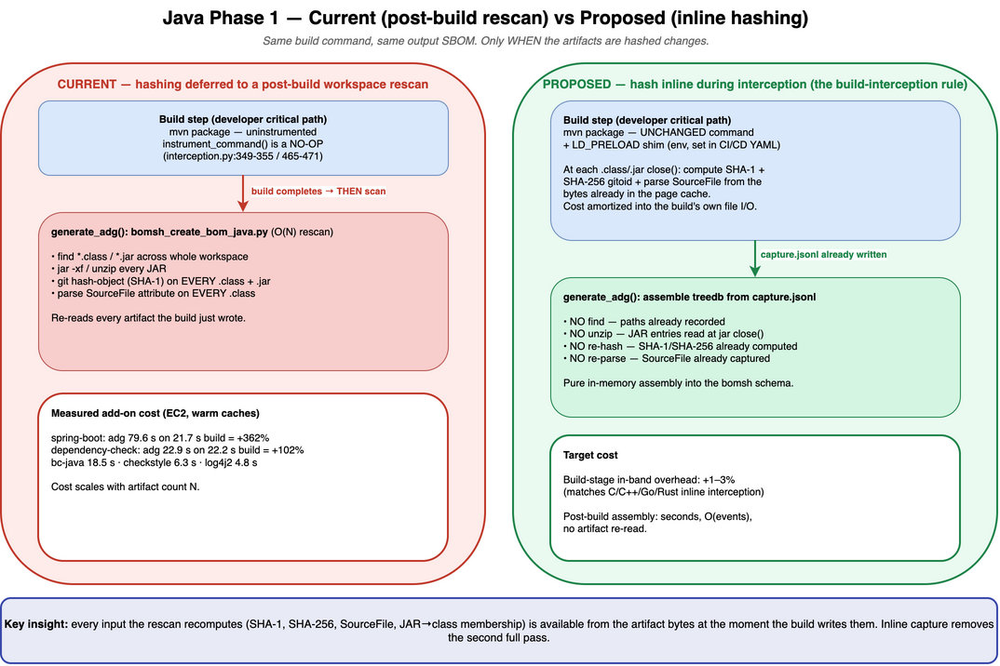
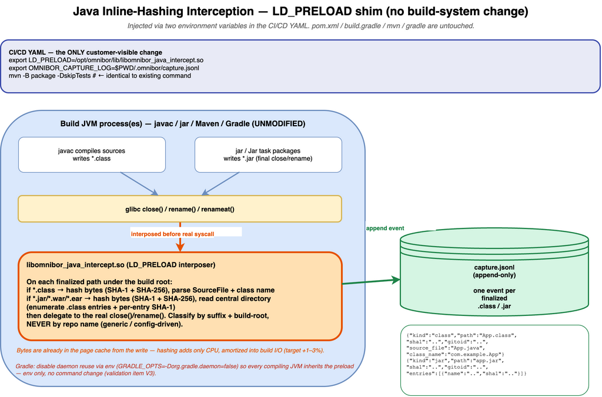
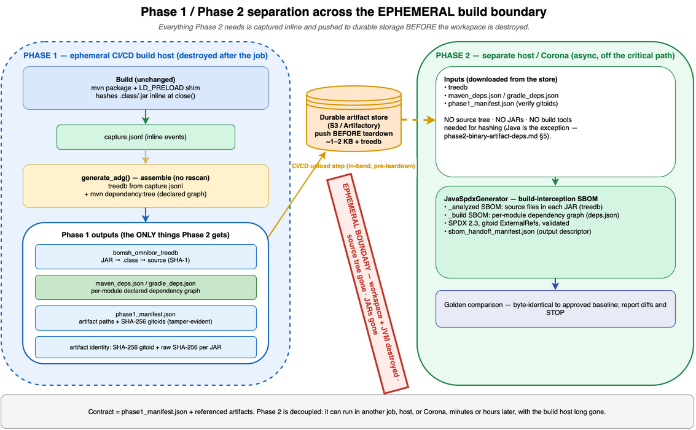
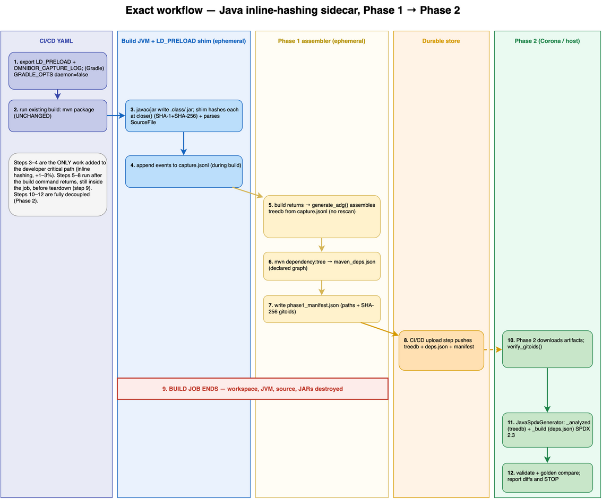

# Java Inline-Hashing Sidecar — What Exists, What I Propose, and Why It Works

| | |
|---|---|
| **Status** | Design + walkthrough — docs only, NO code until USER approves |
| **Date** | 2026-07-15 |
| **Authors** | Ted G. (architect), Cascade AI |
| **Applies to** | Java sidecar mode (Maven and Gradle) |
| **Companion spec** | [`inline-hashing-interception-design.md`](inline-hashing-interception-design.md) |
| **Hard constraints** | Sidecar-only; native build system UNCHANGED; CI/CD-YAML injection only; golden-clean output; Phase 1/Phase 2 separated; build phase is ephemeral |

This document proves the design with four diagrams and grounds every claim in
the actual code. Read the diagrams in order:

| # | Diagram | Answers |
|---|---|---|
| 1 | Current vs Proposed | What exists today, what changes, why build time drops |
| 2 | Interception mechanism | Exactly where and how gitoids are computed inline |
| 3 | Phase separation | Phase 1/Phase 2 split and ephemeral-safe hand-off |
| 4 | Workflow sequence | The exact end-to-end steps and who does what |

---

## 1. What is currently INCORRECTLY implemented (AI Hallucination)

Java sidecar is the **only** interception strategy that does **no** inline
work. Verified in `@/Users/tedg/workspace/omnibor-analysis/app/pipeline/interception.py`:

- `MavenDepTreeStrategy.instrument_command()` (`:349-355`) and
  `GradleDepTreeStrategy.instrument_command()` (`:465-471`) both
  `return build_cmd, {}` — the build runs uninstrumented, nothing hashes
  anything during the build.
- All gitoid/treedb work is deferred to `generate_adg()` →
  `_generate_java_treedb()` (`:43-93`), which runs `bomsh_create_bom_java.py`
  as a **post-build workspace rescan**.

That rescan is the cost. Per the fast-IO module docstring
(`@/Users/tedg/workspace/omnibor-analysis/docker/patches/bomsh_java_fast_io.py`),
for a JAR with N `.class` files the upstream flow spawns "~3N subprocesses"
plus `find` and `jar -xf` per JAR. Concretely it does:

- `find *.class` / `*.jar` across the whole workspace,
- `jar -xf` / unzip every JAR,
- `git hash-object` (SHA-1) on every `.class` and `.jar`,
- parse the `SourceFile` attribute on every `.class`.

The treedb record it builds is
`{"outfile": (git_blob_sha1(jar), jar), "infiles": [...]}` (source:
`@/Users/tedg/workspace/omnibor-analysis/docker/patches/README-bomsh_java_sourcefile.md`),
mapping JAR → `.class` → source.

**Measured cost** (EC2, sidecar, warm caches) — this is *after* the ~12x
fast-path optimization already merged:

| Repo | Native build | `adg` (rescan + `dep:tree`) | Impact |
|---|---|---|---|
| `spring-boot` | 21.7 s | 79.6 s | +362% |
| `dependency-check` | 22.2 s | 22.9 s | +102% |
| `bc-java` | — | 18.5 s | large |
| `checkstyle` | — | 6.3 s | moderate |
| `logging-log4j2` | — | 4.8 s | moderate |
| `jsoup` / `crawler4j` / `omnibor-java-testapp` | — | 2–3 s | small |

The left half of **Diagram 1** depicts this current path.

The phase-split plumbing already exists and is CI-validated for Java:
`@/Users/tedg/workspace/omnibor-analysis/app/pipeline/manifest.py`
(`write_manifest`/`read_manifest`/`verify_gitoids`), the `--phase build`/`--phase spdx`
flags, and `run_java_phase1`/`run_java_phase2`. What is missing is the **inline
hashing** that the interception rule requires.

<a href="java-inline-current-vs-proposed.png"></a>

*Diagram 1. Click to enlarge. Source: [java-inline-current-vs-proposed.drawio](java-inline-current-vs-proposed.drawio)*

---

## 2. Realigned Proposal

Compute the gitoids **inline, as the build produces each artifact** — the same
rule C/C++ (`CC`/`CXX` wrappers), Go (`-toolexec`), and Rust (`RUSTC_WRAPPER`)
already follow. For Java the sidecar-legal mechanism is an `LD_PRELOAD` shim
injected via the CI/CD YAML (matching the C/C++ sidecar direction in
`infrastructure.md` §10.1):

- A shared library `libomnibor_java_intercept.so` is loaded into the build's
  JVM processes by exporting `LD_PRELOAD` in the pipeline YAML.
- It interposes libc `close()` / `rename()` / `renameat()`. When a finalized
  path under the build root is a `.class` or `.jar`, it computes the git-blob
  **SHA-1** (treedb topology) and the **SHA-256 gitoid** (SBOM identity) from
  the bytes already in the page cache, parses the `SourceFile` attribute and
  class name from those same bytes, and for a JAR reads its central directory
  to enumerate member `.class` entries — then delegates to the real syscall.
- Each event is appended to a capture log (`capture.jsonl`, config-driven path).
- `generate_adg()` no longer rescans; it **assembles** the treedb from the
  capture log (no `find`, no unzip, no re-hash), then runs `dep:tree` as today.

Nothing that the rescan recomputes is lost — it is all captured the first time,
during the build. **Diagram 2** shows exactly where hashing happens.

<a href="java-inline-interception-mechanism.png"></a>

*Diagram 2. Click to enlarge. Source: [java-inline-interception-mechanism.drawio](java-inline-interception-mechanism.drawio)*

---

## 3. How CI/CD Java build time stays minimally impacted

The post-build `adg` step has **two** components, and inline hashing removes
**only one** of them. This must be stated plainly — the earlier claim that the
post-build window "collapses to seconds" was wrong because it overlooked the
dependency-graph capture.

| Cost component | Current | Proposed |
|---|---|---|
| **Build-stage in-band** (developer critical path) | ~0% (nothing runs) | **+1–3%** — inline hashing amortized into the build's own file I/O |
| **Post-build: `treedb`** (artifact hashing) | full O(N) rescan | **eliminated** → in-memory assembly in seconds |
| **Post-build: dependency graph** (`mvn dependency:tree` / `gradlew dependencies`) | runs | **UNCHANGED** — inline hashing does not touch it |

Why the build-stage add is small: the shim hashes bytes that the build just
wrote and that are still in the page cache; it adds CPU time per artifact, not a
second full read pass over the workspace. This is the same profile that makes
C/C++/Go/Rust inline interception cost only a few percent
(`strategy-evaluation.md` §4.1).

**What inline hashing does and does not remove.** The measured `adg` total is
`treedb` + `dep_tree`. Inline hashing eliminates the `treedb` rescan — the
largest single piece for `spring-boot`. It does **not** reduce the
`dep_tree` capture, which remains and becomes the dominant residual. Real split
from `adg_substeps.json` (most recent EC2 runs, sidecar, warm caches):

| Repo | Native build | `treedb` (eliminated) | `dep_tree` (**remains**) | Old `adg` total |
|---|---|---|---|---|
| `spring-boot` | 21.7 s | 58.3 s | **23.5 s** (`gradlew dependencies`) | 81.8 s |
| `bc-java` | — | 10.6 s | **9.4 s** (`gradlew dependencies`) | 20.0 s |
| `checkstyle` | — | 3.9 s | **2.5 s** (`mvn dependency:tree`) | 6.4 s |
| `logging-log4j2` | — | 1.9 s | **2.9 s** (`mvn dependency:tree`) | 4.8 s |

So the honest picture: for `spring-boot` the post-build window drops from
~81.8 s to ~23.5 s (the `dep_tree` time), **not** to "seconds" — the residual
`gradlew dependencies` alone is ~108% of the 21.7 s build. `dep_tree` runs
*after* the build command returns (not on the artifact-production critical path)
and **must** stay in Phase 1 because it needs the build tool and resolved
dependencies, which are unavailable in Phase 2. Reducing it (e.g. reusing the
resolution the build already performed) is a **separate** effort, out of scope
for this inline-hashing design and tracked as a distinct optimization.

Note: **Diagram 1**'s "Target cost" panel still says "post-build assembly:
seconds" and carries the same overstatement — it should be updated to show the
`treedb`/`dep_tree` split above.

---

## 4. Phase 1 / Phase 2 separation

The split is unchanged in contract and strengthened in practice:

| | Phase 1 (ephemeral build host) | Phase 2 (separate host / Corona) |
|---|---|---|
| Runs | inside the CI/CD build job | asynchronously, off the critical path |
| Does | build (unchanged) + inline hash + assemble treedb + `dep:tree` + write manifest | reads metadata, generates + validates SPDX |
| Reads | the build workspace (once, inline) | ONLY the pushed artifacts |
| Contract | writes `phase1_manifest.json` + referenced artifacts | `read_manifest` + `verify_gitoids`, then `JavaSpdxGenerator` |

Phase 2 for Java needs **no source tree, no JARs, and no build tools for
hashing** — it consumes only the treedb + the dependency-capture JSON
(`phase2-binary-artifact-deps.md` §5; `phase2-consume-dep-capture.md`). The
manifest is the sole interface between the phases. **Diagram 3** shows the split
and the hand-off.

<a href="java-inline-phase-separation.png"></a>

*Diagram 3. Click to enlarge. Source: [java-inline-phase-separation.drawio](java-inline-phase-separation.drawio)*

---

## 5. All data Phase 2 needs is captured before the ephemeral workspace dies

The build phase is ephemeral: when the CI/CD job ends, the workspace, the JVM,
the source tree, and the JARs are destroyed. Therefore **everything Phase 2
needs to create a build-interception SBOM must be produced and pushed to durable
storage before the job ends**. This table maps every Phase 2 input to where it
is produced and confirms it survives teardown:

| Phase 2 needs | Used for | Produced in Phase 1 by | Captured inline? | Pushed before teardown? |
|---|---|---|---|---|
| `.class` → source mapping | `_analyzed` SBOM (files in each JAR) | `SourceFile` attribute parsed at `.class` close | Yes | Yes (in treedb) |
| `.class` / `.jar` git-blob SHA-1 | treedb topology | hashed at close | Yes | Yes (in treedb) |
| JAR → `.class` membership | treedb JAR provenance | JAR central directory read at jar close | Yes | Yes (in treedb) |
| SHA-256 gitoid + raw SHA-256 per JAR | artifact identity / `ExternalRef` | computed at close; recorded in manifest | Yes | Yes (manifest) |
| Per-module dependency graph | `_build` SBOM | `mvn dependency:tree` / `gradlew dependencies` | N/A (declared graph) | Yes (`maven_deps.json`) |
| Artifact paths + integrity | discovery + tamper check | `write_manifest` (SHA-256 gitoids) | Yes | Yes (`phase1_manifest.json`) |

No Phase 2 input depends on re-reading the workspace after the build. The
`_analyzed` view comes entirely from the treedb; the `_build` view comes
entirely from the dependency-capture JSON. Both are byte-small and pushed in the
same job. This is the ephemeral-safety guarantee, drawn as the boundary in
**Diagram 3**.

---

## 6. The exact workflow

The numbered flow below is drawn as swimlanes in **Diagram 4**.

1. **CI/CD YAML** exports `LD_PRELOAD` and `OMNIBOR_CAPTURE_LOG` (and, for
   Gradle, `GRADLE_OPTS=-Dorg.gradle.daemon=false` so every compiling JVM
   inherits the preload). Env only — no build-file or command change.
2. **CI/CD YAML** runs the existing build command, e.g. `mvn -B package
   -DskipTests`, byte-for-byte unchanged.
3. **Build JVM + shim** — `javac`/`jar` write `.class`/`.jar`; the shim hashes
   each at `close()` (SHA-1 + SHA-256) and parses the `SourceFile` attribute.
4. **Build JVM + shim** appends one event per finalized artifact to
   `capture.jsonl`, during the build.
5. **Phase 1 assembler** — when the build command returns, `generate_adg()`
   assembles the treedb from `capture.jsonl` (no rescan).
6. **Phase 1 assembler** runs `mvn dependency:tree` → `maven_deps.json`.
7. **Phase 1 assembler** writes `phase1_manifest.json` (paths + SHA-256 gitoids).
8. **CI/CD upload step** pushes treedb + `maven_deps.json` + manifest to durable
   storage (in-band, before teardown).
9. **Build job ends** — workspace, JVM, source, JARs destroyed.
10. **Phase 2** downloads the artifacts and runs `verify_gitoids()`.
11. **Phase 2** runs `JavaSpdxGenerator`: `_analyzed` (from treedb) + `_build`
    (from `maven_deps.json`), SPDX 2.3 with gitoid `ExternalRef`s.
12. **Phase 2** validates and golden-compares; any diff is reported and work
    STOPS pending USER review.

Steps 3–4 are the only additions to the developer critical path. Steps 5–8 run
after the build returns but still inside the job — of these, **step 6
(`dep_tree`) is the dominant residual cost** (see §3), not the treedb assembly
in step 5. Steps 10–12 are fully decoupled.

<a href="java-inline-workflow-sequence.png"></a>

*Diagram 4. Click to enlarge. Source: [java-inline-workflow-sequence.drawio](java-inline-workflow-sequence.drawio)*

---

## 7. Correctness: it must be golden-clean

The treedb assembled from `capture.jsonl` must be **byte-identical** to the one
the rescan produces, so downstream SPDX is unchanged. Verification gates:

1. Run both paths (legacy rescan and inline assembly) on the same build and diff
   `bomsh_omnibor_treedb` — must be identical.
2. Run the full pipeline and compare SPDX against the approved golden baselines
   for the multi-module repos (`dependency-check`, `logging-log4j2`,
   `checkstyle`, `spring-boot`). Any diff is reported and work STOPS. No golden
   updates by Cascade.

---

## 8. Honest open validation items (proven on EC2, not assumed)

| # | Risk | How it is validated |
|---|---|---|
| V1 | HotSpot must reach `.class`/`.jar` finalization through interposable libc symbols, not raw `syscall()` | instrument a real `mvn package`; every produced artifact must yield a capture event vs a `find` inventory |
| V2 | atomic `*.tmp` → `rename()` write patterns | confirm `rename`/`renameat` hooks capture final paths (Maven, Gradle `Jar`, `jar`) |
| V3 | Gradle daemon reuse could miss classes | disable via env `GRADLE_OPTS=-Dorg.gradle.daemon=false` in YAML — confirm this is env-only, not a command change |
| V4 | musl/Alpine / statically-linked launchers limit `LD_PRELOAD` | test on the Alpine image; document fallback |
| V5 | in-memory JAR assembly | the single final `close()` still yields JAR bytes + central directory — confirm entry hashes match |
| V6 | concurrent module builds appending to one log | JSONL append-only, per-line atomicity — confirm no interleaving corruption |

If any of V1–V6 cannot be met inside the sidecar / no-build-change boundary, I
will report it plainly and revise — never work around it by touching the build
definition.

---

## 9. What is explicitly NOT changed

- `pom.xml`, `build.gradle(.kts)`, `settings.gradle`, `build.xml`, `ivy.xml`,
  `Makefile` — untouched.
- The `mvn` / `gradle` / `ant` / `javac` command line — untouched.
- No compiler plugins, no annotation processors, no build-arg edits.
- Phase 2 SPDX generation — unchanged; it still consumes treedb + dep-capture.

The only additions are (a) the `LD_PRELOAD` shim shipped in the sidecar image
and (b) environment variables set in the CI/CD YAML.

---

## Rendering the diagrams

The `.drawio` sources are committed. Per the repo convention
(`docs/architecture/README.md`), export each to a PNG of the same name. With the
installed draw.io desktop app:

```bash
cd docs/sidecar/java
for f in java-inline-*.drawio; do
  /Applications/draw.io.app/Contents/MacOS/draw.io -x -f png -o "${f%.drawio}.png" "$f" --no-sandbox
done
```
