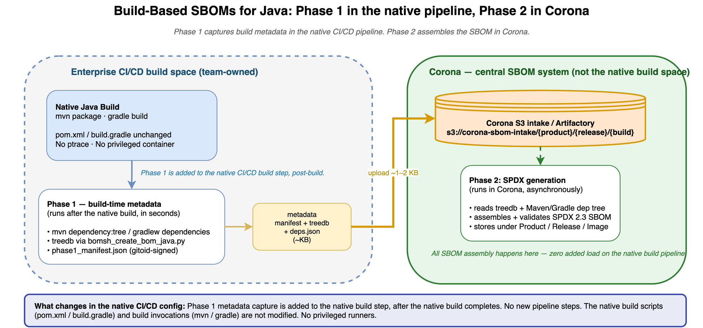

# Sidecar & Phase Isolation — Java

<table>
<colgroup><col style="width:16%"><col style="width:84%"></colgroup>
<tbody>
<tr><td><strong>Parent doc</strong></td><td><code>../infrastructure.md</code></td></tr>
<tr><td><strong>Reference guide</strong></td><td><code>reference/inline-hashing-interception-design.md</code> — the delivered, golden-clean <code>LD_PRELOAD</code> inline-hashing sidecar design</td></tr>
<tr><td><strong>Status</strong></td><td>Sidecar mode ✅ implemented; Phase 1/2 split (<code>--phase</code>) ✅ implemented (Java). Phase 2 generates SBOMs from Phase 1 metadata with <strong>no source-tree access</strong> (<code>tedg-dev/omnibor-analysis#194</code>, merged).</td></tr>
<tr><td><strong>Date</strong></td><td>2026-06-12 (status updated 2026-07-23)</td></tr>
</tbody>
</table>

---

> **Supported mode — Sidecar only.** See `../infrastructure.md` §1.
> Sidecar is the sole supported mode; **standalone is deprecated** — the
> initial ptrace-based implementation, retained only for a rare ~1%
> embedded corner case — and must not be offered as an option.

---

## Architecture Diagram

<a href="java-sbom-phase-split.png"></a>

*Click image to enlarge. Source: [java-sbom-phase-split.drawio](java-sbom-phase-split.drawio)*

---

## 1. Current State

| Component | Status |
|-----------|--------|
| Standalone pipeline (strace) | ✅ Production — 8 repos |
| `MavenDepTreeStrategy` (sidecar) | ✅ Fully wired and tested |
| `GradleDepTreeStrategy` (sidecar) | ✅ Fully wired and tested |
| `run_java_pipeline()` accepts `mode=` | ✅ Dispatches to correct strategy |
| `_select_java_strategy()` | ✅ Auto-detects Maven vs Gradle |
| Phase 1/2 timing tags | ✅ Properly assigned |
| `--mode sidecar` for Java | ✅ **Works end-to-end** |
| Phase 1/2 split (`--phase`) | ✅ Implemented (Java) — `--phase build` writes the manifest, `--phase spdx --manifest` consumes it (`_run_phase1_only()` / `_run_phase2_only()` in `runners.py`) |
| Phase 2 from metadata (no source tree) | ✅ Implemented (Java) — `dep_capture_reader.py` consumes `maven_deps.json` / `gradle_deps.json` |

**Java is the reference implementation for sidecar mode.** The patterns
established here — `_select_java_strategy()`, strategy-based dispatch in
`builder.build()`, and the `InterceptionStrategy` ABC — are the template
for all other languages.

### 1.1 Current Code Path (Standalone)

```
runners.py main()
  → run_java_pipeline(mode="standalone")
    → _select_java_strategy() → None (standalone)
    → pipeline.builder.build_java()         # Phase 1: strace + bomsh_create_bom_java.py
      ├── clean_cmd (mvn clean)
      ├── prebuild steps
      ├── "strace -f -s99999 ... mvn package"  # instrumented build
      ├── bomsh_create_bom_java.py             # treedb generation
      └── strace log archival
    → _run_post_build()                     # Phase 2
      ├── spdx_gen.generate_java() → None   # placeholder (Java SPDX via ADG)
      ├── MetadataCollector.collect()
      ├── generate_java_adg_spdx()          # per-JAR analyzed + build SPDX
      ├── SpdxValidator.validate()
      └── BinaryCollector.collect()
```

### 1.2 Current Code Path (Sidecar)

```
runners.py main()
  → run_java_pipeline(mode="sidecar")
    → _select_java_strategy() → MavenDepTreeStrategy or GradleDepTreeStrategy
    → pipeline.builder.build(strategy=strategy)  # Phase 1
      ├── clean_cmd
      ├── prebuild steps
      ├── "mvn package -DskipTests"           # unmodified build (no strace)
      └── strategy.generate_adg()
          ├── bomsh_create_bom_java.py        # treedb (SourceFile + path similarity)
          └── mvn dependency:tree → maven_deps.json
    → _run_post_build()                       # Phase 2 (same as standalone)
```

### 1.3 Configured Java Repos

| Repo | Build System | Modules | Sidecar Tested? |
|------|-------------|---------|-----------------|
| jsoup | Maven | Single | ✅ |
| checkstyle | Maven | Single (multi-module POM) | ✅ |
| crawler4j | Maven | Multi (`-pl crawler4j`) | ✅ |
| dependency-check | Maven | Multi (`-pl cli -am`) | ✅ |
| logging-log4j2 | Maven | Multi (`-pl log4j-core -am`) | ✅ |
| spring-boot | Gradle | Multi (`:spring-boot:build`) | ✅ |
| bc-java | Gradle | Multi (`:prov:build`) | ✅ |
| `omnibor-java-testapp` | Maven | Single (CI test app) | ✅ |

---

## 2. Interception Strategies

Sidecar is the primary, supported mode — the build runs **unmodified** with
no `strace` and no `SYS_PTRACE`. The standalone strace path (§2.3) is
**deprecated**, retained only for the rare ~1% embedded corner case.

### 2.1 Sidecar: `MavenDepTreeStrategy`

- **Mechanism**: Build runs unmodified (no strace prefix)
- **Capability needed**: None
- **Output**:
  1. Treedb via `bomsh_create_bom_java.py` (uses `SourceFile` bytecode
     attribute + path similarity instead of strace log)
  2. `maven_deps.json` via `mvn dependency:tree` (default **text** output,
     parsed per-module by `maven_dep_tree_parser.parse_text_output`; text is
     the only format carrying `optional` with no plugin-version requirement)
- **Multi-module support**: `_extract_maven_modules()` passes `-pl` from
  build steps to `run_maven_dep_tree()`

### 2.2 Sidecar: `GradleDepTreeStrategy`

- **Mechanism**: Build runs unmodified
- **Capability needed**: None
- **Output**:
  1. Treedb via `bomsh_create_bom_java.py` (same as Maven sidecar)
  2. `gradle_deps.json` via `./gradlew dependencies` per subproject

### 2.3 Standalone (deprecated): strace `openat`

> **Deprecated** — retained only for the rare ~1% embedded corner case;
> must not be offered as an option.

- **Mechanism**: `strace -f -s99999 --seccomp-bpf -e trace=openat` prefix
- **Capability needed**: `SYS_PTRACE` in Docker
- **Output**: strace log at `/tmp/strace_java_logfile`
- **ADG**: `bomsh_create_bom_java.py -r <repo_dir> -j <treedb_file>`
- **Strace log is archived** to `bom_dir/metadata/bomsh/strace_java_logfile`

### 2.4 Key Difference: Strace Evidence vs Workspace Scan

| Aspect | Sidecar (dep:tree) | Standalone (strace) |
|--------|--------------------|---------------------|
| File access evidence | ❌ Workspace scan only | ✅ strace `openat` log |
| `filesAnalyzed: true` confidence | Medium (SourceFile heuristic) | High (strace-verified) |
| Dependency graph source | `mvn dep:tree` / `gradlew dependencies` | strace + treedb |
| `SYS_PTRACE` required | ❌ | ✅ |

The downstream SPDX generator (`JavaSpdxGenerator`) handles both cases:
when `strace_accessed` is populated (standalone), it filters treedb results
against strace evidence. When empty (sidecar), it trusts the workspace scan.

### 2.5 Artifact Identity: Why C/C++ Is Automatic and Java Isn't

> **Design of record**: see `.windsurf/rules/project/artifact-identity.md`.
> gitOID + raw SHA are `SHA-256` for every artifact, in every language.

A common misconception is that Java cannot carry per-file/per-object OmniBOR
identity the way C/C++ does. It can. The asymmetry lives **only** in bomsh's
hashing step, not in whether the dependency graph can be captured:

| | C/C++ | Java |
|---|---|---|
| **Interception** | `bomtrace3` (syscall-level) sees every `gcc`/`ld` call and its exact inputs/outputs | `bomsh_create_bom_java.py` uses `strace` of `javac` + JAR packaging |
| **bomsh ID computation** | `bomsh_create_bom.py` supports `--hashtype sha256` natively | `SHA-1` only; no `--hashtype` |

The resolution is to **separate topology from identity**:

- **Topology (edges: output ← inputs)** is language-specific and bomsh already
  captures it for Java (`strace` `.java`→`.class`→`.jar`, plus Maven/Gradle
  `dep:tree` for external deps). The treedb maps `sha1 → path`.
- **Identity (`SHA-256` gitOIDs + raw hashes + Input Manifests)** is pure,
  language-agnostic math. We lift it **out** of bomsh and compute it ourselves,
  uniformly, by reading each artifact once and re-keying bomsh's `SHA-1` nodes
  to our `SHA-256` IDs via file path.

With identity as our responsibility, bomsh's lack of `--hashtype sha256` for
Java is irrelevant, and Java gets the same full `SHA-256` identity (per-file
artifact gitOIDs + raw SHA, package OMID) as C/C++.

**Java-specific caveats**: hash `.class` intermediates while they still exist
(during/right after the build, before cleanup); validate that every `.class`
in the JAR traces back to a `.java` (the `strace` capture is more fragile than
`bomtrace3`); and treat Maven/Gradle dependencies as leaf artifacts identified
by their JAR's gitOID + `purl`.

---

## 3. Phase 1 Artifacts

| Artifact | Standalone | Sidecar | Location |
|----------|-----------|---------|----------|
| Treedb (`bomsh_omnibor_treedb`) | ✅ | ✅ | `bom_dir/metadata/bomsh/` |
| Strace log | ✅ | ❌ | `bom_dir/metadata/bomsh/strace_java_logfile` |
| `maven_deps.json` | ❌ | ✅ (Maven) | `bom_dir/maven_deps.json` |
| `gradle_deps.json` | ❌ | ✅ (Gradle) | `bom_dir/gradle_deps.json` |
| Output JARs | ✅ in `repo_dir` | ✅ in `repo_dir` | Per `output_binaries` glob |
| `phase1_manifest.json` | ✅ (when `--phase build`) | ✅ | `bom_dir/phase1_manifest.json` |

---

## 4. Phase 2 Requirements

| Operation | Module | Needs JAR? | Needs Source Tree? | Needs Treedb? |
|-----------|--------|-----------|-------------------|---------------|
| `JavaSpdxGenerator.generate()` | `java_generator.py` | ❌ (path only) | ❌ | ✅ |
| Maven/Gradle dep parsing | `dep_capture_reader.py` | ❌ | ❌ (reads Phase 1 `maven_deps.json` / `gradle_deps.json`) | ❌ |
| `BinaryCollector` (copy JARs) | `binary_collector.py` | ✅ | ❌ | ❌ |
| `MetadataCollector` | `metadata_collector.py` | ❌ | ✅ (repo metadata) | ❌ |

### 4.1 Cross-Host Phase 2

**Java is the easiest language for cross-host Phase 2** because:

1. `JavaSpdxGenerator` does not call `ldd` or `readelf` — JARs are not ELF
2. Dependency resolution reads `maven_deps.json` / `gradle_deps.json` from
   Phase 1, not from the live build environment
3. The treedb + dep tree JSON are the only required artifacts
4. JAR paths are only needed for `BinaryCollector` (optional for SPDX)

**Minimum artifact set for cross-host Phase 2**:
- `phase1_manifest.json`
- `bom_dir/metadata/bomsh/bomsh_omnibor_treedb`
- `bom_dir/maven_deps.json` or `bom_dir/gradle_deps.json`
- (No `pom.xml` / `build.gradle` needed — dependency data is captured in Phase 1.)

**Note**: Dependency resolution runs in **Phase 1** and is captured to
`maven_deps.json` / `gradle_deps.json`. Phase 2 reads that capture via
`app/spdx/dep_capture_reader.py` (`load_capture()` / `get_module_deps()`)
and never touches the source tree. The earlier "resolve at Phase 2 time"
approach was superseded by `tedg-dev/omnibor-analysis#194` (merged).

---

## 5. Config Schema

### 5.1 Current (flat format)

```yaml
omnibor_java:
  strace_opts: -f -s99999 --seccomp-bpf -e trace=openat -qqq
  create_bom_script: bomsh_create_bom_java.py
  strace_logfile: /tmp/strace_java_logfile
```

### 5.2 Target (nested mode format)

```yaml
omnibor_java:
  standalone:
    strace_opts: -f -s99999 --seccomp-bpf -e trace=openat -qqq
    create_bom_script: bomsh_create_bom_java.py
    strace_logfile: /tmp/strace_java_logfile
  sidecar:
    create_bom_script: bomsh_create_bom_java.py
```

The sidecar section is simpler because:
- No `strace_opts` or `strace_logfile` (strace is not used)
- `create_bom_script` is the same (workspace scan mode)

---

## 6. Phase Split Design

> **✅ Delivered.** The design below is implemented for Java in
> `app/pipeline/runners.py` (`_run_phase1_only()` / `_run_phase2_only()`,
> gated by `--phase` + `_validate_phase_args()`) and
> `app/pipeline/lang_runners.py` (`run_java_phase1()` / `run_java_phase2()`).
> The code sketches below are the original design, retained as a record;
> shipped signatures may differ in detail.

### 6.1 `run_java_phase1()`

```python
def run_java_phase1(
    pipeline, repo_name, repo_cfg,
    paths_cfg, omnibor_java_cfg, run_ts,
    mode="standalone",
    vcs_uri="NOASSERTION",
    commit_sha=None,
):
    """Java Phase 1: build + treedb + dep tree + manifest.

    Returns TimingResult with Phase 1 steps only.
    """
    strategy = _select_java_strategy(
        repo_name, repo_cfg, paths_cfg, mode,
    )
    tracer = strategy.name if strategy else "strace"
    timing = TimingResult(tracer=tracer)

    if strategy:
        build_result = pipeline.builder.build(
            ..., strategy=strategy,
        )
    else:
        build_result = pipeline.builder.build_java(...)

    timing.steps.extend(build_result.steps)
    timing.success = build_result.success

    if build_result.success:
        ManifestWriter().write(
            bom_dir=build_result.bom_dir,
            ...
        )

    return timing
```

### 6.2 `run_java_phase2()`

```python
def run_java_phase2(
    pipeline, repo_name, repo_cfg,
    paths_cfg, omnibor_java_cfg, run_ts,
    vcs_uri="NOASSERTION",
    manifest=None,
):
    """Java Phase 2: SPDX generation from treedb + dep tree.

    When manifest is provided, reads paths from it.
    """
    if manifest:
        ctx = ManifestReader().read(manifest)

    timing = TimingResult(tracer="phase2-only")
    timing.steps.extend(
        _run_post_build(
            pipeline, repo_name, repo_cfg,
            paths_cfg, run_ts,
            sbom_fn=lambda: pipeline.spdx_gen.generate_java(...),
            spdx_gen_fn=lambda: generate_java_adg_spdx(...),
        )
    )
    timing.success = True
    return timing
```

### 6.3 `run_java_pipeline()` (backward compatible)

The existing `run_java_pipeline()` becomes a thin wrapper:

```python
def run_java_pipeline(
    pipeline, repo_name, repo_cfg,
    paths_cfg, omnibor_java_cfg, run_ts,
    vcs_uri="NOASSERTION",
    mode="standalone",
):
    timing = run_java_phase1(...)
    if not timing.success:
        return timing
    timing2 = run_java_phase2(...)
    timing.steps.extend(timing2.steps)
    return timing
```

---

## 7. Testing

### 7.1 Unit Tests

| Test | What it validates |
|------|-------------------|
| `test_select_java_strategy_standalone` | Returns `None` |
| `test_select_java_strategy_sidecar_maven` | Returns `MavenDepTreeStrategy` |
| `test_select_java_strategy_sidecar_gradle` | Returns `GradleDepTreeStrategy` |
| `test_extract_maven_modules` | Parses `-pl` from build steps |
| `test_java_phase1_writes_manifest` | Manifest contains treedb + dep tree paths |
| `test_java_phase2_reads_manifest` | Phase 2 runs from manifest |
| `test_java_pipeline_unchanged` | Full pipeline backward compatible |

### 7.2 Integration Tests

| Test | Command | Validates |
|------|---------|-----------|
| Standalone full | `--repo jsoup` | Current behavior unchanged |
| Sidecar full | `--repo jsoup --mode sidecar` | No `SYS_PTRACE`, valid SPDX |
| Phase split (standalone) | `--repo jsoup --phase build` then `--phase spdx` | Matches golden |
| Phase split (sidecar) | `--repo jsoup --mode sidecar --phase build` then `--phase spdx` | Matches golden |
| Multi-module Maven | `--repo dependency-check --mode sidecar` | Per-module SPDX correct |
| Gradle | `--repo spring-boot --mode sidecar` | Gradle dep tree parsed |

### 7.3 Golden File Comparison

Sidecar SPDX must match standalone golden files. Known expected differences:

- `creationInfo.created` timestamp (always differs — excluded from comparison)
- Tracer name in `creationInfo.creators` (`strace` vs `maven-dep-tree`)
- `filesAnalyzed` confidence may differ (strace-verified vs heuristic)

All structural content (packages, relationships, versions, checksums) must
match. Any difference is a regression to investigate.

---

## 8. Implementation Tasks

| # | Task | Effort | Depends On |
|---|------|--------|------------|
| 1 | Split `run_java_pipeline()` into `phase1`/`phase2` | 0.5d | Infra manifest module |
| 2 | Write manifest in `run_java_phase1()` | 0.25d | Task 1 |
| 3 | Read manifest in `run_java_phase2()` | 0.25d | Task 1 |
| 4 | Convert `omnibor_java:` to nested format | 0.25d | — |
| 5 | Unit tests for phase split | 0.5d | Tasks 1-3 |
| 6 | Integration test: phase split on EC2 | 0.5d | Task 5 |
| 7 | Cross-host Phase 2 test (transfer artifacts) | 0.5d | Task 6 |

**No blockers** — Java sidecar already works. Phase isolation is purely a
refactoring exercise with well-defined boundaries.

---

## 9. Risks

| Risk | Likelihood | Impact | Mitigation |
|------|-----------|--------|------------|
| `pom.xml` needed at Phase 2 time | Medium | Breaks cross-host Phase 2 | Pre-parse deps in Phase 1 or copy `pom.xml` to `bom_dir` |
| Gradle daemon state | Low | `./gradlew dependencies` may behave differently across hosts | Use `--no-daemon` (already in all Gradle build steps) |
| Multi-module `-pl` not captured in manifest | Low | Phase 2 runs dep:tree against wrong modules | `_extract_maven_modules()` result stored in manifest |
| `SourceFile` heuristic divergence | Low | Sidecar treedb maps slightly different files than strace | Compare against golden files; investigate any diff |
